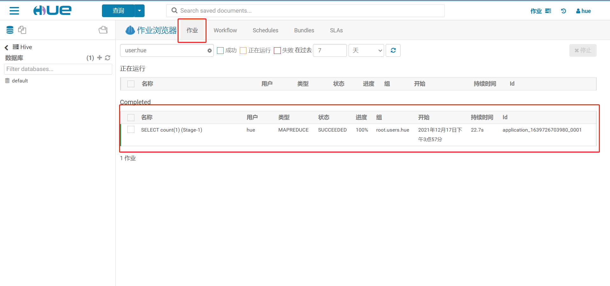

# 项目环境及Hue的使用

## 知识点01：课程回顾


## 知识点02：课程目标

1. 新零售项目的环境
   - **掌握：企业中集群部署方式以及CM的基本使用**
   - **==实现：项目虚拟机的启动和测试==**
2. Hue工具的使用
   - 了解：Hue的功能、安装、配置、原理
   - **实现：Hue的使用**
3. ETL的介绍以及Sqoop的介绍
   - **掌握：ETL的概念、功能以及工具**
   - **==掌握：Sqoop的功能及基本原理、全量和增量的概念==**


## 知识点03：【了解】大数据集群部署方式

- **目标**：**了解大数据集群部署方式**

- **实施**

  - **手动安装部署**

    

    

    - **优点**
      - 灵活性和安全性、自定义的程度最高
    
    - **缺点**
      
      - 如果集群的机器比较多，安装和管理非常麻烦
      - 需要自己维护兼容性、监控等问题
    - **场景**：机器个数比较少
    
  - **集群管理工具**
  
    
  
    - **优点**
      - 由管理工具来实现批量化的同步操作：安装、配置
      - 有监控管理：进程监控、资源监控
      - 可以管理所有程序：不需要命令行，通过可视化界面来管理所有进程
    - **缺点**
      - 屏蔽底层，灵活性较差，组件扩展性较差
    - **场景**：机器个数比较多，集群规模比较大
      
    - **工具**：CM、Ambari
  
- **小结**

  - 了解大数据集群部署方式


## 知识点04：【理解】ClouderaManager介绍

- **目标**：**理解ClouderaManager的功能及基本使用**

- **实施**

  - **Cloudera**：全球最大的大数据商业软件公司

    - https://www.cloudera.com/

      

    

  - **CDH**：【Cloudera’s Distribution Including Apache Hadoop】CDH是Cloudera的100％开放源代码平台发行版

    - 主流发行版本：Apache、CDH、HDP、TDH、E-MR

    - 版本划分清晰、兼容性认证、安全稳定、支持多种安装方式

    - https://www.cloudera.com/products/open-source/apache-hadoop.html

      

    - 组件：Hadoop、Flume、Hue、Oozie、Sqoop、Spark、Impala、Hive、Hbase等

      

  - **CM**：【Cloudera Manager】，Cloudera公司开发的一款大数据集群安装部署利器，这款利器具有集群自动化安装、中心化管理、集群监控、报警等功能，极大的提高集群管理的效率。

    - https://www.cloudera.com/products/product-components/cloudera-manager.html

      
  
    - 功能
  
      ```properties
    （1）管理: 对集群进行管理，如添加、删除节点等操作。
      （2）监控: 监控集群的健康情况，对设置的各种指标和系统运行情况进行全面监控。
      （3）诊断: 对集群出现的问题进行诊断，对出现的问题给出建议解决方案。
    （4）集成: 对hadoop的多组件进行整合。
      ```

    - 架构
  
      
  
      ```properties
    CM Server: Cloudera Manager的核心是Cloudera Manager Server。提供了统一的UI和API方便用户和集群上的CDH以及其它服务进行交互，能够安装配置CDH和其相关的服务软件，启动停止服务，维护集群中各个节点服务器以及上面运行的进程。
      CM Agent: 安装在每台主机上的代理服务。它负责启动和停止进程，解压缩配置，触发安装和监控主机 
      Management Service: 执行各种监控、报警和报告功能的一组角色的服务
      Database: CM自身使用的数据库，存储配置和监控信息
      Cloudera Repository: 云端存储库，提供可供Cloudera Manager分配的软件 
      Client: 用于与服务器进行交互的接口，包含Admin Console和API
      ```
  
- **小结**

  - 理解ClouderaManager的功能及基本使用


## ==知识点05：【实现】新零售项目环境导入测试==

- **目标**：**实现新零售项目环境导入及测试**

- **实施**

  - **step1：解压虚拟机**，将虚拟机的压缩文件到一个没有中文没有空格的路径下

    

    

  - **step2：导入虚拟机**

    - 打开VMware WorkStation，选择  `文件` -> `打开`

    

    

    - 选择虚拟机文件夹中.vmx结尾的文件，选择打开

    

    

    

    - 第二台机器操作如上

      

    

  - **step3：修改资源**【注意，CM平台非常占用资源，把不需要的软件全部关闭，尤其360或者腾讯管家之流】

    - 内存

      ```properties
      # 内存
      windows一共8G: 第一台4.5G(4608m)，第二台1.5G(1536m)，win10预留2G即可。
      windows一共12G: 第一台6.5G(6656m)，第二台3.5G(3584m)，win10预留2G即可。
      windows一共16G:【可以不改】 第一台7G(10752m)，第二台5G(5120m)，win10预留4G即可。
      windows大于16G：请随意
      ```

    - CPU【保证至少有2个逻辑处理器可以给Windows使用】

      

    

  - **step4：启动连接虚拟机**

    - 选择**==我已移动该虚拟机==**

      

      

    - 配置Windows映射，修改C:\Windows\System32\drivers\etc\hosts文件，添加以下内容，保存退出

      ```
      #CM
      192.168.88.80	hadoop01
      192.168.88.81	hadoop02
      ```

    - 测试映射

      

    - 远程连接

      | hostname | ip            | username | password |
      | -------- | ------------- | -------- | -------- |
      | hadoop01 | 192.168.88.80 | root     | 123456   |
      | hadoop02 | 192.168.88.81 | root     | 123456   |

      

    - **==注意：如果你的VMware不是192.168.88网段，请参考附录一，如果参考附录一还不会，请找我==**

    

  - **step5：配置Linux资源**【工作中是不用的】

    ```shell
    # 如果你的服务器的总是报告内存不足，并且时常因为内存不足而引发服务被强制kill的话，在不增加物理内存的情况下，启用swap交换区作为虚拟内存是一个不错的选择。　　
    #swap是Linux中的虚拟内存，用于扩充物理内存不足而用来存储临时数据存在的。它类似于Windows中的虚拟内存。
    ```

    - hadoop01配置

      ```shell
      # 1、创建一个swap文件，文件越大耗时越长，注意确保磁盘有足够的可用空间，这条命令执行时间比较长，需要等待
      dd if=/dev/zero of=/home/swap bs=1024 count=5120000
      
      # 2、将文件格式转换为swap格式的
      mkswap /home/swap
      
      # 3、文件分区挂载swap分区
      swapon /home/swap
      
      # 4、防止重启后swap分区变成0
      vi /etc/fstab
      #在文件的最后一行加上这个内容
      /home/swap swap swap default 0 0
      
      # 5、虚拟内存使用阈值
      sysctl -w vm.swappiness=0
      echo "vm.swappiness=0" >> /etc/sysctl.conf
    ```
    
  - hadoop02配置
    
      ```shell
      # 1、创建一个swap文件，文件越大耗时越长，注意确保磁盘有足够的可用空间。
      dd if=/dev/zero of=/home/swap bs=1024 count=3072000
      
      # 2、将文件格式转换为swap格式的
      mkswap /home/swap
      
      # 3、文件分区挂载swap分区
      swapon /home/swap
      
      # 4、防止重启后swap分区变成0
      vi /etc/fstab
      /home/swap swap swap default 0 0
      
      # 5、虚拟内存使用阈值
      sysctl -w vm.swappiness=0
      echo "vm.swappiness=0" >> /etc/sysctl.conf
      ```

- **小结**

  - 实现新零售项目环境导入及测试


## 知识点06：【掌握】项目虚拟机CM环境的使用

- **目标**：**掌握项目虚拟机CM环境的使用**

- **实施**

  - **启动**：ClouderaManager会自动开机自启，**==不用手动管理执行==**，手动管理命令如下

    ```shell
    # 主节点
    systemctl status|start|stop cloudera-scm-server
    # 从节点
    systemctl status|start|stop cloudera-scm-agent
    ```

  - **访问**

    - 浏览器：http://hadoop01:7180/

    - 用户名：admin

    - 密    码：admin

      

    - ==**容易遇到的问题，请注意**==

      - 现象：有些服务显示为红色感叹号或者为黄色警告标识 ，服务无法正常启动或者运行

        

      - 问题：资源不足，导致有些进程无法正常启动或者运行

      - 解决：如果是刚启动就多等一会，如果是已经启动很长时间了，针对有问题的服务，使用重启按钮进行重启

  - **使用**

    - 节点管理

      

      

      

      

    - 服务管理

      

      

      

      

    - 配置管理

      

      

      

    - Web界面

      

      

      

  - **关闭**【工作中7x24小时运行，不关机】

    - 先关闭所有服务【下次开机再启动】

      

      

    - 再使用命令关机

      ```
      poweroff
      ```

- **小结**

  - 掌握项目虚拟机CM环境的使用


## 知识点07：【了解】数据开发过程中的问题

- **目标**：**了解数据开发过程中的问题**

- **实施**

  - **需求**：将MySQL中的数据同步到Hive中，并使用HiveSQL对数据进行统计，将结果保存在HDFS文件中

  - **实现**

    - step1：开启一个**MySQL窗口**，查看MySQL中的数据
    - step2：开启一个**Sqoop窗口**，将MySQL数据采集到Hive表中
    - step3：开启一个**Hive Beeline窗口**，验证采集的数据，并实现HiveSQL的开发
    - step4：开启一个**YARN浏览器窗口**，监控程序的运行是否正常
    - step5：开启一个**HDFS浏览器窗口**，监控结果是否正常
    - step6：如果程序异常，需要开启一个**HistoryServer浏览器窗口**，查看运行日志

    

  - **问题**：必须在Linux命令行和浏览器中开启多个交互窗口来实现需求

    - 开发人员：需要频繁的切换不同的窗口，管理混乱
    - 业务人员：不熟悉Linux命令行，无法操作Linux命令上实现SQL查询

  - **解决**：使用统一化的交互工具，基于一个工具上来实现所有工具的操作和查看

- **小结**

  - 了解数据开发过程中的问题


## 知识点08：【了解】Hue的诞生及功能介绍

- **目标**：**了解Hue的诞生及功能介绍**

- **实施**

  - **介绍**

    - HUE：Hadoop User Experience

    

    ```
        由于大数据框架很多，为了解决某个问题，一般来说会用到多个框架，但是每个框架又都有自己的web UI监控界面，对应着不同的端口号。比如HDFS(50070)、YARN(8088)、MapReduce(19888)等。这个时候有一个统一的web UI界面去管理各个大数据常用框架是非常方便的。这就使得对大数据的开发、监控和运维更加的方便。
        Hue是一个开源的Apache Hadoop UI系统，Cloudera为了解决上述的问题，研发设计了Cloudera Desktop，Hue就是由Cloudera Desktop演化而来，最后Cloudera公司将其贡献给Apache基金会的Hadoop社区，它是基于Python Web框架Django实现的。
    ```

  - **功能**

    - 支持基于文件浏览器访问HDFS
    - 支持基于Hive编辑器来开发和运行Hive查询
    - 支持基于Solr进行搜索的应用，并提供可视化的数据视图，以及仪表板
    - 支持基于Impala的应用进行交互式查询
    - 支持Spark编辑器和仪表板
    - 支持Pig编辑器，并能够提交脚本任务
    - 支持Oozie编辑器，可以通过仪表板提交和监控Workflow、Coordinator和Bundle
    - 支持HBase浏览器，能够可视化数据、查询数据、修改HBase表
    - 支持Metastore浏览器，可以访问Hive的元数据，以及HCatalog
    - 支持Job浏览器，能够访问MapReduce Job（MR1/MR2-YARN）
    - 支持Job设计器，能够创建MapReduce/Streaming/Java Job
    - 支持Sqoop 2编辑器
    - 支持ZooKeeper浏览器和编辑器
    - 支持MySql、PostGresql、Sqlite和Oracle数据库查询编辑器
    - 支持使用sentry基于角色的授权以及多租户的管理
    - ……

    

    

    

    

- **小结**

  - 了解Hue的诞生及功能介绍


## 知识点09：【了解】Hue的架构及基本原理

- **目标**：**了解Hue的架构和基本原理**

- **实施**

  - **架构**

    

    - **Hue Server**：Hue的服务端进程，启动后会开放一个Hue的Web UI，负责接收并处理用户在Web UI上的请求
    - **Hue UI**：Hue的Web界面，默认端口为8888，用于提供与用户交互的界面，可以浏览所有集成的服务
    - **Hue DB**：Hue的元数据存储，保存Hue中所有连接、配置、操作的信息等等

  - **基本原理**

    - 本质：一个通用的大数据软件的客户端，相当于将Hive、Hadoop、Spark等软件的客户端融合为一个整体
    - step1：启动Hue Server后，Hue Server会与其他大数据软件的服务端构建连接，并开放Hue UI
    - step2：用户在Hue UI中进行操作，Hue Server将对应的操作提交给对应软件的服务端进行请求，并将信息记录在Hue  DB中
    - step3：Hue Server将软件服务端的结果展示在Hue UI中返回给用户

- **小结**

  - 了解Hue的架构和基本原理


## 知识点10：【了解】Hue的下载及安装

- **目标**：**了解Hue的编译及安装**

- **实施**

  - **文档**：https://docs.gethue.com/administrator/installation/install/

  - **下载**

    - GitHub：https://github.com/cloudera/hue
    - Gitee：https://gitee.com/mirrors/Hue

  - **安装**[不用操作]

    - 方式一：使用安装包进行安装：以hue-4.10.0.tar.gz为例

      - 安装依赖

        ```shell
        yum install ant asciidoc cyrus-sasl-devel cyrus-sasl-gssapi cyrus-sasl-plain gcc gcc-c++ krb5-devel libffi-devel libxml2-devel libxslt-devel make  mysql mysql-devel openldap-devel python-devel sqlite-devel gmp-devel
        ```

      - 解压

        ```shell
        tar -zxvf  hue-4.10.0.tar.gz -C /export/server/
        ```

      - 配置：修改hue.ini配置文件

      - 编译

        ```shell
        cd /export/server/hue-4.10.0
        make apps
        ```

      - 启动

        ```shell
        cd /export/server/hue-4.10.0
        build/env/bin/supervisor
        ```

    - 方式二：使用Cloudera Manager进行安装

      

      

      

      

      

- **小结**

  - 了解Hue的编译及安装


## 知识点11：【掌握】Hue的集成使用

- **目标**：**掌握Hue与其他工具的集成及使用**

- **实施**

  - **访问Hue UI**

    

    

    - **==用户名:hue       密 码:hue==**

    

    

  - **集成HDFS**

    

    

    

    

    

  - **集成Hive**

    

    

    

    

    

    

    

  - **集成YARN**

    

    

    

    

- **小结**

  - 掌握Hue与其他工具的集成及使用


## 知识点12：【掌握】ETL的概念和设计

- **目标**：**掌握ETL的概念及设计**

- **实施**

  - **ETL定义**

    ```
    ETL是将数据从来源端经过抽取（Extract）、转换（Transform）、加载（Load）至目的端的过程。
    ```

    

    - 一般常用于数据仓库领域，将数据进行采集并做转换处理，最终将转换好的数据加载至数据仓库中。

  - **ETL功能**

    - **抽取/采集**：Extract
    - 将不同数据来源的数据进行抽取
      - 数据来源：RDBMS、文件系统、数据流端口【结构化、半结构化、非结构化】
      - 抽取方式
        - 全量：每次都抽取所有数据，覆盖之前的数据
        - 增量：每次只抽取最新的数据，追加到之前的数据中
      
    - **转换/处理**：Transform
      - 对抽取到的数据进行转换处理，数据清洗
      - **过滤**：将非法数据进行剔除过滤
        - 字段缺失、非法
      - **转换**：将数据格式进行转换或者数据类型进行转换
        - 将原始数据格式转换成想要的数据格式
        - 原始时间数据：时间戳、dd/MMM/yyyy:HH:mm:ss
        - 需要时间数据：yyyy-MM-dd HH:mm:ss
      - **补全**：利用已有的数据，将需要的但当前缺少的数据进行补全
        - 通过GPS或者IP地址解析得到用户所在国家、省份、城市信息

    - **加载**：Load
    - 将转换处理好的数据加载到目标地中
      - 加载方式
        - 全量：覆盖加载
        - 增量：追加加载

  - **ETL与ELT的区别**

    - ETL：先转换再加载，适用于数据业务比较单一的场景，直接处理加载后得到结果，数据源格式不统一

      

      

    - ELT：先加载再转换，适用于数据业务比较复杂的场景，加载后根据不同的业务需求进行处理再应用，数据一定结构化的

      - ODS：原始数据层
    - DWD：明细数据层，对ODS层数据进行数据清洗
      
      
      
      

  - **大数据中的ETL**

    - 传统数据平台的ETL：传统数据业务比较单一，主要实现数据清洗的功能，将非法数据进行过滤处理等

    - 大数据系统中的ETL：大数据业务逻辑比较复杂，所有与数仓相关的计算处理过程统称为ETL

      ```
    数据仓库工程师 = ETL工程师 = 数据开发工程师
      ```

- **小结**

  - 掌握ETL的概念及设计


## 知识点13：【了解】常见的数仓ETL工具

- **目标**：**了解常用的数仓ETL工具**

- **实施**

  - **传统的ETL工具**

    - 特点：所有功能集于一身

    - 代表产品

      - Datastage：IBM公司的商业软件，最专业的ETL工具，但同时价格不菲，适合大规模的ETL应用

        

        

      - Informatica：同为商业的专业ETL工具，类似于Datastage，也适合大规模的ETL应用

        

        

      - Kettle：业界最有名的开源ETL工具，用纯java编写的ETL工具，只需要JVM环境即可部署，可跨平台，扩展性好

        

  - **大数据平台的ETL工具**

    - 特点：不同的功能由不同的工具来实现
    - 工具
      - 抽取/采集：Sqoop、Flume、Logstash、Beats、Canal
      - 转换/处理：HiveSQL、SparkSQL、Impala、Presto、Kylin
      - 调度：Oozie、AirFlow、DS、Azkaban

- **小结**

  - 了解常用的数仓ETL工具


## 知识点14：【掌握】Sqoop的功能及应用

- **目标**：**掌握Sqoop的功能及应用场景**

- **实施**

  

  - **功能**：用于**实现MySQL等RDBMS数据库与HDFS【Hive/Hbase】之间的数据导入与导出**

    

    - 导入：从MySQL导入到HDFS
    - 导出：从HDFS导出到MySQL
    - 抽取：将A的数据同步到B里面
      - A：读取A数据
      - B：写入B数据

  - **本质**

    - 底层就是MapReduce程序

    - **将Sqoop的程序转换成了MapReduce程序，提交给YARN运行，实现分布式采集**

      

      - 问题：Sqoop的程序转换成的MR程序中一般有没有Shuffle 和 Reduce?

  - **特点**

    - 必须依赖于Hadoop：MapReduce + YARN
    - MapReduce是离线计算框架，Sqoop离线数据采集的工具，只能适合于**离线业务平台**

  - **应用**

    - **数据同步**：定期将离线的数据进行采集同步到数据仓库中
    - **数据迁移**：将历史数据【MySQL、Oracle】存储到HDFS中

  - **测试**

    - 登陆hadoop01的MySQL中

      ```
      mysql -uroot -p
      ```

      - 密码：123456

    - MySQL创建数据库**【在MySQL中执行】**

      ```sql
      create database sqoopTest;
      use sqoopTest;
      ```

    - MySQL创建数据表**【在MySQL中执行】**

      ```sql
      CREATE TABLE `tb_tohdfs` (
        `id` int(11) NOT NULL AUTO_INCREMENT,
        `name` varchar(100) NOT NULL,
        `age` int(11) NOT NULL,
        PRIMARY KEY (`id`)
      ) ENGINE=InnoDB DEFAULT CHARSET=utf8;
      ```

    - MySQL插入数据**【在MySQL中执行】**

      ```sql
      insert into tb_tohdfs values(null,"laoda",18);
      insert into tb_tohdfs values(null,"laoer",19);
      insert into tb_tohdfs values(null,"laosan",20);
      insert into tb_tohdfs values(null,"laosi",21);
      insert into tb_tohdfs values(null,"laowu",22);
      insert into tb_tohdfs values(null,"laoliu",23);
      insert into tb_tohdfs values(null,"laoqi",24);
      insert into tb_tohdfs values(null,"laoba",25);
      ```

    - 需求：将MySQL中tb_tohdfs表的数据导入HDFS的/sqoop/import/test01目录中

      ```shell
      sqoop import \
      --connect jdbc:mysql://hadoop01:3306/sqoopTest \
      --username root \
      --password 123456 \
      --table tb_tohdfs \
      --target-dir /sqoop/import/test01
      ```

- **小结**

  - 掌握Sqoop的功能及应用场景


## 知识点15：【掌握】数据全量、增量、条件概念

- **目标**：**掌握数据全量与数据增量的概念**

- **实施**

  

  - **全量数据**：从开始到目前为止所有数据的集合为全量数据集
    - 第一次处理
    - 第二次处理
    - 第三次处理
    - 第四次处理
  - **增量数据**：从上一次之后到这一次开始之间数据集合为增量数据集
    - 第一次处理
    - 第二次处理
    - 第三次处理
    - 第四次处理
  - **条件数据**：符合某种条件的数据集合为条件数据集
    - 第一次处理
    - 第二次处理
    - 第三次处理
    - 第四次处理

- **小结**

  - 掌握数据全量与数据增量的概念


## 附录一：虚拟机网段非88网段

- 方案一：自己修改所有Linux机器的IP地址和映射

  ```
  /etc/sysconfig/network-scripts/ifcfg-ens33 
  /etc/hosts
  ```

- 方案二：将VM网段修改为88

  

  
