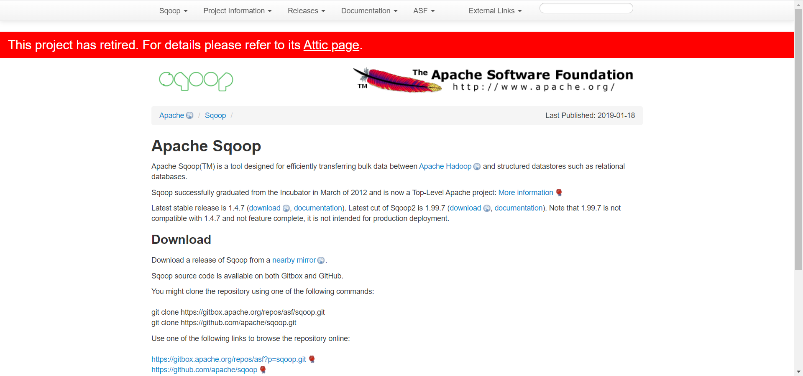
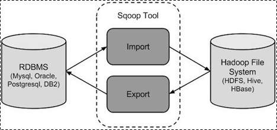
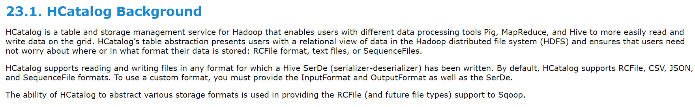
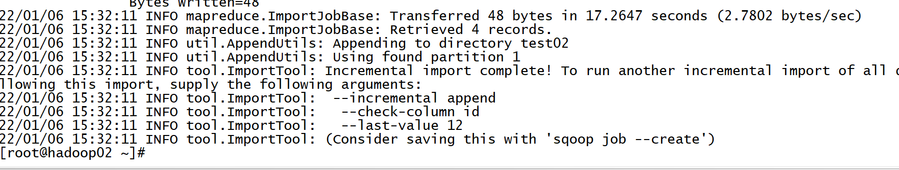
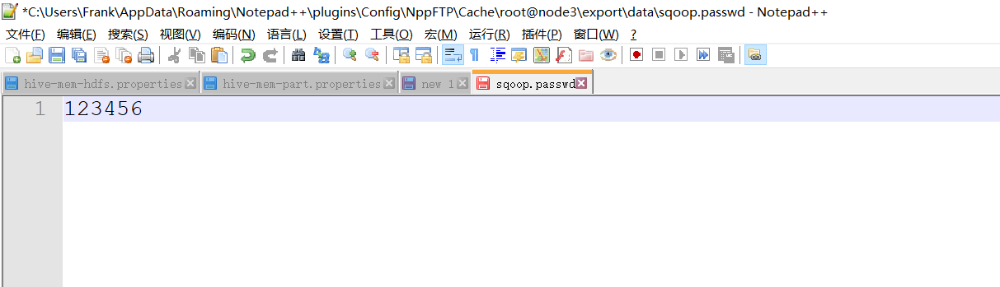
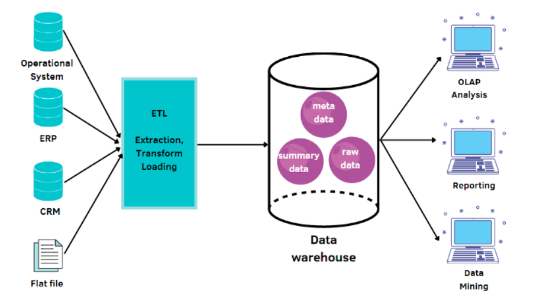
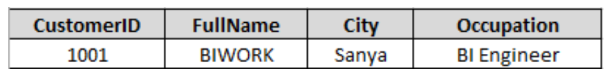

# Sqoop的使用及数仓基础

## 知识点01：课程回顾

1. 理论
   - ETL：传统的含义代表数据清洗，抽取转换加载，现在整个数仓构建过程都称为ETL过程
2. 操作
   - 项目环境启动测试完成即可
3. 问题
   - 虚拟机导入：IP不一致
     - 原因：导入时没有选择我已移动
     - 解决：删除虚拟机，重新导入
   - CM平台爆红，显示Host Monitor不可用
     - 原因：CM监控进程没有启动完善
     - 解决：先等，等了一段时间还不行就重启它
     - 建议：前期，用不到所有软件，按照顺序只启动一部分软件：ZK、HDFS、YARN、Hive
   - host映射修改不成功
     - 原因：Windows没有管理员权限
     - 解决：添加当前用户对这个文件的操作权限
4. 建议
   - 大家电脑中不要安装杀毒软件或者一些安全工具：360、腾讯电脑
     - 拦截一些程序的运行：关闭一些服务的开机自启
     - 占用大量的CPU和内存
   - 预习笔记，上课所有内容以笔记为准，课后尽量参考笔记中来复习
   - 带图问问题：尽量截图截的全一点


## 知识点02：课程目标

1. Sqoop工具的使用
   - **掌握：Sqoop的功能和场景以及了解基本原理**
   - **==掌握：Sqoop常用的命令和参数实现导入和导出==**
2. 数据仓库的设计：整个项目中理论的难点
   - **==目标：熟练回答以下问题==**
   - 什么是数据仓库？
   - 数据仓库的4大特性是什么？
   - 数据仓库中的分层和建模的功能？
   - 什么是指标，什么是维度？
   - 什么是维度建模？
   - 事实表的分类？事实指标值的分类？
   - 维度表的设计模型？
   - 渐变维度问题的解决方案？


## 知识点03：【掌握】Sqoop的功能及应用

- **目标**：**掌握Sqoop的功能及应用场景**

- **实施**

  

  - **功能**：用于**实现MySQL等RDBMS数据库与HDFS【Hive/Hbase】之间的数据导入与导出**

    

    - 导入和导出是相对HDFS而言的
    - 导入：从MySQL导入到HDFS
    - 导出：从HDFS导出到MySQL
    - 抽取：将A的数据同步到B里面
      - A：读取A数据
      - B：写入B数据

  - **本质**

    - 底层就是MapReduce程序

      - Input：负责程序输入的，从哪里读取数据由InputFormat决定
      - Map：负责数据处理，由Mapper类的map方法决定
      - Shuffle：负责分区、排序、分组
      - Reduce：负责数据处理【聚合】，有Reducer类的reduce方法决定
      - Output：负责程序输出的，将结果保存到什么地方由OutputFormat
      - Sqoop导入程序：底层MR将数据库的数据读取，写入HDFS
        - InputFormat：DBInputFormat：负责通过JDBC读取RDBMS
        - OutputFormat：TextOutputFormat：将数据写入HDFS
      - Sqoop导出程序：底层MR读HDFS文件的数据，写入RDBMS
        - InputFormat：TextInputFormat：读取HDFS文件
        - OutputFormat：DBOutputFormat：将数据写入RDBMS

    - **将Sqoop的程序转换成了MapReduce程序，提交给YARN运行，实现分布式采集**

      

      - 问题：Sqoop的程序转换成的MR程序中一般有没有Shuffle 和 Reduce?
        - 一般都没有Shuffle和Reduce，Input -》Map -》 Output

  - **特点**

    - 必须依赖于Hadoop：MapReduce + YARN
    
  - **场景**

    - MapReduce是离线计算框架，Sqoop离线数据采集的工具，只能适合于**离线数据库分布式采集的业务平台**

  - **应用**

    - **数据同步**：定期将离线的数据进行采集同步到数据仓库中
    - **数据迁移**：将历史数据【MySQL、Oracle】存储到HDFS中

  - **测试**

    - 登陆hadoop01的MySQL中

      ```
      mysql -uroot -p
      ```

      - 密码：123456

    - MySQL创建数据库**【在MySQL中执行】**

      ```sql
      create database sqoopTest;
      use sqoopTest;
      ```

    - MySQL创建数据表**【在MySQL中执行】**

      ```sql
      CREATE TABLE `tb_tohdfs` (
        `id` int(11) NOT NULL AUTO_INCREMENT,
        `name` varchar(100) NOT NULL,
        `age` int(11) NOT NULL,
        PRIMARY KEY (`id`)
      ) ENGINE=InnoDB DEFAULT CHARSET=utf8;
      ```

    - MySQL插入数据**【在MySQL中执行】**

      ```sql
      insert into tb_tohdfs values(null,"laoda",18);
      insert into tb_tohdfs values(null,"laoer",19);
      insert into tb_tohdfs values(null,"laosan",20);
      insert into tb_tohdfs values(null,"laosi",21);
      insert into tb_tohdfs values(null,"laowu",22);
      insert into tb_tohdfs values(null,"laoliu",23);
      insert into tb_tohdfs values(null,"laoqi",24);
      insert into tb_tohdfs values(null,"laoba",25);
      ```

    - 需求：将MySQL中tb_tohdfs表的数据导入HDFS的/sqoop/import/test01目录中

      ```shell
      sqoop import \
      --connect jdbc:mysql://hadoop01:3306/sqoopTest \
      --username root \
      --password 123456 \
      --table tb_tohdfs \
      --target-dir /sqoop/import/test00
      ```

- **小结**

  - 掌握Sqoop的功能及应用场景

​	

## 知识点04：【掌握】Sqoop的开发规则

- **目标**：**掌握Sqoop的开发规则**

- **实施**

  - **版本**

    - sqoop1版本：单纯的工具，直接实现程序的转换的【**最常用的版本选择**】

    - sqoop2版本：基于1.x的功能之上，引入CS模式【**如果用的MySQL版本比较高，建议使用Sqoop2**】

  - **命令**：`${SQOOP_HOMW}/bin/sqoop`

  - **语法**：`sqoop help`

    ```shell
    usage: sqoop COMMAND [ARGS]
    Available commands:
      codegen            Generate code to interact with database records
      create-hive-table  Import a table definition into Hive
      eval               Evaluate a SQL statement and display the results
      export             Export an HDFS directory to a database table
      help               List available commands
      import             Import a table from a database to HDFS
      import-all-tables  Import tables from a database to HDFS
      import-mainframe   Import datasets from a mainframe server to HDFS
      job                Work with saved jobs
      list-databases     List available databases on a server
      list-tables        List available tables in a database
      merge              Merge results of incremental imports
      metastore          Run a standalone Sqoop metastore
      version            Display version information
    
    See 'sqoop help COMMAND' for information on a specific command.
    ```

  - **导入**

    ```
    sqoop import --help
    usage: sqoop import [GENERIC-ARGS] [TOOL-ARGS]
    ```

  - **导出**

    ```
    sqoop export --help
    usage: sqoop export [GENERIC-ARGS] [TOOL-ARGS]
    ```

  - **测试**

    ```shell
    sqoop list-databases --connect jdbc:mysql://hadoop01:3306 --username root --password 123456
    ```

- **小结**

  - 掌握Sqoop的开发规则


## 知识点05：【掌握】Sqoop导入HDFS

- **目标**：**掌握Sqoop导入HDFS**

- **实施**

  - **MySQL选项**

    ```properties
    --connect: 指定连接的RDBMS数据库的地址
    --username: 指定数据库的用户名
    --password: 指定数据库的密码
    --table: 指定数据库中的表
    --columns: 指定导入的列名
    --where: 指定导入行的过滤条件
    -e/--query: 指定导入数据的SQL语句，不能与--table一起使用，必须指定where条件，where中必须指定$CONDITIONS
    ```

  - **HDFS选项**

    ```properties
    --target-dir: 指定导入的HDFS路径
    --delete-target-dir: 指定如果导入的HDFS路径已存在就提前删除
    --fields-terminated-by: 指定导入HDFS的文件中列的分隔符
    ```

  - **其他选项**

    ```properties
    -m: 指定底层MapReduce程序的MapTask的个数
    --split-by: MySQL没有主键时，必须加这个参数指定多个MapTask划分数据的方式
    ```

  - **测试案例**

    - 需求1：将MySQL中tb_tohdfs表的数据导入HDFS的/sqoop/import/test01目录中

      ```shell
      sqoop import \
      --connect jdbc:mysql://hadoop01:3306/sqoopTest \
    --username root \
      --password 123456 \
    --table tb_tohdfs \
      --target-dir /sqoop/import/test01
      ```

    - 需求2：将tb_tohdfs表的id和name导入HDFS的/sqoop/import/test01目录,指定Map个数为1个

      ```shell
    sqoop import \
      --connect jdbc:mysql://hadoop01:3306/sqoopTest \
    --username root \
      --password 123456 \
      --table tb_tohdfs \
      --columns id,name \
      --delete-target-dir  \
      --target-dir /sqoop/import/test01 \
      -m 1
      ```
      
    - 需求3：将tb_tohdfs表的id和name导入HDFS的/sqoop/import/test01目录,指定Map个数为2个

      ```shell
        sqoop import \
        --connect jdbc:mysql://hadoop01:3306/sqoopTest \
        --username root \
        --password 123456 \
        --table tb_tohdfs \
        --columns id,name \
        --delete-target-dir  \
        --target-dir /sqoop/import/test01 \
        -m 2
      ```

        - 注意：指定多个MapTask时，分为两种情况

          - 情况一：如果MySQL表有主键，可以直接指定

          - 情况二：如果MySQL表没有主键，会报错，加上--split-by指定按照哪一列进行划分数据即可

            ```shell
            #ERROR tool.ImportTool: Import failed: No primary key could be found for table emp. Please specify one with --split-by or perform a sequential import with '-m 1'.
            ```

          - 删除MySQL表，重建

            ```sql
            use sqoopTest;
            drop table if exists `tb_tohdfs2`;
            CREATE TABLE `tb_tohdfs2` (
              `id` int(11) NOT NULL,
              `name` varchar(100) NOT NULL,
              `age` int(11) NOT NULL
            ) ENGINE=InnoDB DEFAULT CHARSET=utf8;
            
            insert into tb_tohdfs2 values(1,"laoda",18);
            insert into tb_tohdfs2 values(2,"laoer",19);
            insert into tb_tohdfs2 values(9,"laosan",20);
            insert into tb_tohdfs2 values(100,"laosi",21);
            insert into tb_tohdfs2 values(300,"laowu",22);
            insert into tb_tohdfs2 values(600,"laoliu",23);
            insert into tb_tohdfs2 values(700,"laoqi",24);
            insert into tb_tohdfs2 values(800,"laoba",25);
            ```

          - 执行

            ```shell
            sqoop import \
            --connect jdbc:mysql://hadoop01:3306/sqoopTest \
            --username root \
            --password 123456 \
            --table tb_tohdfs2 \
            --columns id,name \
          --delete-target-dir  \
            --split-by id \
          --target-dir /sqoop/import/test01 \
            -m 2
            ```

    - 需求4：将tb_tohdfs表中的id >4的数据导入HDFS的/sqoop/import/test01目录中，并且用制表符分隔

        ```shell
        sqoop import \
      --connect jdbc:mysql://hadoop01:3306/sqoopTest \
        --username root \
      --password 123456 \
        --table tb_tohdfs \
        --where 'id > 4' \
        --delete-target-dir  \
        --target-dir /sqoop/import/test01 \
        --fields-terminated-by '\t' \
        -m 1
      ```

    - 需求5：将tb_tohdfs表中的id>4的数据中id和name两列导入/sqoop/import/test01目录中

      ```shell
      # 方式一：指定条件
      sqoop import \
      --connect jdbc:mysql://hadoop01:3306/sqoopTest \
      --username root \
      --password 123456 \
      --table tb_tohdfs \
      --columns id,name \
    --where 'id > 4' \
      --delete-target-dir \
    --target-dir /sqoop/import/test01 \
      --fields-terminated-by '\t' \
      -m 1
      
      # 方式二：使用SQL
      sqoop import \
      --connect jdbc:mysql://hadoop01:3306/sqoopTest \
      --username root \
      --password 123456 \
      -e 'select id,name from tb_tohdfs where id > 4 and $CONDITIONS' \
      --delete-target-dir \
      --target-dir /sqoop/import/test01 \
      --fields-terminated-by '\t' \
    -m 1
      ```

- **小结**

  - Sqoop导入HDFS的常用选项有哪些？
  
      - 数据库
          - --connect
          - --username
          - --password
          - --table
          - --where
          - --column
          - -e/--query
      - HDFS
          - --target-dir
          - --delete-target-dir
          - --fields-terminated-by
      - 其他
          - -m
          - --split-by
  
      

## 知识点06：【掌握】Sqoop导入Hive

- **目标**：**掌握Sqoop导入Hive**

- **实施**

  - **MySQL选项**

    ```properties
    --connect: 指定连接的RDBMS数据库的地址
    --username: 指定数据库的用户名
    --password: 指定数据库的密码
    --table: 指定数据库中的表
    --columns: 指定导入的列名
    --where: 指定导入的条件
    -e/--query: 指定导入数据的SQL语句，不能与--table一起使用，必须指定where条件，where中必须指定$CONDITIONS
    ```

  - **Hive选项**

    ```properties
    --hive-import: 指定导入数据到Hive表
    --hive-database: 指定原生方式导入Hive的数据库名称
    --hive-table: 指定原生方式导入的Hive的表名
    --hcatalog-database: 指定使用hcatalog方式导入Hive的数据库名称
    --hcatalog-table: 指定使用hcatalog方式导入Hive的数据库名称
    ```

  - **测试案例**

    - 需求：将MySQL中tb_tohdfs同步到Hive的default数据库下的fromsqoop表中

    - 方式一：old API ，先建表，将数据采集到Hive表中【不常用】

      ```shell
      # Hive中建表
      use default;
      drop table if exists fromsqoop2;
      create table fromsqoop2(
      id int,
      name string,
      age int
      ) row format delimited fields terminated by '\t';
      # 同步
      sqoop import \
      --connect jdbc:mysql://hadoop01:3306/sqoopTest \
      --username root \
      --password 123456 \
      --table tb_tohdfs \
      --hive-import \
      --hive-database default \
      --hive-table fromsqoop2 \
      --fields-terminated-by '\t' \
      -m 1
      ```
      
    - 注意：采集到Hive时，默认分隔符是\001，如果Hive表不是默认分隔符，采集时一定要指定
    
    - **方式二：new API 使用hcatalog方式，将数据同步到Hive表**【主要使用的方式】
    
      ```shell
      # Hive中建表
      use default;
      drop table if exists fromsqoop3;
      create table fromsqoop3(
      id int,
      name string,
      age int
      ) row format delimited fields terminated by '\t';
      # 同步
      sqoop import \
      --connect jdbc:mysql://hadoop01:3306/sqoopTest \
      --username root \
      --password 123456 \
      --table tb_tohdfs \
      --hcatalog-database default \
      --hcatalog-table fromsqoop3 \
      -m 1
      ```
  
- **Hcatalog**
  
  ```
    Apache HCatalog是基于Apache Hadoop之上的数据表和存储管理服务。
    - 提供一个共享的模式和数据类型的机制。
    - 抽象出表，使用户不必关心他们的数据怎么存储，底层什么格式。
    - 提供可操作的跨数据处理工具，如Pig，MapReduce，Streaming，和Hive。
  ```
  
    - Sqoop中Hcatalog：https://sqoop.apache.org/docs/1.4.7/SqoopUserGuide.html#_sqoop_hcatalog_integration
  
      
  
    - 与原生方式的区别
  
      | 区别     | 原生方式【--hive】         | Hcatalog方式[--hcatalog]                        |
      | -------- | -------------------------- | ----------------------------------------------- |
      | 数据格式 | 较少                       | 支持多种特殊格式：orc/rcfile/squencefile/json等 |
      | 导入方式 | 允许覆盖                   | 不允许覆盖，只能追加                            |
      | 字段匹配 | 顺序匹配，字段名可以不相等 | 字段名匹配，名称必须相等                        |
  
- **小结**

  - 掌握Sqoop导入Hive


## 知识点07：【掌握】数据全量、增量、条件概念

- **目标**：**掌握数据全量与数据增量的概念**

- **实施**

  

  - **全量数据**：从开始到目前为止所有数据的集合为全量数据集
    - 第一次处理：100条数据
    - 第二次处理：200条数据
    - 第三次处理：200条数据
    - 第四次处理：400条数据
    - 为了避免数据重复：一般都是覆盖
  - **增量数据**：从上一次之后到这一次开始之间数据集合为增量数据集【新增的或者更新的】
    - 第一次处理：100条数据
    - 第二次处理：100条数据
    - 第三次处理：0条数据
    - 第四次处理：200条数据
    - 为了避免数据丢失：一般都是追加
    - 大数据系统中大多数情况下都是增量
  - **条件数据**：符合某种条件的数据集合为条件数据集【增量的将age=20的数据进行采集】
    - 第一次处理：50条
    - 第二次处理：50条
    - 第三次处理：0条
    - 第四次处理：100条

- **小结**

  - 掌握数据全量与数据增量的概念


## 知识点08：【掌握】Sqoop增量导入

- **目标**：**掌握Sqoop的增量导入**

- **实施**

  - **增量需求**:T+1，今天处理昨天的数据，第二天采集第一天数据

    - 第一天

      - Hive：空的

      - MySQL：MySQL产生数据1,2,3,4

        ```
        |  1 | laoda  |  18 |
        |  2 | laoer  |  19 |
        |  3 | laosan |  20 |
        |  4 | laosi  |  21 |
        ```

    - 第二天

      - Hive：采集第一天的数据

        ```
        |  1 | laoda  |  18 |
        |  2 | laoer  |  19 |
        |  3 | laosan |  20 |
        |  4 | laosi  |  21 |
        ```

      - MySQL：MySQL产生数据5,6,7,8

        ```
        |  1 | laoer  |  18 |
        |  2 | laoer  |  19 |
        |  3 | laosan |  20 |
        |  4 | laosi  |  21 |
        |  5 | laowu  |  22 |
        |  6 | laoliu |  23 |
        |  7 | laoqi  |  24 |
        |  8 | laoba  |  25 |
        ```

    - 第三天

      - Hive：采集第二天的数据
      - 问题1：Hive是只采集5,6,7,8，还是需要把1,2,3,4,5,6,7,8都采集一遍？
        - 数据量大，变量比较频繁的数据，一定是做增量的
        - 只要增量的采集5,6,7,8即可
      - 问题2：你怎么知道这些数据是昨天的？
        - 增量的实现，必须一个判断条件

    - **设计：每次记录这一次采集这一列的值，用于对某一列值进行判断，只要大于上一次的值就会被导入**

    - **需求：将昨天的新增的和更新的数据都进行采集**

      - 情况一：只有新增，没有更新【只采集新增】
        - 用户登录信息表
        - 用户浏览信息表
        - ……
      - 情况二：既有新增，也有更新【都要采集】
        - 订单表：订单状态可能发生更新

  - **Sqoop自带方式**

    ```
    Incremental import arguments:
    --check-column <column>        Source column to check for incrementalchange
    --incremental <import-type>    Define an incremental import of type 
    								'append' or 'lastmodified'
    --last-value <value>           Last imported value in the incremental
    								check column
    ```

    - --check-column：以哪一列的值作为增量的基准

    - --last-value：指定上一次这一列的值是什么

    - --incremental：指定增量的方式

  - **Append方式测试**

    - 要求：必须有一列自增的值，按照自增的int值进行判断

    - 特点：只能导入新增的数据，**无法导入更新的数据**

    - 场景：数据只会发生新增，不会发生更新的场景

    - 测试

      - 第一次导入

        ```shell
        sqoop import \
        --connect jdbc:mysql://hadoop01:3306/sqoopTest \
        --username root \
        --password 123456 \
        --table tb_tohdfs \
        --target-dir /sqoop/import/test02 \
        --fields-terminated-by '\t' \
        --check-column id \
        --incremental append \
        --last-value 0 \
        -m 1
        ```

      - 第二次产MySQL生新的数据

        ```sql
        insert into tb_tohdfs values(null,"laowu",22);
        insert into tb_tohdfs values(null,"laoliu",23);
        insert into tb_tohdfs values(null,"laoqi",24);
        insert into tb_tohdfs values(null,"laoba",25);
        ```

      - 第二次导入

        ```shell
        sqoop import \
        --connect jdbc:mysql://hadoop01:3306/sqoopTest \
        --username root \
        --password 123456 \
        --table tb_tohdfs \
        --target-dir /sqoop/import/test02 \
        --fields-terminated-by '\t' \
        --incremental append \
        --check-column id \
        --last-value 8 \
        -m 1
        ```

      
      
      

  - **Lastmodified方式测试**

    - 要求：**必须包含动态时间变化这一列**，按照数据变化的时间进行判断

    - 特点：既导入新增的数据也导入更新的数据

    - 场景：工作中一般用不到，无法满足要求

    - 测试

      - MySQL中创建测试数据

        ```sql
        -- MYSQL中创建测试表
        CREATE TABLE `tb_lastmode` (
        `id` int(11) NOT NULL AUTO_INCREMENT,
          `word` varchar(200) NOT NULL,
        `lastmode` timestamp NOT NULL DEFAULT CURRENT_TIMESTAMP  ON UPDATE CURRENT_TIMESTAMP,
          PRIMARY KEY (`id`)
        ) ENGINE=InnoDB DEFAULT CHARSET=utf8;
        -- MYSQL中插入测试数据
        insert into tb_lastmode values(null,'hadoop',null);
        insert into tb_lastmode values(null,'spark',null);
        insert into tb_lastmode values(null,'hbase',null);
        ```

      - 第一次采集

        ```shell
        sqoop import \
        --connect jdbc:mysql://hadoop01:3306/sqoopTest \
        --username root \
        --password 123456 \
        --table tb_lastmode \
        --target-dir /sqoop/import/test03 \
        --fields-terminated-by '\t' \
        --incremental lastmodified \
        --check-column lastmode \
        --last-value '2022-01-01 00:00:00' \
        -m 1
        ```

      - 数据发生变化

        ```sql
        insert into tb_lastmode values(null,'hive',null);
        update tb_lastmode set word = 'sqoop' where id = 1;
        ```

      - 第二次采集 

        ```shell
        sqoop import \
        --connect jdbc:mysql://hadoop01:3306/sqoopTest \
        --username root \
        --password 123456 \
        --table tb_lastmode \
        --target-dir /sqoop/import/test03 \
        --fields-terminated-by '\t' \
        --merge-key id \
        --incremental lastmodified \
        --check-column lastmode \
        --last-value '2022-03-12 16:53:38' \
        -m 1
        ```

        - --merge-key：将相同ID的数据进行合并

  - ==**条件过滤方式测试**==

    - 由于Append和Lastmodified的场景有限，工作中会见到使用条件过滤的方式来实现增量采集

    - 数据内容

      ```
      id		name		age			……		createTime		updateTime
      ```

      - createTime：数据产生的时间
      - updateTime：数据更新的时间

    - 实现采集：今天采集昨天的数据

      ```shell
      sqoop import \
      --connect jdbc:mysql://hadoop01:3306/sqoopTest \
      --username root \
      --password 123456 \
      -e 'select * from tb_tohdfs where substr(create_time,1,10) = 昨天的日期 or substr(update_time,1,10) = 昨天的日期  and $CONDITIONS' \
      --target-dir /sqoop/import/昨天的日期 \
      --fields-terminated-by '\t' \
      -m 1
      ```

- **小结**

  - 掌握Sqoop的增量导入


## 知识点09：【掌握】Sqoop全量导出

- **目标**：**掌握Sqoop全量导出**

- **实施**

  - 导出：从HDFS读取数据写入MySQL

  - 场景：在数据仓库中的统计分析的结果都在Hive中，最后需要做报表，报表工具一般都支持MySQL

    - 问题：需要做报表的数据在Hive中，必须放入MySQL中才能做报表
    - 解决：将Hive中的数据导出到MySQL中

  - **MySQL选项**

    ```properties
    --connect: 指定连接的RDBMS数据库的地址
    --username: 指定数据库的用户名
    --password: 指定数据库的密码
    --table: 指定数据库中的表
    ```

  - **HDFS选项**

    ```properties
    --export-dir: 指定导出的HDFS路径
    --input-fields-terminated-by: 指定导出的HDFS文件的列的分隔符
    ```

  - **Hive选项**

    ```properties
    --hcatalog-database: 指定使用hcatalog方式导入Hive的数据库名称
    --hcatalog-table: 指定使用hcatalog方式导入Hive的数据库名称
    ```

  - **准备数据**

    - MySQL中建表

      ```sql
      use sqoopTest;
      CREATE TABLE `tb_url` (
        `id` int(11) NOT NULL,
        `url` varchar(200) NOT NULL,
        PRIMARY KEY (`id`)
      ) ENGINE=InnoDB DEFAULT CHARSET=utf8;
      ```

    - Linux上创建测试文件

      ```shell
      # hadoop01上创建这个文件
      mkdir -p /export/data
      vim /export/data/url.txt
      1	http://facebook.com/path/p1.php?query=1
      2	http://www.baidu.com/news/index.jsp?uuid=frank
      3	http://www.jd.com/index?source=baidu
      ```

    - Hive中建表

      ```sql
      -- Hive中建表
      use default;
      create table tb_url(
      id int,
      url string
      ) row format delimited fields terminated by '\t';
      -- 加载数据到Hive表
      load data local inpath '/export/data/url.txt' into table tb_url;
      ```

  - **测试案例**

    - 需求1：将HDFS的某个目录下的数据导出到MySQL

      ```shell
      sqoop export \
      --connect  jdbc:mysql://hadoop01:3306/sqoopTest \
      --username root \
      --password 123456 \
      --table tb_url \
      --export-dir /user/hive/warehouse/tb_url \
      --input-fields-terminated-by '\t' \
      -m 1 
      ```

    - 需求2：将Hive的某张表的数据导出到MySQL

      ```shell
    sqoop export \
      --connect  jdbc:mysql://hadoop01:3306/sqoopTest \
      --username root \
      --password 123456 \
      --table tb_url \
      --hcatalog-database default \
      --hcatalog-table tb_url \
      --input-fields-terminated-by '\t' \
      -m 1 
      ```

- **小结**

  - 掌握Sqoop全量导出


## 知识点10：【掌握】Sqoop增量导出

- **目标**：**掌握Sqoop增量导出**

- **实施**

  - **增量导出场景**

    - Hive中有一张结果表：存储每天分析的结果

      ```shell
      # Hive第一天：10号处理9号
      id		daystr			UV 			PV			IP
      1		2020-11-09		1000		10000		500
      
      # Hive第二天：11号处理10号
      id		daystr			UV 			PV			IP
      1		2020-11-09		1000		10000		500
      2		2020-11-10		2000		20000		1000
      ```

    - MySQL：存储每一天的结果

      ```shell
      # MySQL第一天：存储Hive导出的9号的结果
      1		2020-11-09		1000		10000		500
      
      # MySQL第二天：存储Hive导出的10号的结果
      ```

    - 问题：第二天是全量导出到MySQL还是增量导出到MySQL？

      - 增量导出，只导出最新的结果，MySQL已有的就不再导出了

  - **增量导出方式**

    - updateonly：只增量导出更新的数据，不能同步新增的数据
    - **allowerinsert**：既导出更新的数据，也导出新增的数据

  - **updateonly**【场景：数据没有新增，只有更新】

    - 修改url.txt数据

      ```
      1	http://www.itcast.com/path/p1.php?query=1
      2	http://www.baidu.com/news/index.jsp?uuid=frank
      3	http://www.jd.com/index?source=baidu
      4	http://www.heima.com
      ```

    - 重新加载覆盖

      ```
      load data local inpath '/export/data/url.txt' overwrite into table tb_url;
      ```

    - 增量导出

      ```shell
      sqoop export \
      --connect jdbc:mysql://hadoop01:3306/sqoopTest \
      --username root \
      --password 123456 \
      --table tb_url \
      --export-dir /user/hive/warehouse/tb_url \
      --input-fields-terminated-by '\t' \
      --update-key id \
      --update-mode updateonly \
      -m 1
      ```

  - ==**allowerinsert**==

    - 修改url.txt

      ```
      1	http://bigdata.itcast.com/path/p1.php?query=1
      2	http://www.baidu.com/news/index.jsp?uuid=frank
      3	http://www.jd.com/index?source=baidu
      4	http://www.heima.com
      ```

    - 覆盖表中数据

      ```
      load data local inpath '/export/data/url.txt' overwrite into table tb_url;
      ```

    - 增量导出

      ```shell
      sqoop export \
      --connect jdbc:mysql://hadoop01:3306/sqoopTest \
      --username root \
      --password 123456 \
      --table tb_url \
      --export-dir /user/hive/warehouse/tb_url \
      --input-fields-terminated-by '\t' \
      --update-key id \
      --update-mode allowinsert \
      -m 1
      ```

- **小结**

  - 掌握Sqoop增量导出


## 知识点11：【了解】Sqoop Job的使用

- **目标**：**了解Sqoop Job的使用**

- **实施**

  - **工作中：项目中所有程序最终要自动化执行**

  - **增量导入的问题**

    - 增量导入每次都要手动修改上次的值执行，怎么解决？

      ```shell
      sqoop import \
      --connect jdbc:mysql://hadoop01:3306/sqoopTest \
      --username root \
      --password 123456 \
      --table tb_tohdfs \
      --target-dir /sqoop/import/test04 \
      --fields-terminated-by '\t' \
      --incremental append \
      --check-column id \
      --last-value 4 \
      -m 1
      ```

  - **Sqoop Job的使用**

    - MySQL插入数据

      ```sql
      insert into tb_tohdfs values(null,'laojiu',26);
      insert into tb_tohdfs values(null,'laoshi',27);
      ```

    - 创建job

      ```shell
      sqoop job --create job01 \
      -- import \
      --connect jdbc:mysql://hadoop01:3306/sqoopTest \
      --username root \
      --password 123456 \
      --table tb_tohdfs \
      --target-dir /sqoop/import/test04 \
      --fields-terminated-by '\t' \
      --incremental append \
      --check-column id \
      --last-value 12 \
      -m 1
      ```

      - 创建job，不会运行程序，只是在元数据中记录信息

    - 列举job

      ```
      sqoop job --list
      ```

    - 查看job的信息

      ```
      sqoop job --show jobName
      ```

    - 运行job

      ```
      sqoop job --exec jobName
      ```

    - 删除job

      ```
      sqoop job --delete jobName
      ```

- **小结**

  - 了解Sqoop Job的使用


## 知识点12：【理解】Sqoop密码问题

- **目标**：**理解Sqoop的密码问题**

- **实施**

  - 如何解决手动输入密码和密码明文问题？

  - 方式一：在sqoop的sqoop-site.xml中配置将密码存储在客户端中

  - 方式二：将密码存储在文件中，通过文件的权限来管理密码

    ```shell
    sqoop job --create job02 \
    -- import \
    --connect jdbc:mysql://hadoop01:3306/sqoopTest \
    --username root \
    --password-file file:///export/data/sqoop.passwd \
    --table tb_tohdfs \
    --target-dir /sqoop/import/test05 \
    --fields-terminated-by '\t' \
    --incremental append \
    --check-column id \
    --last-value 4 \
    -m 1
    ```

    - --password-file：密码文件的路径，默认读取的是HDFS文件，这个文件中只能有一行密码

      

- **小结**

  - 理解Sqoop的密码问题


## 知识点13：【了解】OLTP与OLAP业务场景

- **目标**：**了解OLTP与OLAP的业务场景**
- **实施**
  - 需求 -》场景 -》 存储模型 -》 工具
  - 工作中两种需求
    - 需求1：希望能将数据存储下来，供用户实现业务操作
      - 公司：电商
      - 业务：用户在公司的平台上买东西
        - step1：用户注册，将用户账号信息进行存储，供用户登陆使用
        - step2：浏览商品，将所有商品的信息进行存储，供用户查询浏览
        - step3：提交订单，将用户的订单信息进行存储，供用户查询订单
      - 场景：OLTP
    - 需求2：对数据进行统计分析处理，供公司提供数据支持
      - 公司：电商
      - 运营：用户量、订单量、复购率、退款率、广告点击率
        - step1：将所有数据进行存储
        - step2：对所有数据进行处理
        - step3：将处理好的结果进行应用
      - 场景：OLAP
  - **OLTP**：联机事务处理
    - 场景：为了满足公司的买卖的业务场景，而给用户提供了注册、登录、订单等功能，为了实现这些功能而存储了数据
      - **目的**：将数据**存储下来**，支撑业务需求
    - 数据的使用者：**客户**【对外】
    - 特点
      - 业务性数据管理和存储
      - 读写速度：快
      - 满足事务性的需求：数据一致性
      - 数据量相对较小
    - 数据管理模型：数据库管理模型
    - 工具：一般选用关系型数据库来实现：MySQL、Oracle
  - **OLAP**：联机分析处理
    - 场景：为了满足运营决策的需求，将公司各种各样的数据，实现数据的统一化管理和应用
      - 目的：数据处理**分析**：**数据应用**
    - 数据的使用者：**运营、运维、领导层、数据分析师**【对内】
    - 特点
      - 读写速度要求：按照一定时间周期进行处理，每个小时，每天
      - 数据量：非常庞大
      - 事务性的需求：不需要
    - 数据管理模型：数据仓库管理模型
    - 工具：一般使用专业数据仓库工具来实现：Hive、GreepNum
- **小结**
  - 了解OLTP与OLAP的业务场景


## 知识点14：【掌握】数据仓库的功能及场景

- **目标**：**掌握数据仓库的功能及应用场景**

- **实施**

  

  - **功能**：为了**满足OLAP场景**下的数据管理需求
    - 存储：管理数据，将公司中所有数据进行统一化的存储管理
    - 处理：数据分析，将各种原始数据进行规范化的处理，提供给各个需求方
  - **本质**：是一种分布式、统一化的、规范化的数据管理的设计模型
  - **目地**：为了满足OLAP场景，提供整个公司所有数据的支持
    - 运营：订单分析、转化分析判断广告投放效果
    - 运维：日志分析、资源使用分析错误发生原因
  - **应用**：满足企业中所有数据的统一化存储，通过规范化的数据处理来实现企业的数据分析应用

- **小结**

  - 掌握数据仓库的功能及应用场景


## 知识点15：【掌握】数据仓库的四大特性

- **目标**：**掌握数据仓库的四大特点**

- **实施**

  - **面向主题**：按照主题划分数据的应用需求

    - 数据库：面向业务

      - 人事部门：人事管理系统：人事数据库管理系统中
        - 在职人员信息表
        - 离职人员信息表
      - 财务部门：财务管理系统：财务数据库管理系统中
        - 工资信息表
        - 报税信息表
        - 收入信息表

    - 数据仓库【DW】：面向主题，【存储整个公司所有数据】

      - 数据**主题**：各个应用对应的主题【某一个具体的报表需求的数据】

        ```
        订单明细主题报表
        订单回退主题报表
        年度财务收入主题报表
        在职人员社保主题报表
        ```

  - **数据集成**：存储整个公司所有数据，为公司所有数据的需求方提供数据

    - 数据仓库既不会生产数据，也不消费数据

  - **非易失/稳定性**：按照数据仓库的业务需求，没有更新和删除的业务

    - 数据进入数据仓库以后，不会轻易的修改或者删除某条数据
    - Hive数据仓库：delete/update => 改变数据的真实性
    - 一般只有insert：Hive中采集了一个订单的数据，MySQL中该订单发生了变化，第二天采集，更新的订单也会被采集
      - Hive中这条订单之前的数据和最新的数据都会进行存储，每条数据都代表了这条订单在对应时间下的状态

  - **时变性/动态性**：数据仓库中会按照时间，记录时间发生变化的数据状态

    - 离线数仓业务需求：T+1
    - Hive一般选用时间作为分区字段

- **小结**

  - 数据仓库的四大特性分别是什么？
    - 面向主题
    - 集成化的
    - 非易失的
    - 时变性


## 知识点16：【理解】数据仓库的三大核心

- **目标**：**理解数据仓库的三大核心**

- **实施**

  - **ETL**：整个数仓的处理都是ETL

    - 功能：Extract、Transform、Load：抽取、转换、加载，将原始数据根据需求进行处理，将处理好的数据加载
    - 实现：过滤、转换、补全

    - 开发操作

  - **分层**：决定数据的规范性

    - 本质：决定了数据仓库中数据库的设计

    - 目的：**将各种数据的处理流程进行规范化**

      - 不分层：各种数据来源各种数据表，不同表经过不同的处理流程来得到结果
      - 数据仓库中所有数据表非常混乱
      - 做分层：所有数据在处理的时候，都会按照固定的步骤来实现
        - 规范化数据从进入数仓一直到被使用，每个环节每个流程进行规范

    - 实现：数据仓库是用Hive进行构建的，分层是通过数据库来实现的

      - 常见分层：ODS【存放所有原始数据】，DW【将原始数据转换成应用数据】，APP【对外提供所有数据应用】

      - 每一层的表就放入对应层次的数据库中

        ```
        create database if not exists yp_ods;
        ```

  - **建模**：决定了数据存储的方式

    - **本质：决定了数据仓库中每一层表的设计**
    - 功能：将数据按照一定的规范存储在不同的表中
    - 实现：使用建模方法论来实现数据存储模型

- **小结**

  - 理解数据仓库的三大核心


## 知识点17：【理解】数仓建模：指标概念

- **目标**：**理解数据仓库建模中指标的概念**
- **实施**
  - **OLAP最终的目的：发现公司的一些问题，提高转换，合理的决策和运营，为公司提高效益，提高ROI**
    - 怎么知道公司存在问题呢？
    - 现象1：明明花钱投放了广告，怎么知道有没有效果？
      - 广告点击率、广告来源用户数、注册数、订单数
- 现象2：用户量上去了，但是怎么知道有没有下订单？
    - 现象3：订单量上去了，但是怎么知道有没有挣钱？
  - **指标的设计**
    - 概念：对数据统计分析得到的结果，就是指标，**是一个度量值**，也称为指数
    - 功能：通过指标来衡量事实的结果，**反映事实的好坏**
    - 例如
      - 每天的用户量
      - 每个城市的订单总金额
      - 所有用户的性别比例
      - 每个视频的播放次数、转发次数、点赞量
    - 注意：不同行业的业务指标需求不一样
      - 电商行业：订单金额、订单个数、退款个数
      - 视频行业：播放量、点击量、评论量、点赞量、转发量
      - 游戏行业：活跃用户、留存用户、二次付费用户人数、关卡通过时间、升级时长
      - 教育行业：出勤率、及格率
      - 金融行业：还款率、贷款总金额、还款总金额、总利息
    - 神策：商业化大数据分析平台
- **小结**
  
  - 理解数据仓库建模中指标的概念


## 知识点18：【了解】数仓建模：常见指标

- **目标**：**了解数仓建模中的常见指标**

- **实施**

  - **数据内容**

    ```
    stime					sessionId	userid		url				refere_url		ip
    2022-01-01 12:00:00		s001		u001		www.baidu.com	-				192.168.99.1
    2022-01-01 12:00:09		s001		u001		map.baidu.com	www.baidu.com	192.168.99.1
    2022-01-01 12:00:09		s002		u002		www.baidu.com	-				192.168.99.2
    2022-01-01 12:00:10		s002		u002		www.jd.com		www.baidu.com	192.168.99.2
    2022-01-01 12:01:30		s001		u001		news.baidu.com	map.baidu.com	192.168.99.1
    2022-01-01 12:40:09		s003		u001		www.baidu.com	-				192.168.99.1
    ```

  - **PV**：Page  View，页面访问量

    - 计算：只要用户访问一个页面，PV就计1次

    - 数据：url，用户在访问的页面

    - 实现

      ```
      select count(url) as pv from table;
      ```

      

  - **UV**：Unique View，唯一访问数，用户访问数

    - 计算：每个用户算作一个UV

    - 数据：userid，每个用户的id是唯一的

    - 实现

      ```
      select count(distinct userid) as uv from table;
      ```

      

  - **IP**：统计IP的个数

    - 计算：统计所有IP个数

    - 数据：ip 

    - 实现

      ```
      select count(distinct ip) as ip_cnt from table;
      ```

      

  - **跳出率**：会话跳出率

    - 计算：会话中只访问了一个页面的会话个数 / 总的会话个数

    - 数据：sessionId

    - 实现

      ```
      with tmp as (
      -- 计算每个会话访问的PV
      select 
      	sessionId,
      	count(url) as pv
      from table
      group by sessionId
      )
      select 
      	count(case when pv = 1 then sessionId else null end) / count(sessionId)
      from tmp;
      ```

      

  - **二跳率**：会话二跳率

    ```
    with tmp as (
    -- 计算每个会话访问的PV
    select 
    	sessionId,
    	count(url) as pv
    from table
    group by sessionId
    )
    select 
    	count(case when pv > 1 then sessionId else null end) / count(sessionId)
    from tmp;
    ```

    

  - **平均访问时长**：每个会话代表每次访问平均访问时间

    - 计算：每个会话的访问时间之和 / 总的会话个数

    - 数据：sessionId，s_time

    - 实现

      ```
      with tmp as (
      -- 先求出每个会话访问时间
      select
      	sessionId,
      	max(s_time) - min(s_time) as staylong
      from table
      group by sessionId
      )
      select
      	sum(staylong) / count(sessionId)
      from tmp;
      ```

- **小结**

  - 了解数仓建模中的常见指标


## 知识点19：【理解】数仓建模：维度概念

- **目标**：**理解数仓建模中维度的概念**

- **实施**

  - **维度的概念**
    - ==用于描述事实【指标】的角度==
    - 大数据分析目的：发现问题，调整方案，支撑运营和决策的
    - 指标如果不基于组合维度进行分析得到，这个指标是没有意义的
    
  - **维度的功能**

    - 基于组合维度来更加**细化我们的指标**，来更加精确的发现问题

    - 现象：去年订单总营业额2000万，今年订单总营业额2000万

    - 问题：为什么今年营业额没有增长？

  - **实现：开发**
      - 统计今年每个城市的营业额增长率【时间、城市】
          - 去年每个城市的营业额都是100万
          - 今年每个城市的营业额还是100万或者10个城市营业额增长，另外10个城市营业额下降了
      - 统计今年每个月的营业额增长率【时间】
        - 大部分月份营业额都有增长，部分月份营业额下降
      - 统计今年每个商品分类的营业额增长率【商品】
        - 这几个月有一批商品质量非常差，退货率很高

  - **理解**
    
    - 需求：统计每天每个城市每种商品的订单个数、订单金额
    
      - 指标：订单个数、订单金额
      - 维度：就是分组字段：天、城市、商品
    
    - 实现代码
    
      ```
      select
      	daystr,
      	city,
      	pid,
      	count(orderId) as order_cnt,
      	sum(order_price) as order_amt
      from table
      group by daystr,city,pid;
      ```

- **小结**

  - 理解数仓建模中维度的概念


## 知识点20：【了解】数仓建模：常见维度

- **目标**：**了解数仓建模中的常见维度**
- **实施**
  - **常见维度**
    - 维度一般是固定的：很少发生变化，不同的行业需求的维度是不一样的
    - **时间维度**：年、季度、月、周、天、小时
    - **地区维度**：国家、省份、城市、乡镇
    - 平台维度：网站、APP、小程序、H5
    - 操作系统维度：Windows、Mac OS、Android、IOS
    - 类别维度：家电、服饰、数码
    - 来源维度：搜索引擎、广告平台、导航网站
    - …… 
  - **下钻与上卷**
    - 特殊维度分级：粗细粒度
      - 时间维度：年、季度、月、周、天、小时
      - 地区维度：国家、省份、市区、县区、乡镇
    - 下钻：当前基于一个粗粒度的维度进行分析，要下钻到一个更细的维度进行分析
    - 上卷：当前我的分析是基于一个小的维度的进行分析，要上卷到一个大的颗粒维度来进行分析
- **小结**
  - 了解数仓建模中的常见维度


## 知识点21：【了解】数仓建模：ER建模

- **目标**：**了解数仓建模中的ER建模**

- **实施**

  - **ER建模的应用**

    - 实体关系模型
    - 一般应用于OLTP的关系型数据库系统来实现业务数据库的建模，实现满足业务的数据存储
    - 思想：实现业务存储、**通过外键构建数据关联关系、避免冗余存储，记录事件的产生**

  - **ER建模的角色**

    - 实体、属性、关系

  - **ER建模的流程**

    ```sql
    -- step1：找到业务关系中所有实体，以及每个实体的属性
    -- step2：找到所有实体之间的关系
    -- step3：建表，每个实体与每个关系都是一张表
    ```

  - **ER建模的示例**：小明在沃尔玛买了一双800块的鞋【记录这件事情】

    - 实体&属性
      - 小明：用户实体，用户id、用户名称、用户性别……
      - 沃尔玛：店铺实体，店铺id、店铺名称、店铺位置
      - 鞋：商品实体，商品id、商品名称、尺寸、颜色、大小、价格
    - 关系
      - 用户在商店购买商品 =》 订单关系
      - 商品与店铺之间关系
    - 建表
      - 用户表
      - 店铺表
      - 商品表
      - 订单表

    - **特点**

      - 优点：符合数据库的设计规范，没有冗余数据，保证性能，业务的需求把握的比较全面
      - 缺点：设计时候非常复杂，必须找到所有实体和关系，才能构建

- **小结**

  - 了解数仓建模中的ER建模


## 知识点22：【掌握】数仓建模：维度建模

- **目标**：**掌握数仓建模中的维度建模**

- **实施**

  - **维度建模的应用**

    - ==一般应用于**大数据的数据仓库的模型构建**，用于**通过不同维度来反映事情的好坏**==

  - **维度建模的角色**

    - **维度**：基于不同维度下的指标的结果，看待指标的角度

    - **事实**：就是通过不同维度的指标来反映事实

    - **维度建模流程**

      ```sql
      -- step1：构建所有维度
      -- step2：基于维度分析事实
      ```

  - **维度建模示例**：2020年1月2日小明在沃尔玛买了 一双800块的鞋【反映这件事情的好坏、多少、贵便宜】

    - 目标：反映事实好坏

    - 事实指标有哪些？

      - 一双：个数：可以反映多少
      - 800块：金额：可以反映贵或者便宜

    - 衡量维度有哪些？

      - 2020年1月2日：时间维度
      - 小明：用户维度
      - 沃尔玛：店铺维度
      - 鞋：商品维度

    - 建模实现：每个维度可以构建一张表或者多张表，多个指标可以构建为多张或者一张事实表

      - 时间维度表：年维度表、季度维度表、月维度表、天维度表

        ```
        天				周			月			季度			年
        2020-01-02		1			1			1			2020
        ……
      ```
      
    - 商店维度表
      
      ```
        商店id	商店名称
      ```
      
      - 商品维度表
      
        ```
        商品id	商品名称	分类名称
        ```
      
      - 用户维度表
      
        ```
        用户id	用户名称
        ```
      
      - 购买主题事实表
      
        ```
        时间维度id	商店维度id	商品id	用户维度id		个数		金额
        2020-1-2	沃尔玛		鞋		小明			  1			800
        2020-1-2	沃尔玛		可乐		小明			  1			800
        2020-1-2	沃尔玛		鞋		小丽			  1			800
        ```
      
        

  - **特点**：主要为了通过数据体现事实的结果而设计，反数据库范式的设计，主要用于数据仓库

- **小结**

  - 掌握数仓建模中的维度建模


## 知识点21：【掌握】数仓建模：事实指标值分类

- **目标**：**掌握数仓建模中事实指标值的分类**
- **实施**
  - **面试题：数仓维度建模中事实指标值的分类有哪几种？**
  - **可累加类型**：基于不同的维度和统计可以直接进行累加的值
  - **半可累加类型**：在有一些维度下可以累加，在有一些维度下不可以累加
  - **不可累加类型**：在任何维度下，指标的累加是没有意义的
- **小结**
  - 掌握数仓建模中事实指标值的分类


## 知识点22：【掌握】数仓建模：事实表的分类

- **目标**：**掌握数仓建模中事实表的分类**

- **实施**

  - **面试题：事实表分为哪几种？什么是无事实事实表？**

  - **事务事实表**：原始的事务数据，业务数据

    - 订单表：每一条数据就是一个事务的产生，就代表一个订单

      ```
      orderid			userid			price			create_time		status
      1				1				100万			2022-01-01		已支付
      2				2				100万			2022-01-01		已发货
      ……
      ```

    - 数仓中最原始的数据表：ODS层

  - **周期快照事实表**：基于事务事实表按照一定的周期进行聚合

    - 月订单快照表：一条数据代表一个月订单的信息

      ```
      monthstr			total_price			order_cnt
      2022-01				1000万				10
      2022-02				1亿					10
      ```

    - 数仓中就是最后对外提供的结果表：APP层

  - **累积快照事实表**：事实的结果随着时间的变化而不断完善

    - 订单累计快照表

      ```
      orderid		userid			price	 创建时间		发货时间		签收时间		退款时间
      1			1				100万	 1-1		    1-2           1-4 
      ```

    - 年订单结果表

      ```
      yearstr		sumPrice	1		2		3		4		5	…… 	12
      2022					100万   100万
      ```

    

  - **无事实事实表**：特殊的事实表，无事实的事实表中没有度量值，只有多个维度外键，一般用于业务维度关联

    - 维度表：每种维度至少有一张表，这张表中只有这种维度的信息

      - 时间维度表：天		月		年
      - 地区维度表：上海   深圳     广州 
      - 商品维度表：火箭      大炮        AK47

    - 事实表：组合维度 + 指标

      - 销售主题事实表

        ```
        时间		地区			商品			个数			金额
        1-2      深圳			 火箭           10            1亿
        ```

    - 需求：列举1-2号深圳哪些商品没有卖出去？

      - 有的东西

        - 销售主题事实表：1-2深圳哪些商品卖出去了，sale

          ```
          时间		地区			商品			个数			金额
          1-2      深圳			 火箭           10            1亿
          ```

        - 时间地区商品明细表:all

          ```
          时间		地区			商品	
          1-2		深圳			火箭
          1-2		深圳			大炮
          1-2		深圳			AK
          1-2		深圳			火箭筒
          ……
          ```

    - 场景：求数据差值

      ```sql
      select
        a.商品id、a.商品名称
      from all a left join sale b on 商品id进行关联
      where b.个数 is null;
      ```

- **小结**

  - 掌握数仓建模中事实表的分类


## 知识点23：【掌握】数仓建模：维度表的设计

- **目标**：**掌握数仓建模中维度表的设计**

- **实施**

  - **维度表的分类**

    - 高基数维度数据：一般是用户资料表、商品资料表类似的资料表。数据量可能是千万级或者上亿级别。

      - 商品维度、用户维度：数据量大

    - 低基数维度数据：一般是配置表，比如枚举值对应的中文含义，或者日期维表、地理维表等。数据量可能是个位数或者几千条几万条。

      - 时间维度、地区维度：数据量小

    - 注意：什么是枚举字典表？

      - 用一个表专门用于存储各种类型对应的具体的值的表，就是枚举字典表。

      - 订单表

        ```
        订单id	用户id	商品id		订单状态		是否是周末		商品类别
        o001	  u001      p001			1			0				a
        o002      u002      p002			2			1				b
        o003      u003      p003  			3			0				c
        ……
        ```

      - 枚举字典表

        ```
        id		type		dicId		dicName
        1		订单状态	  1			已提交
        2		订单状态	  2			已支付
        3		订单状态	  3			已发货
        4		订单状态	  4			已收货
        5		订单状态	  5			已退货
        6		是否周末	  0			是
        7		是否周末	  1			不是
        8		商品类别	  a			数码
        9       商品类别	  b			家电
        9       商品类别	  c			服饰
        ……		……			 ……		   ……
        ```

  - **维度表的设计模型**

    - 维度模型构建的方式：**决定了维度表与事实表怎么关联，维度表怎么设计的问题**

    - **雪花模型**

      - 设计：**部分维度通过其他维度间接关联事实表**
    - 优点：避免数据的冗余
      - 缺点：关联层次比较多，数据大的情况下，底层层层Join，查询数据性能降低

      

    - 雪花模型的构建

      - 时间维度

      - 事实表1

        ```
      时间维度id	地区维度	平台维度		UV		IP		PV
        4			-1			-1		  11111	  9000      1000000
        1			-1			-1		  11111	  9000      1000000
        ……
        ```
    
      - 时间维度：B

        ```
      时间维度id		yearid：外键		monthid：外键		dayid:外键
        1				1				1					1
      4				19				-1					-1
        ```

      - 年维度表：B1
    
        ```
      yearid	yearvalue
        1		2000
      ……
        10		2009
    
        19		2020
        ……
        100		2099
        ```
    
      - 月维度表
    
        ```
      monthid		month
        1			01
      ……
        12			12
        ```
      ```
      
      - 天维度表
      
      ```
      dayid		dayvalue
        1			1
      ……
        31			31
      ```
      
      - 查询事实：查询2000年1月1日的结果
      
        ```sql
      -- 先查询年、月、日对应的id
        select yearid from tb_year where yearvalue = 2000;
      select monthid from tb_month where month = 01
        select dayid from tb_day where dayvalue = 01
      -- 再查询时间维度表
        select timeid from tb_time where yearid in (select yearid from tb_year where yearvalue = 2000) and monthid in (select monthid from tb_month where month = 01) and dayid in (select dayid from tb_day where dayvalue = 01)
        -- 再查询事实表
        select uv,pv,ip from tb_fact where timeid = (select timeid from tb_time where yearid in (select yearid from tb_year where yearvalue = 2000) and monthid in (select monthid from tb_month where month = 01) and dayid in (select dayid from tb_day where dayvalue = 01))
      ```
    
        
    
  - **星型模型**
    
    - 设计：**所有维度表直接关联事实表**
    
    - 优点：每次查询时候，直接获取对应的数据结果，不用关联其他的维度子表，可以提高性能
    
    - 缺点：数据冗余度比较高
    
      
    
    - 星型模型的构建
    
      - 年维度表
    
          ```
      年维度id	year
        ```
    
      - 月维度表
    
          ```
        月维度id  month
        ```
    
      - 地区维度表
    
          ```
        地区维度id		国家		省份		城市		类型
          1			   中国	   上海	   浦东	   市
      2			   中国	   上海	   徐汇	   市
          ……
        10			   中国      上海      -1		省
          11			   中国	   -1       -1       国
          ```
    
        - 需求：统计基于基于时间维度下以及地区维度下的PV、UV、IP
    
      - 事实表
    
          ```
      年维度id	月维度id	地区维度id		PV		  UV		  IP
          1						1		10			1			1
      4						-1		1000		100			20
          5						-1		1000		200			0
          ```
      ```
        
      - 需求：查询2020年1月1日的结果
        
          ```sql
        -- 先查询年、月、日对应的id
        select yearid from tb_year where yearvalue = 2000;
        select monthid from tb_month where month = 01
          select dayid from tb_day where dayvalue = 01
        
          -- 直接查询事实表
          select 
             ……	
          from tb_fact a
          join tb_year  b on a.yearid = b.yearid
          ……
          where b.yearvalue = 2000 ……
      ```
        
          

    - **星座模型**

      - 星座模型：基于星型模型的演变，**多个事实共同使用一个维度表**
    
        

- **小结**

  - 什么是雪花模型，什么是星型模型，有什么区别？

    

## 知识点24：【掌握】数仓建模：缓慢渐变维问题

- **目标**：**掌握数仓建模中缓慢渐变维度的问题**

- **实施**

  - **渐变维度问题**

    - 维度数据发生变化，如何处理发生变化的数据

    - 举例

      - 每个用户会对应一个工作地区，2019年在北京

        

      - 2020-01-01搬到了三亚

        

      - 现在是2020年，需要对2019年的北京的数据进行统计，这条数据是否参与统计？

        - 应不应该参加统计？应该

        - 如果参与统计，数据中是没有的，无法统计，数据是如何存储的？

  - **处理方案**

    - **SCD1：通过更新维度记录直接覆盖已存在的值**

      - 适合于永远只需要最新状态

    - **SCD2：构建拉链表，根据不同的时间来标记这一列不同的状态**

      | 用户id | 所在的地区 | 时间标记：start | 时间标记：end |
      | ------ | ---------- | --------------- | ------------- |
      | 1001   | beijing    | 2018-01-01      | 9999-12-31    |
      |        |            |                 |               |
      |        |            |                 |               |

    - 实现：为数据增加两个时间标记

  - **SCD3：通过增加列的方式来记录每个状态**

    | 用户id | 工作城市1 | 工作城市2 |
  | ------ | --------- | --------- |
    | 10001  | sanya     | xuliya    |

      - 可以满足记录最近的部分状态
  - 不能满足需求，一般不用
  
- **小结**

  - 掌握数仓建模中缓慢渐变维度的问题