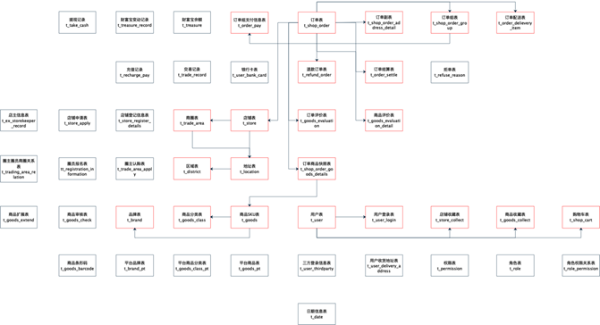
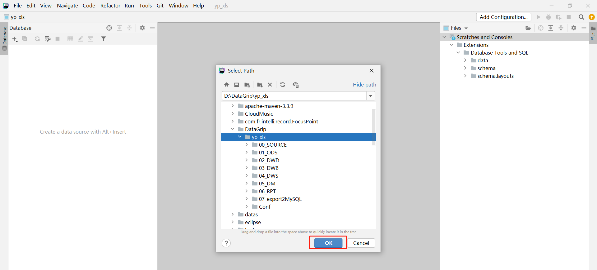
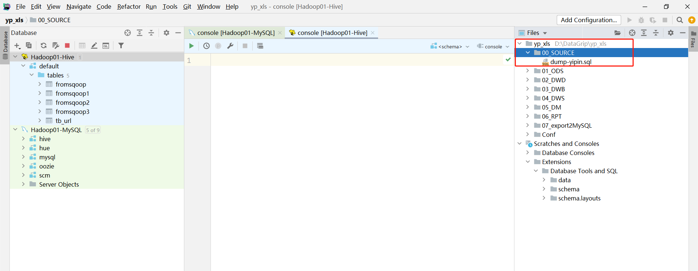
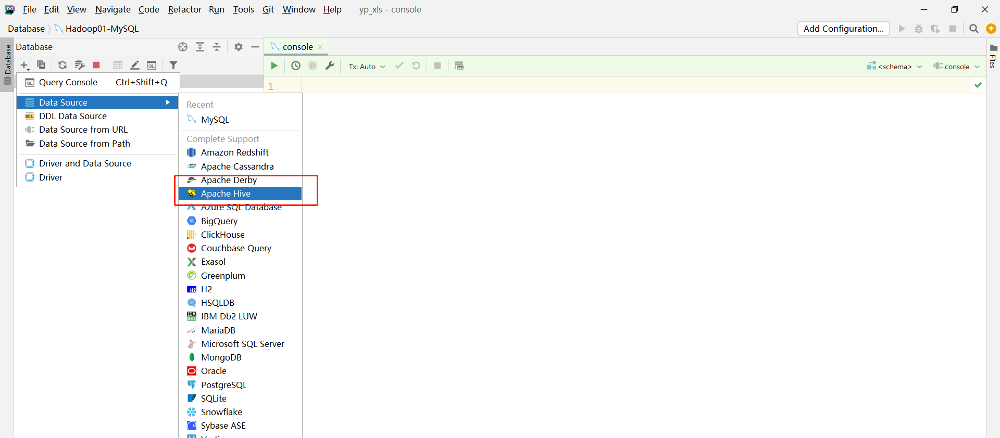
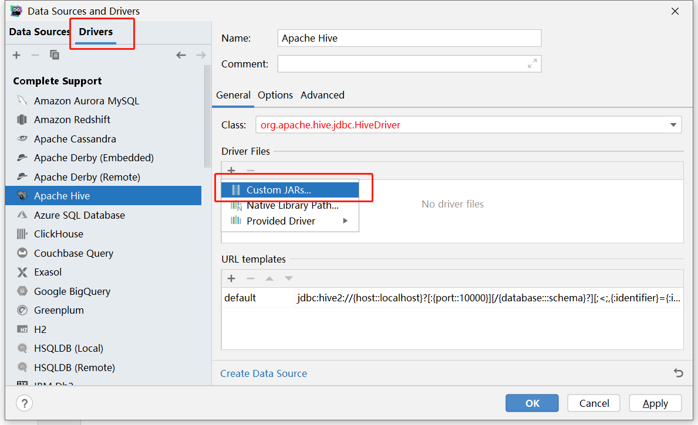

# 数据仓库设计理论

## 知识点01：课程回顾


## 知识点02：课程目标

1. 维度建模中常见一些基础概念
   - **==掌握：事实指标分类、事实表的分类、维度表的设计模型、渐变维度问题==**
2. 数仓中分层设计
   - **掌握：常见的分层设计、每一层的功能**
3. 新零售项目中数仓设计
   - **目标：回答面试中会问的问题**
   - 项目中怎么分层的，每一层的功能是什么？
   - 项目分析主题的需求？主题有哪些事实表和维度表？
4. 新零售业务数据的导入
   - 实现：将MySQL中的业务数据导入，构建项目的开发环境


## 知识点03：【掌握】数仓建模：事实指标值分类

- **目标**：**掌握数仓建模中事实指标值的分类**
- **实施**
  - **面试题：数仓维度建模中事实指标值的分类有哪几种？**
  - 指标：PV、UV、跳出率
  - **可累加类型**：基于不同的维度和统计可以直接进行累加的值
    - 典型：PV
    - 时间维度：昨天的PV为100，今天的PV为100  =》 这两天的PV为200
    - 地区维度：上海的PV为100，深圳的PV为100 =》 上海和深圳的PV为200
  - **半可累加类型**：在有一些维度下可以累加，在有一些维度下不可以累加
    - UV
      - 时间维度：昨天的UV为100，今天的UV为100 =》 这两天的UV为100【不成立，一个用户可以在每天都访问】
      - 地区维度：上海的UV为100，深圳的UV为100 =》 上海和深圳的UV为200
    - 银行余额
      - 时间维度：昨天在上海银行有100万，今天在上海银行的余额有100万 =》 我这两天200万
      - 银行维度：在上海银行的100万，在浦发银行的余额100万 =》 200万
  - **不可累加类型**：在任何维度下，指标的累加是没有意义的
    - 比率型
    - 出勤率
    - 时间维度：昨天出勤率50%，今天的出勤率50% =》 100%
    - 地区维度
    - ……
- **小结**
  - 掌握数仓建模中事实指标值的分类


## 知识点04：【掌握】数仓建模：事实表的分类

- **目标**：**掌握数仓建模中事实表的分类**

- **实施**

  - **面试题：事实表分为哪几种？什么是无事实事实表？**

  - **事务事实表**：原始的事务数据，业务数据

    - 订单表：每一条数据就是一个事务的产生，就代表一个订单

      ```
      orderid			userid			price			create_time		status
      1				1				100万			2022-01-01		已支付
      2				2				100万			2022-01-01		已发货
      ……
      ```

    - 数仓中最原始的数据表：ODS层

  - **周期快照事实表**：基于事务事实表按照一定的周期进行聚合

    - 月订单快照表：一条数据代表一个月订单的信息

      ```
      monthstr			total_price			order_cnt
      2022-01				1000万				10
      2022-02				1亿					10
      ```

    - 数仓中就是最后对外提供的结果表：APP层

  - **累积快照事实表**：事实的结果随着时间的变化而不断完善

    - 订单累计快照表

      ```
      orderid		userid			price	 创建时间		发货时间		签收时间		退款时间
      1			1				100万	 1-1		    1-2           1-4 
      ```

    - 年订单结果表

      ```
      yearstr		sumPrice	1		2		3		4		5	…… 	12
      2022					100万   100万
      ```

    

  - **无事实事实表**：特殊的事实表，无事实的事实表中没有度量值，只有多个维度外键，一般用于业务维度关联

    - 维度表：每种维度至少有一张表，这张表中只有这种维度的信息

      - 时间维度表：天		月		年
      - 地区维度表：上海   深圳     广州 
      - 商品维度表：火箭      大炮        AK47

    - 事实表：组合维度 + 指标

      - 销售主题事实表：1-2深圳的每种商品卖出去多少个以及多少钱

        ```
        时间		地区			商品			个数			金额
        1-2      深圳			 火箭           10            1亿
        ```

    - 需求：列举1-2号深圳哪些商品没有卖出去？

      - 有的东西

        - 销售主题事实表：1-2深圳哪些商品卖出去了，sale

          ```
          时间		地区			商品			个数			金额
          1-2      深圳			 火箭           10            1亿
          ```

        - 时间地区商品明细表:all

          ```
          时间		地区			商品	
          1-2		深圳			火箭
          1-2		深圳			大炮
          1-2		深圳			AK
          1-2		深圳			火箭筒
          ……
          ```

    - 场景：求数据差值

      ```sql
      select
         a.*
      from all a left join sale b on a.商品 = b.商品
      where b.商品 is null
      ```

- **小结**

  - 掌握数仓建模中事实表的分类


## 知识点05：【掌握】数仓建模：维度表的设计

- **目标**：**掌握数仓建模中维度表的设计**

- **实施**

  - **维度表的分类**

    - 高基数维度数据：一般是用户资料表、商品资料表类似的资料表。数据量可能是千万级或者上亿级别。

      - 商品维度、用户维度：数据量大

    - 低基数维度数据：一般是配置表，比如枚举值对应的中文含义，或者日期维表、地理维表等。数据量可能是个位数或者几千条几万条。

      - 时间维度、地区维度：数据量小

    - 注意：什么是枚举字典表？

      - 用一个表专门用于存储各种类型对应的具体的值的表，就是枚举字典表。

      - 订单表

        ```
        订单id	用户id	商品id		订单状态		是否是周末		商品类别
        o001	  u001      p001			1			0				a
        o002      u002      p002			2			1				b
        o003      u003      p003  			3			0				c
        ……
        ```

      - 枚举字典表

        ```
        id		type		dicId		dicName
        1		订单状态	  1			已提交
        2		订单状态	  2			已支付
        3		订单状态	  3			已发货
        4		订单状态	  4			已收货
        5		订单状态	  5			已退货
        6		是否周末	  0			是
        7		是否周末	  1			不是
        8		商品类别	  a			数码
        9       商品类别	  b			家电
        9       商品类别	  c			服饰
        ……		……			 ……		   ……
        ```

  - **维度表的设计模型**

    - 数仓的设计模型：维度建模

      - 事实表
- 维度表
      
- 维度表设计模型：雪花模型和星型模型
    
- 维度模型构建的方式：**决定了维度表与事实表怎么关联，维度表怎么设计的问题**
    
- **雪花模型**
    
  - 设计：**部分维度通过其他维度间接关联事实表**
    
  - 优点：避免数据的冗余
      - 缺点：关联层次比较多，数据大的情况下，底层层层Join，查询数据性能降低

      

    - 雪花模型的构建
    
      - 时间维度
    
      - 事实表1
    
    ```
        时间维度id	地区维度	平台维度		UV		IP		PV
    4			-1			-1		  11111	  9000      1000000
        1			-1			-1		  11111	  9000      1000000
        ……
        ```
    
      - 时间维度：B

        ```
    时间维度id		yearid：外键		monthid：外键		dayid:外键
        1				1				1					1
        4				19				-1					-1
        ```
    
      - 年维度表：B1
    
        ```
        yearid	yearvalue
        1		2000
        ……
    10		2009
        
    19		2020
        ……
        100		2099
        ```
    
      - 月维度表
    
        ```
        monthid		month
        1			01
        ……
        12			12
        ```
        
        - 天维度表
    
          ```
          dayid		dayvalue
          1			1
          ……
          31			31
          ```
    
        - 查询事实：查询2000年1月1日的结果
    
          ```sql
          时间维度id	地区维度	平台维度		UV		IP		PV
          4			-1			-1		  11111	  9000      1000000
          1			-1			-1		  11111	  9000      1000000
          ……
          --查询事实表
          select * from fact_day f join 
          --先查询2000年1月1日对应的时间维度表中id
          (
          select 
          	a.timeid
          from dim_time a
          join dim_year b on a.yearid = b.yearid
          join dim_month c on a.monthid = c.monthid
          join dim_day d on a.dayid = d.dayid
          where b.year = 2000 and c.month =1 and d.day = 1 ) e on f.timeid = e.timeid
          ```
    
          

  - **星型模型**

    - 设计：**所有维度表直接关联事实表**

    - 优点：每次查询时候，直接获取对应的数据结果，不用关联其他的维度子表，可以提高性能

    - 缺点：数据冗余度比较高

      

    - 星型模型的构建

      - 年维度表

        ```
        年维度id	year
        ```

      - 月维度表

        ```
        月维度id  month
        ```

      - 地区维度表

        ```
        地区维度id		国家		省份		城市		类型
          1			   中国	   上海	   浦东	   市
        2			   中国	   上海	   徐汇	   市
          ……
        10			   中国      上海      -1		省
          11			   中国	   -1       -1       国
        ```

        - 需求：统计基于基于时间维度下以及地区维度下的PV、UV、IP

      - 事实表

        ```
        年维度id	月维度id	地区维度id		PV		  UV		  IP
        1						1		10			1			1
        4						-1		1000		100			20
        5						-1		1000		200			0
        ```
        
        - 需求：查询2020年1月1日的结果
      
          ```
          select 
           * 
          from fact_day  a
          join dim_year b on a.yearid = b.yearid
          ……
          where b.year=2020
          ```
      
    - **星座模型**
    
      - 星座模型：基于星型模型的演变，**多个事实共同使用一个维度表**
    
        

- **小结**

  - 什么是雪花模型，什么是星型模型，有什么区别？

    - 雪花模型：部分维度表间接关联事实表
      - 优点：冗余度低
      - 缺点：查询性能比较低
    - 星型模型：所有维度表直接关联事实表
      - 优点：查询性能比较高
      - 缺点：冗余度高
    
    

## 知识点06：【掌握】数仓建模：缓慢渐变维问题

- **目标**：**掌握数仓建模中缓慢渐变维度的问题**

- **实施**

  - **渐变维度问题**

    - 维度数据发生变化，如何处理发生变化的数据

    - 举例

      - 每个用户会对应一个工作地区，2019年在北京

        

      - 2020-01-01搬到了三亚

        

      - 现在是2020年，需要对2019年的北京的数据进行统计，这条数据是否参与统计？

        - 应不应该参加统计？应该

        - 如果参与统计，数据中是没有的，无法统计，数据是如何存储的？

  - **处理方案**

    - **SCD1：通过更新维度记录直接覆盖已存在的值**

      - 场景：适合于永远只需要最新状态，不关心历史状态场景

    - **SCD2**：**==构建拉链表，通过时间来标记数据每一个状态的生命周期==**

      | 用户id | 所在的地区 | 时间标记：startTime | 时间标记：endTime |
      | ------ | ---------- | ------------------- | ----------------- |
      | 1001   | beijing    | 2018-01-01          | 2019-12-31        |
      | 1001   | sanya      | 2020-01-01          | 2021-04-30        |
      | 1001   | xuliya     | 2021-05-01          | 9999-12-31        |

      - 实现：为数据增加两个时间标记
        - startTime：标记当前这个状态的开始时间
        - endTime：标记当前这个状态的结束时间，如果当前是最新状态，默认值给9999-12-31
      - 根据时间标记，查询在对应时间范围内的数据
        - startTime<=2019-01-01
        - endTime<=2019-12-31
      - 查询每条数据最新状态：where endTime = 9999-12-31

    - **SCD3：通过增加列的方式来记录每个状态**

      | 用户id | 工作城市1 | 工作城市2 |
      | ------ | --------- | --------- |
      | 10001  | sanya     | xuliya    |

        - 可以满足记录最近的部分状态
      - 不能满足需求，一般不用

- **小结**

  - 掌握数仓建模中缓慢渐变维度的问题


## 知识点07：【理解】数仓分层：分层设计

- **目标**：**理解数仓分层中的分层设计**

- **实施**

  - **什么是分层？**

    - **决定数据在数据仓库中处理的流程**
    - 数据从进入到被应用，总共经过哪些步骤
    - **在Hive中每一层就是一个数据库**，每一层的表放在对应的数据库中

  - **为什么要做分层？**

    - 数仓不做分层

      

      

    - 数仓做了分层

      

    - **分层的优点**

      - `清晰数据结构`：每一个数据分层都有它的作用域，这样我们在使用表的时候能更方便地定位和理解
      - `数据血缘追踪`：我们最终给业务呈现的是一张能够直接使用放入业务表，但是它的来源有很多，如果有一张来源表出问题了，我们希望能够快速准确地定位到问题，并清楚它的危害范围
      - `减少重复开发`：规范数据分层，开发一些通用的中间层数据，能够减少极大的重复计算
      - `把复杂问题简单化`：一个复杂的任务分解成多个步骤来完成，每一层只处理单一的步骤，比较简单和容易理解
      - `屏蔽原始数据的异常对业务的影响`：不必改一次业务就需要重新接入数据

  - **一般怎么分层？**

    - `原始数据层`
      - 名称：ODS，原始数据层或者操作数据层
      - 功能：用于存储最原始的数据，最接近原始数据的层次
    - `数据仓库层`
      - 名称：DW，专门用于实现原始数据的处理和加工转换的
      - 功能：实现原始数据的转换处理
    - `数据应用层`
      - 名称：DA/APP/ADS/RPT，存储最终要被使用的数据的
      - 功能：存储结果

    

- **小结**

  - 什么是分层？
    - 目的：分层就是规划化数据在数据仓库中处理流程
    - 实现：分数据库
  - 常见的分层结构是什么？
    - ODS：原始数据层，直接采集过来的原始数据
    - DW：数据仓库层，实现对原始数据的处理转换
    - APP：数据应用层，对外提供所有数据应用的


## 知识点08：【掌握】数仓分层：常见层次

- **目标**：**掌握数仓分层中的常见层次**
- **实施**
  - **每个公司的分层都不一样，常见的层次要记住功能**
  - **ODS**：原始数据层
    - 功能：临时存储采集到的原始数据
    - 数据：与原始数据保持一致
  - **DWD**：明细数据层
    - 功能：对ODS层数据进行数据清洗，保证数据质量
    - 数据：来自于ODS层
  - **DWM/DWB**：轻度聚合层【中间数据层/基础数据层】
    - 功能：对DWD层实现轻度聚合，通过关联构建宽表退化维度，或者轻度聚合构建基础指标来实现
    - 数据：来自于DWD
  - **DWS**：服务数据层
    - 功能：对上一层的数据按照主题需求构建主题结果进行最终聚合，主题域宽表
    - 数据：上一层，包含这个主题域所有维度和指标
  - **APP/DA/ADS**：数据应用层
    - 功能：按照数仓主题对外提供数据的需求
    - 数据：对DWS层的数据进行拆解，构建每个主题的结果表
  - **DM**：数据集市层
    - 功能：按照每个部门的需求来构建每个部门的数据或者按照细粒度做轻度聚合
    - 数据：来自于DW
  - **DIM**：维度数据层
    - 功能：存储所有维度数据表
    - 数据：一般都来自于DWD
  - **TMP**：临时数据层
    - 功能：存放一些临时数据表
    - 数据：来自于DW中任何一层需要用到的临时数据
- **小结**
  - 掌握数仓分层中的常见层次


## 知识点09：【了解】数仓分层：分层案例

- **目标**：**了解数仓分层中的分层案例**

- **实施**

  - **电商案例**

    

  - **斗鱼案例**

    

  - **美团数仓设计**

    - https://tech.meituan.com/2017/05/26/hotel-dw-layer-topic.html

  - **携程数仓设计**

    - https://mp.weixin.qq.com/s/CfxNcMJIl6irunrTNTs25g

- **小结**
  
  - 了解数仓分层中的分层案例


## 知识点10：【掌握】新零售项目数仓设计

- **目标**：**掌握新零售项目中数仓设计**

- **实施**

  - **建模**

    - 建模方法论：维度建模
    - 维度表设计：星型模型

  - **分层：六层架构**

    

    - **ODS（数据临时存储层）**
    
      | 属性 | 设计                                                         |
      | ---- | :----------------------------------------------------------- |
      | 功能 | 将各个数据源的**原始数据**几乎无处理地存放在数据仓库系统中，结构上与源系统基本保持一致，是数据仓库的数据准备区。 |
    | 来源 | MySQL，业务系统数据库                                        |
      | 格式 | Hive分区表，textFile格式                                     |

    - **DWD（明细数据层  Data Warehouse Detail）**
    
      | 属性 | 设计                                                         |
      | ---- | :----------------------------------------------------------- |
      | 功能 | 对来自ODS数据层做一些**数据清洗**和规范化的操作，提供更干净的数据，提供一定的**数据质量**保证，同时划分事实与维度。 |
    | 来源 | 数据来自于ODS，一般保持和ODS层数据一样的粒度                 |
      | 格式 | Hive分区表，textFile格式                                     |

    - **DWB（基础数据层 Data Warehouse Base）**
    
      | 属性 | 设计                                                         |
      | ---- | :----------------------------------------------------------- |
      | 功能 | 基础数据层一般用作中间层。多张表数据关联在一起，降维操作，形成一张**大宽表** |
    | 来源 | 数据来自于DWD                                                |
      | 格式 | Hive分区表，textFile格式                                     |

    - **DWS（服务数据层 Data Warehouse Service ）**
    
      | 属性 | 设计                                                         |
      | ---- | :----------------------------------------------------------- |
      | 功能 | 基于DWB上的基础数据，整合汇总成分析某一个主题域的服务数据，基于分析主题根据相关指标 维度进行提前统计聚合操作**(提前聚合【细粒度轻度聚合：天】**), 形成宽表统计结果数据 |
    | 来源 | 数据来自于DWB                                                |
      | 格式 | Hive分区表，textFile格式                                     |

    - **DM（数据集市层 Data Mart）**
    
      | 属性 | 设计                                                         |
      | ---- | :----------------------------------------------------------- |
      | 功能 | 基于DWS层进行细粒度统计操作, 进行**上卷维度【月、季度、年】**统计操作, 形成大的主题统计宽表 |
    | 来源 | 数据来自于DWS                                                |
      | 格式 | Hive分区表，textFile格式                                     |

    - **RPT（报表应用层  DA）**
    
      | 属性 | 设计                                                 |
      | ---- | :--------------------------------------------------- |
      | 功能 | 对外提供数据报表的数据支持，提供每个需求对应的结果表 |
      | 来源 | 数据来自于DM                                         |
      | 格式 | Hive分区表，textFile格式                             |

- **小结**
  
  - 掌握新零售项目中数仓设计


## 知识点11：【掌握】项目业务主题需求

- **目标**：**掌握项目业务主题需求**

- **实施**

  - **每个主题对应展现不同业务分析的结果，实际项目中会有几十个主题，本次项目以三个主题作为讲解**

  - **销售主题**

    - 目的：也可以成为订单主题，基于数据统计分析所有订单的成交额、成交量等运营情况

    - 指标：收入、成交额、订单个数

      ```
      销售收入、平台收入
      配送成交额、小程序成交额、安卓APP成交额、苹果APP成交额、PC商城成交额
      订单量、参评单量、差评单量、配送单量、退款单量、小程序订单量、安卓APP订单量、苹果APP订单量、PC商城订单量
      ```

    - 维度

      ```
      日期、城市、商圈、店铺、品牌、大类、中类、小类
      ```

    - 举个栗子

      - 每天每个城市的不同平台的订单量、不同平台的成交额
      - 每天每个商圈的不同平台的订单量、退款单量

  - **商品主题**

    - 目的：基于数据统计分析所有商品的销售情况及产品质量情况等

    - 指标

      ```
      下单次数、下单件数、下单金额
      被支付次数、被支付金额、被退款次数、被退款件数、被退款金额、被加入购物车次数、被加入购物车件数、被收藏次数
      好评数、中评数、差评数
      ```

    - 维度

      ```
      商品、日期
      ```

    - 举个栗子

      - 每天每个商品的下单次数、件数、金额
      - 每天每个商品的好评数、中评数、差评数

  - **用户主题**

    - 指标

      ```
      登录次数、收藏店铺数、收藏商品数、加入购物车次数、加入购物车金额
      下单次数、下单金额、支付次数、支付金额
      ```

    - 维度

      ```
      用户、日期
      ```

    - 举个栗子

      - 每天每个用户的登录次数、收藏商品数、加入购物车次数
      - 每天每个用户的下单次数、下单金额、支付次数、支付金额

- **小结**

  - 掌握项目业务主题需求


## 知识点12：【掌握】项目核心业务数据

- **目标**：**掌握项目核心业务数据**

- **实施**

  

  - **订单相关数据**

    | 表名                        | 注释               | 功能                                                         |
    | --------------------------- | :----------------- | ------------------------------------------------------------ |
    | t_shop_order                | 订单主表           | 记录订单基础信息(买家、卖家、订单来源、订单状态、订单评价状态、取货方式、是否需要备货) |
    | t_shop_order_address_detail | 订单副表           | 记录订单额外信息 与订单主表是1对1关系 (订单金额、优化金额、是否配送、支付接单配送到达完成各时间) |
    | t_shop_order_group          | 订单组表           | 多笔订单构成一个订单组 (含orderID)                           |
    | t_order_pay                 | 订单组支付表       | 记录订单组支付信息 (订单组ID、订单总金额)                    |
    | t_order_settle              | 订单结算表         | 记录一笔订单中配送员、圈主、平台、商家的分成 (含orderID)     |
    | t_order_delievery_item      | 订单配送表         | 记录配送员信息、收货人信息、商品信息(含orderID)              |
    | t_refund_order              | 订单退款表         | 记录退款相关信息(含orderID)                                  |
    | t_goods_evaluation          | 订单评价表         | 记录订单综合评分,送货速度评分等(含orderID)                   |
    | t_goods_evaluation_detail   | 商品评价信息表     | 记录订单中对所购买商品的评价信息(含orderID)                  |
    | t_shop_order_goods_details  | 订单和商品的明细表 | 记录订单中商品的相关信息，如商品ID、数量、价格、总价、名称、规格、分类(含orderID) |
    | t_trade_record              | 交易记录表         | 记录所有交易记录信息，比如支付、结算、退款                   |

    

  - **店铺相关数据**

    | 表名         | 注释       | 功能                                                         |
    | ------------ | ---------- | ------------------------------------------------------------ |
    | t_store      | 店铺详情表 | 记录一家店铺的详细信息                                       |
    | t_trade_area | 商圈表     | 记录商圈相关信息，店铺需要归属商圈中                         |
    | t_location   | 地址表     | 记录了地址信息以及地址的所属类别，如是商圈地址还是店铺地址，还是买家地址 |
    | t_district   | 区域字典表 | 记录了省市县区域的名称、别名、编码、父级区域ID               |

    

  - **商品相关数据**

    | 表名            | 注释       | 功能                       |
    | --------------- | ---------- | -------------------------- |
    | t_goods         | 商品表     | 记录了商品相关信息         |
    | t_goods_class   | 商品分类表 | 记录了所有商品分类的信息表 |
    | t_brand         | 品牌表     | 记录了商品的品牌的相关信息 |
    | t_goods_collect | 商品收藏表 | 记录了所有收藏的信息       |

    

  - **用户相关数据**

    | 表名            | 注释       | 功能                                                         |
    | --------------- | ---------- | ------------------------------------------------------------ |
    | t_user_login    | 登陆日志表 | 记录登陆日志信息，如登陆用户、类型、客户端标识、登陆时间、登陆ip、登出时间等 |
    | t_store_collect | 店铺收藏表 | 记录用户收藏的店铺ID                                         |
    | t_shop_cart     | 购物车表   | 记录用户添加购物车的商品id、商品数量、卖家店铺ID             |

    

  - **其他相关数据**

    | 表名   | 注释           | 功能                           |
    | ------ | -------------- | ------------------------------ |
    | t_date | 时间日期维度表 | 记录了年月日周、农历等相关信息 |

    

- **小结**

  - 掌握项目核心业务数据


## 知识点13：【实现】本地开发环境准备

- **目标**：**实现本地开发环境准备**

- **实施**

  - **目标**：使用DataGrip连接业务数据库MySQL以及数据仓库Hive，并导入脚本目录

  - **创建**：新建一个DataGrip Project

    

    

    

    

    

  - **导入**：将提供的脚本目录放入一个不包含空格和中文的路径下，然后添加到工程中

    

    

    

    

    

    

  - **连接**：使用DataGrip连接MySQL以及Hive

    - 连接MySQL：参考《附录一》
    - 连接Hive：参考《附录二》

- **小结**

  - 实现本地开发环境准备


## 知识点14：【实现】模拟导入业务数据

- **目标**：**实现模拟导入业务数据**

- **实施**

  - **目标**：所有公司的原始业务数据存储在MySQL中，为了保证项目的完整性，需要将数据放入MySQL

  - **实现**：在MySQL中运行脚本目录中的`00_SOURCE/dump-yipin.sql`文件

    - step1：找到该文件

      

    - step2：运行该文件

      

      

      

      - step3：查看结果

        

        

        

- **小结**

  - 实现模拟导入业务数据


## 附录一：DataGrip连接MySQL

- **确保两台虚拟机已经启动**

- **创建连接**

  

  

- **配置连接**

  

  

  

  

  

- **更改显示**

  

  


## 附录二：DataGrip连接Hive

- **确保Hive已经启动**

- **创建连接**

  

  

- **配置连接**

  

  

  

  

  

  