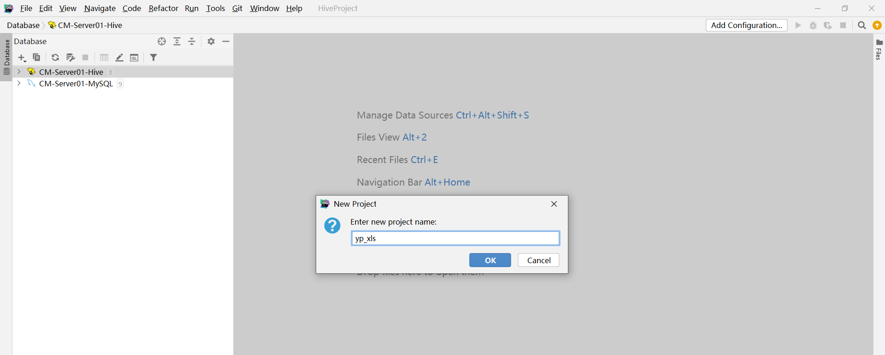
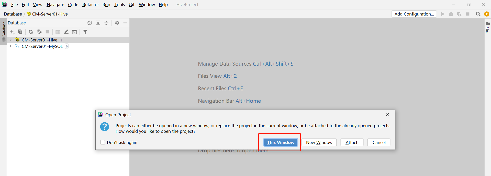
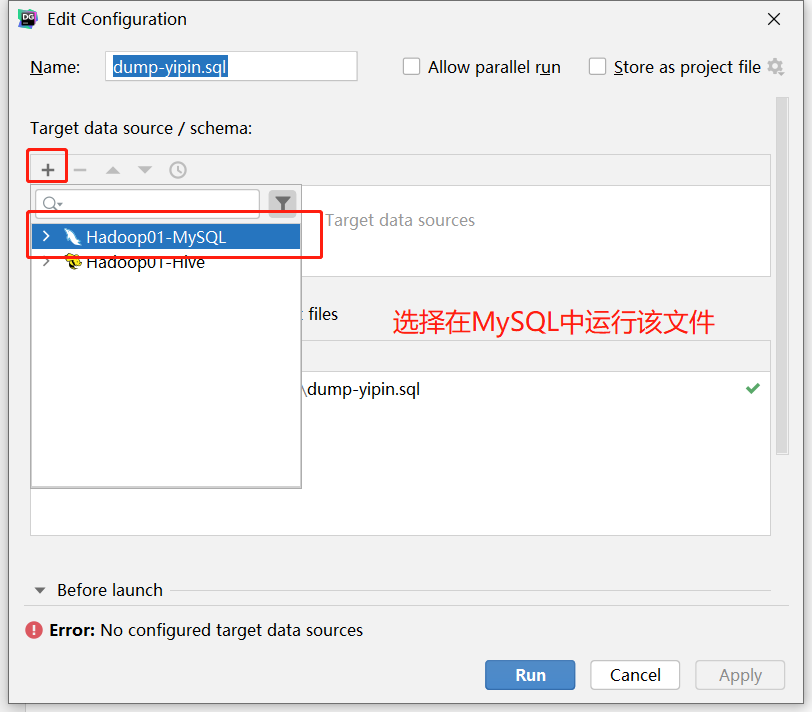
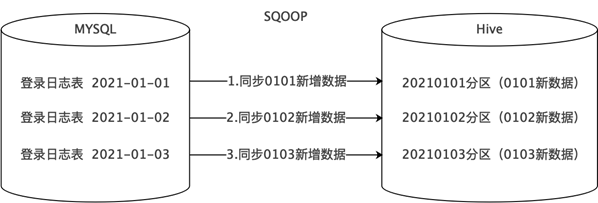
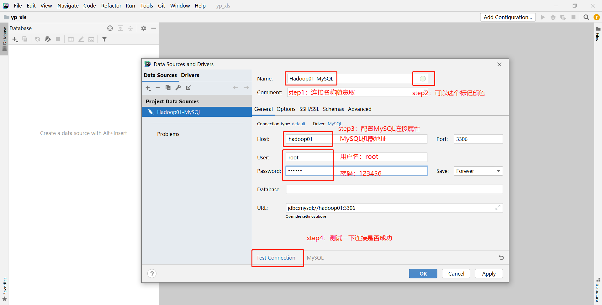

# 新零售数仓设计及ODS层构建

## 知识点01：课程回顾


## 知识点02：课程目标

1. 新零售数仓设计

   - **掌握：分层设计、主题以及维度划分**
   - 问题：分层怎么设计的，每一层功能是什么？有哪些主题，有哪些维度？

2. 项目开发环境搭建

   - 实现：模拟业务数据导入到MySQL

3. ODS层构建

   - **==掌握：ODS层需求、数据同步多种方式、采集脚本的开发==**

     

## 知识点03：【掌握】新零售项目数仓设计

- **目标**：**掌握新零售项目中数仓设计**

- **实施**

  - **建模**

    - 建模方法论：维度建模
    - 维度表设计：星型模型

  - **分层：六层架构**

    

    - **ODS（数据临时存储层）**

      | 属性 | 设计                                                         |
      | ---- | :----------------------------------------------------------- |
      | 功能 | 将各个数据源的**原始数据**几乎无处理地存放在数据仓库系统中，结构上与源系统基本保持一致，是数据仓库的数据准备区。 |
      | 来源 | MySQL，业务系统数据库                                        |
      | 格式 | Hive分区表，textFile格式                                     |

    - **DWD（明细数据层  Data Warehouse Detail）**

      | 属性 | 设计                                                         |
      | ---- | :----------------------------------------------------------- |
      | 功能 | 对来自ODS数据层做一些**数据清洗**和规范化的操作，提供更干净的数据，提供一定的**数据质量**保证，同时**==划分事实【fact _】与维度【dim _】==**。 |
      | 来源 | 数据来自于ODS，一般保持和ODS层数据一样的粒度                 |
      | 格式 | Hive分区表，textFile格式                                     |

    - **DWB（基础数据层 Data Warehouse Base）**

      | 属性 | 设计                                                         |
      | ---- | :----------------------------------------------------------- |
      | 功能 | 基础数据层一般用作中间层。多张表数据关联在一起，**==降维操作==**，形成一张**大宽表** |
      | 来源 | 数据来自于DWD                                                |
      | 格式 | Hive分区表，textFile格式                                     |

    - **DWS（服务数据层 Data Warehouse Service ）**

      | 属性 | 设计                                                         |
      | ---- | :----------------------------------------------------------- |
      | 功能 | 基于DWB上的基础数据，整合汇总成分析某一个主题域的服务数据，基于分析主题根据相关指标 维度进行提前统计聚合操作**(提前聚合【细粒度轻度聚合：天】**), 形成宽表统计结果数据 |
      | 来源 | 数据来自于DWB                                                |
      | 格式 | Hive分区表，textFile格式                                     |

    - **DM（数据集市层 Data Mart）**

      | 属性 | 设计                                                         |
      | ---- | :----------------------------------------------------------- |
      | 功能 | 基于DWS层和DWB层中维度表进行细粒度统计操作, 进行**上卷维度【月、季度、年】**统计操作, 形成大的主题统计宽表 |
      | 来源 | 数据来自于DWS                                                |
      | 格式 | Hive分区表，textFile格式                                     |

    - **RPT（报表应用层  DA）**

      | 属性 | 设计                                                 |
      | ---- | :--------------------------------------------------- |
      | 功能 | 对外提供数据报表的数据支持，提供每个需求对应的结果表 |
      | 来源 | 数据来自于DM                                         |
      | 格式 | Hive分区表，textFile格式                             |

- **小结**

  - 掌握新零售项目中数仓设计


## 知识点04：【掌握】项目业务主题需求

- **目标**：**掌握项目业务主题需求**

- **实施**

  - **每个主题对应展现不同业务分析的结果，实际项目中会有几十个主题，本次项目以三个主题作为讲解**

  - **销售主题**

    - 目的：也可以成为订单主题，基于数据统计分析所有订单的成交额、成交量等运营情况

    - 指标：收入、成交额、订单个数

      ```
      销售收入、平台收入
      配送成交额、小程序成交额、安卓APP成交额、苹果APP成交额、PC商城成交额
      订单量、参评单量、差评单量、配送单量、退款单量、小程序订单量、安卓APP订单量、苹果APP订单量、PC商城订单量
      ```

    - 维度

      ```
      日期、城市、商圈、店铺、品牌、大类、中类、小类
      ```

    - 举个栗子

      - 每天每个城市的不同平台的订单量、不同平台的成交额
      - 每天每个商圈的不同平台的订单量、退款单量

  - **商品主题**

    - 目的：基于数据统计分析所有商品的销售情况及产品质量情况等

    - 指标

      ```
      下单次数、下单件数、下单金额
      被支付次数、被支付金额、被退款次数、被退款件数、被退款金额、被加入购物车次数、被加入购物车件数、被收藏次数
      好评数、中评数、差评数
      ```

    - 维度

      ```
      商品、日期
      ```

    - 举个栗子

      - 每天每个商品的下单次数、件数、金额
      - 每天每个商品的好评数、中评数、差评数

  - **用户主题**

    - 指标

      ```
      登录次数、收藏店铺数、收藏商品数、加入购物车次数、加入购物车金额
      下单次数、下单金额、支付次数、支付金额
      ```

    - 维度

      ```
      用户、日期
      ```

    - 举个栗子

      - 每天每个用户的登录次数、收藏商品数、加入购物车次数
      - 每天每个用户的下单次数、下单金额、支付次数、支付金额

- **小结**

  - 掌握项目业务主题需求


## 知识点05：【掌握】项目核心业务数据

- **目标**：**掌握项目核心业务数据**

- **实施**

  

  - **订单相关数据**

    | 表名                        | 注释               | 功能                                                         |
    | --------------------------- | :----------------- | ------------------------------------------------------------ |
    | t_shop_order                | 订单主表           | 记录订单基础信息(买家、卖家、订单来源、订单状态、订单评价状态、取货方式、是否需要备货) |
    | t_shop_order_address_detail | 订单副表           | 记录订单额外信息 与订单主表是1对1关系 (订单金额、优化金额、是否配送、支付接单配送到达完成各时间) |
    | t_shop_order_group          | 订单组表           | 多笔订单构成一个订单组 (含orderID)                           |
    | t_order_pay                 | 订单组支付表       | 记录订单组支付信息 (订单组ID、订单总金额)                    |
    | t_order_settle              | 订单结算表         | 记录一笔订单中配送员、圈主、平台、商家的分成 (含orderID)     |
    | t_order_delievery_item      | 订单配送表         | 记录配送员信息、收货人信息、商品信息(含orderID)              |
    | t_refund_order              | 订单退款表         | 记录退款相关信息(含orderID)                                  |
    | t_goods_evaluation          | 订单评价表         | 记录订单综合评分,送货速度评分等(含orderID)                   |
    | t_goods_evaluation_detail   | 商品评价信息表     | 记录订单中对所购买商品的评价信息(含orderID)                  |
    | t_shop_order_goods_details  | 订单和商品的明细表 | 记录订单中商品的相关信息，如商品ID、数量、价格、总价、名称、规格、分类(含orderID) |
    | t_trade_record              | 交易记录表         | 记录所有交易记录信息，比如支付、结算、退款                   |

    

  - **店铺相关数据**

    | 表名         | 注释       | 功能                                                         |
    | ------------ | ---------- | ------------------------------------------------------------ |
    | t_store      | 店铺详情表 | 记录一家店铺的详细信息                                       |
    | t_trade_area | 商圈表     | 记录商圈相关信息，店铺需要归属商圈中                         |
    | t_location   | 地址表     | 记录了地址信息以及地址的所属类别，如是商圈地址还是店铺地址，还是买家地址 |
    | t_district   | 区域字典表 | 记录了省市县区域的名称、别名、编码、父级区域ID               |

    

  - **商品相关数据**

    | 表名            | 注释       | 功能                       |
    | --------------- | ---------- | -------------------------- |
    | t_goods         | 商品表     | 记录了商品相关信息         |
    | t_goods_class   | 商品分类表 | 记录了所有商品分类的信息表 |
    | t_brand         | 品牌表     | 记录了商品的品牌的相关信息 |
    | t_goods_collect | 商品收藏表 | 记录了所有收藏的信息       |

    

  - **用户相关数据**

    | 表名            | 注释       | 功能                                                         |
    | --------------- | ---------- | ------------------------------------------------------------ |
    | t_user_login    | 登陆日志表 | 记录登陆日志信息，如登陆用户、类型、客户端标识、登陆时间、登陆ip、登出时间等 |
    | t_store_collect | 店铺收藏表 | 记录用户收藏的店铺ID                                         |
    | t_shop_cart     | 购物车表   | 记录用户添加购物车的商品id、商品数量、卖家店铺ID             |

    

  - **其他相关数据**

    | 表名   | 注释           | 功能                           |
    | ------ | -------------- | ------------------------------ |
    | t_date | 时间日期维度表 | 记录了年月日周、农历等相关信息 |

    

- **小结**

  - 掌握项目核心业务数据


## 知识点06：【实现】本地开发环境准备

- **目标**：**实现本地开发环境准备**

- **实施**

  - **目标**：使用DataGrip连接业务数据库MySQL以及数据仓库Hive，并导入脚本目录

  - **创建**：新建一个DataGrip Project

    

    

    

    

    

  - **导入**：将提供的脚本目录放入一个不包含空格和中文的路径下，然后添加到工程中

    

    

    

    

    

    

  - ==**连接**：使用DataGrip连接MySQL以及Hive==

    - 连接MySQL：参考《附录一》
    - 连接Hive：参考《附录二》

- **小结**

  - 实现本地开发环境准备


## 知识点07：【实现】模拟导入业务数据

- **目标**：**实现模拟导入业务数据**

- **实施**

  - **目标**：所有公司的原始业务数据存储在MySQL中，为了保证项目的完整性，需要将数据放入MySQL

  - **实现**：在MySQL中运行脚本目录中的`00_SOURCE/dump-yipin.sql`文件

    - step1：找到该文件

      

    - step2：运行该文件

      

      

      

      - step3：查看结果

        

        

- **小结**

  - 实现模拟导入业务数据


## 知识点08：【掌握】ODS层：需求分析

- **目标**：**掌握ODS层的构建需求分析**

- **实施**

  - **需求**：在Hive中构建ODS层，将MySQL中所有业务表的数据同步到Hive的ODS层中

  - **分析**

    - step1：在Hive中创建ODS层
    - step2：在Hive的ODS层中，创建ODS层的所有表
    - step3：使用Sqoop将MySQL中的数据同步到Hive ODS层的表中

  - **问题**

    - Hive中如何创建ODS层？
    - Hive中如何创建所有表？

  - **解决**

    - **建库**：每一层就是一个数据库

      ```sql
      -- 查看当前所有数据库
      show databases ;
      -- 创建ODS层数据库yp_ods
      create database if not exists yp_ods ;
      ```

      

      

    - **建表**

      ```sql
      -- 切换数据库
      use yp_ods;
      -- 建表测试
      drop table if exists tb_order_test ;
      create table tb_order_test(
        oid string comment '订单id',
        pid string comment '商品id',
        uid string comment '用户id'
      ) comment '订单测试表' ;
      ```

      

      

- **小结**

  - 掌握ODS层的构建需求分析


## 知识点09：【实现】ODS层：Hive中文注释乱码

- **目标**：**实现解决Hive中文注释乱码问题**

- **实施**

  - **现象**：查询表的信息时，中文注释全部为乱码

    ```sql
    desc tb_order_test;
    ```

    

    

  - **问题**：Hive中的注释都是作为元数据存储在MySQL中，MySQL中默认的字符集为lantin1，不支持中文

    

    

  - **解决**：==**在MySQL中**==，修改Hive元数据中的【列级别的】字符集为utf8

    ```sql
    alter table hive.COLUMNS_V2 modify column COMMENT varchar(256) character set utf8;
    alter table hive.TABLE_PARAMS modify column PARAM_VALUE varchar(4000) character set utf8;
    alter table hive.PARTITION_PARAMS modify column PARAM_VALUE varchar(4000) character set utf8 ;
    alter table hive.PARTITION_KEYS modify column PKEY_COMMENT varchar(4000) character set utf8;
    alter table hive.INDEX_PARAMS modify column PARAM_VALUE varchar(4000) character set utf8;
    ```

    

    

    

  - **验证**

    ```sql
    -- 切换数据库
    use yp_ods;
    -- 建表测试
    drop table if exists tb_order_test ;
    create table tb_order_test(
      oid string comment '订单id',
      pid string comment '商品id',
      uid string comment '用户id'
    ) comment '订单测试表' ;
    -- 查看注释
    desc tb_order_test;
    ```

    

    ```sql
    -- 测试完成删除该表
    drop table tb_order_test;
    ```

    

- **小结**

  - 实现解决Hive中文注释乱码问题


## 知识点10：【实现】ODS层：建表

- **目标**：**实现ODS层所有数据表的构建**

- **实施**

  - **需求**：在ODS层创建所有数据表，数据表结构与MySQL中表结构保持一致

  - **实现**：在Hive中运行`01_ODS/create_ods_table.sql`文件实现所有表的创建

    - step1：找到该文件

      

      

    - step2：运行该文件

      

      

      

    - step3：查看结果

      

      

- **小结**

  - 实现ODS层所有数据表的构建


## 知识点11：【掌握】ODS层：数据同步方式

- **目标**：**理解ODS层构建中数据同步的几种方式**

- **实施**

  - 大的划分：全量和增量

  - 由于不同数据源数据的数据量大小、更新变化频率、业务需求等多方面都可能是不一样的

  - 所以数仓中数据同步针对不同场景下的数据，同步的方式也不一样

  - 举个栗子

    - MySQL
      - 订单表：数据量大，变化【新增和更新】频率快，事务事实表
      - 地区表：数据量小，变量频率【新增和更新】慢，维度表
    - Hive：ODS
      - 订单表：增量
      - 地区表：全量

  - **数据同步方式**

    - **方式一：全量同步**

      - 设计：**每天新增一个日期分区，同步并存储到当天为止的全量数据**，历史数据定期删除

      - 栗子

        - MySQL

          ```shell
          #01-01
          userid01		laoda		18
          userid02		laowu		20
          #01-02
          userid03		laosan		22
          #01-03
          userid04		laosi		24
          ```

        - Hive：分区表

          ```shell
          #2号：daystr=2022-01-01
          userid01		laoda		18
          userid02		laoer		20
          #3号：daystr=2022-01-02
          userid01		laoda		18
          userid02		laoer		20
          userid03		laosan		22
          #4号：daystr=2022-01-03
          userid01		laoda		18
          userid02		laowu		20
          userid03		laosan		22
          userid04		laosi		24
          ```

        - 优点：保存了MySQL中数据的所有状态，查询到所有历史数据在对应时间的状态

        - 缺点：冗余度非常高，历史查询性能非常差

      - 场景：适用于数据会有新增和更新，但是数据量较少，且历史快照不用保存很久的情况

        

      

    - **方式二：全量覆盖**

      - 设计：**不需要分区，每次同步都是先删后写，直接覆盖**

      - 场景：适用于数据量小而且很少有任何新增和变化的情况

      - 栗子：比如地区、时间、性别等维度数据，不会变更或很少会有变更，可以只保留最新值

        - MySQL

          ```shell
          #01-02
          id1			北京市
          id2			上海市
          id3			深圳市
          id4			广州市
          id5			南京市
          ```
        
        - Hive：分区表
        
          ```shell
          #01-03：没有分区，每天直接删除原来的数据，从MySQL中采集所有数据直接覆盖
          id1			北京市
          id2			上海市
          id3			深圳市
          id4			广州市
          id5			南京市
          ```
        
        
        
        
        
        

    - **方式三：仅同步新增**

      - 设计：**每天新增一个日期分区，同步并存储当天的新增数据**

      - 场景：适合于数据永远只有新增，不会发生更新的场景

      - 栗子：比如登录记录表、访问日志表、交易记录表、商品评价表等‘

        - MySQL

          ```shell
          #01-01
          userid01		laoda		18
          userid02		laowu		20
          #01-02
          userid03		laosan		22
          #01-03
          userid04		laosi		24
          ```
        
        - Hive：分区表：将昨天新增的数据单独使用昨天的分区进行存储
        
          ```shell
          #2号：daystr=2022-01-01
          userid01		laoda		18
          userid02		laowu		20
          #3号：daystr=2022-01-02
          userid03		laosan		22
          #4号：daystr=2022-01-03
          userid04		laosi		24
          ```
        
          
        
        
        
        

    - **方式四：新增和更新都同步**

      - 设计：**每天新增一个日期分区，同步并存储当天的新增和更新数据**

      - 场景：适用于既有新增又有更新的数据

      - 栗子：比如用户表、订单表、商品表等

        - MySQL
      
          ```shell
          #01-01
          userid01		laoda		18
          userid02		laowu		30
          #01-02
          userid03		laojiu		22
          #01-03
          userid04		laosi		24
          ```
        
        - Hive：分区表：将昨天新增的数据单独使用昨天的分区进行存储
        
          ```shell
          #2号：daystr=2022-01-01
          userid01		laoda		18
          userid02		laowu		20
          #3号：daystr=2022-01-02
          userid02		laowu		30
          userid03		laosan		22
          #4号：daystr=2022-01-03
          userid03		laojiu		22
          userid04		laosi		24
          ```
        
          
        
        
      
      

  - **离线数仓同步频率**

    - 首次执行：所有表都为全量同步，增量第一次也是全量

    - 循环执行：T + 1

      ```properties
      什么是T+1 ?
      这种说法来源于股票交易
      T+0: 是国际上普遍使用的一种证劵度（或期货）交易制度。凡在证劵（或期货）成交日当天办理好证劵（或期货）和价款清算交割手续的交易制度，就称为T+0交易。通俗说，就是当天买入的证道劵（或期货）在当天就可以卖出。
      T+1: 是一种股票交易制度，即当日买进的股票，要到下一个交易日才能卖出。“T”指交易登记日，“T+1”指登记日的次日。
      ```

- **小结**

  - 理解ODS层构建中数据同步的几种方式

    

## 知识点12：【理解】ODS层：全量覆盖

- **目标**：**理解ODS层构建数据表的全量覆盖**

- **实施**

  - 以`t_district区域字典表`为例

  - **数据特点**

    - 数据量小、很少发生变化、每次只要最新的结果

  - **建表语法【已创建，不用执行】**

    ```sql
    DROP TABLE if exists yp_ods.t_district;
    CREATE TABLE yp_ods.t_district
    (
        `id` string COMMENT '主键ID',
        `code` string COMMENT '区域编码',
        `name` string COMMENT '区域名称',
        `pid`  int COMMENT '父级ID',
        `alias` string COMMENT '别名'
    )
    comment '区域字典表'
    row format delimited fields terminated by '\t' 
    stored as orc 
    tblproperties ('orc.compress'='ZLIB');
    ```

  - **Sqoop同步命令**

    ```shell
    sqoop import "-Dorg.apache.sqoop.splitter.allow_text_splitter=true" \
    --connect 'jdbc:mysql://hadoop01:3306/yipin?useUnicode=true&characterEncoding=UTF-8&autoReconnect=true' \
    --username root \
    --password 123456 \
    --query "select * from t_district where 1=1 and  \$CONDITIONS" \
    --hcatalog-database yp_ods \
    --hcatalog-table t_district \
    -m 1
    ```

    - 注意：特殊语法使用

      - -D：用于指定修改Sqoop程序的属性
      - org.apache.sqoop.splitter.allow_text_splitter=true：如果--split-by指定的是文本类型，需要开启该参数
      - where 1= 1用于在程序开发时，方便加条件拼接SQL条件使用，这里可以不加，也可以暂时不管
      - 由于Hive中这张表时orc类型，所以必须使用hcatalog方式同步
      - 由于使用了hcatalog，只能追加，所以每次必须先清空表以后，再进行同步

    - 清空表，后面执行脚本采集

      ```sql
      truncate table t_district;
      ```

- **小结**

  - 理解ODS层构建数据表的全量覆盖


## 知识点13：【理解】ODS层：新增同步

- **目标**：**理解ODS层构建数据表的新增同步**

- **实施**

  - 以`t_user_login用户登录日志表`为例

  - **数据特点**

    - 数据量大、数据一旦产生不会发生改变，只有新增没有更新

  - **建表语法【已创建，不用执行】**

    ```sql
    DROP TABLE if exists yp_ods.t_user_login;
    CREATE TABLE yp_ods.t_user_login(
       id string,
       login_user string,
       login_type string COMMENT '登录类型（登陆时使用）',
       client_id string COMMENT '推送标示id(登录、第三方登录、注册、支付回调、给用户推送消息时使用)',
       login_time string,
       login_ip string,
       logout_time string
    ) 
    COMMENT '用户登录记录表'
    partitioned by (dt string)
    row format delimited fields terminated by '\t'
    stored as orc 
    tblproperties ('orc.compress' = 'ZLIB');
    ```

  - **Sqoop同步命令**

    - **以下命令不要运行，**MySQL中没有对应数据

    - 假设今天是：2021-12-20日，需要采集MYSQL中2021-12-19日的数据

      ```shell
      sqoop import "-Dorg.apache.sqoop.splitter.allow_text_splitter=true" \
      --connect 'jdbc:mysql://hadoop01:3306/yipin?useUnicode=true&characterEncoding=UTF-8&autoReconnect=true' \
      --username root \
      --password 123456 \
      # where substr(login_time,0,10) = '2021-12-19'
      --query "select *, '2021-12-19' as dt from t_user_login where 1=1 and (login_time between '2021-12-19 00:00:00' and '2021-12-19 23:59:59') and  \$CONDITIONS" \
      --hcatalog-database yp_ods \
      --hcatalog-table t_user_login \
      -m 1
      ```
      
    - 假设今天是：2021-12-21日，需要采集MYSQL中2021-12-20日的数据
      
        ```shell
        sqoop import "-Dorg.apache.sqoop.splitter.allow_text_splitter=true" \
        --connect 'jdbc:mysql://hadoop01:3306/yipin?useUnicode=true&characterEncoding=UTF-8&autoReconnect=true' \
        --username root \
        --password 123456 \
        --query "select *, '2021-12-20' as dt from t_user_login where 1=1 and (login_time between '2021-12-20 00:00:00' and '2021-12-20 23:59:59') and  \$CONDITIONS" \
        --hcatalog-database yp_ods \
        --hcatalog-table t_user_login \
        -m 1
      ```
      
    - 固定写法：${yesterday}为昨天的日期
      
        ```shell
        sqoop import "-Dorg.apache.sqoop.splitter.allow_text_splitter=true" \
        --connect 'jdbc:mysql://hadoop01:3306/yipin?useUnicode=true&characterEncoding=UTF-8&autoReconnect=true' \
        --username root \
        --password 123456 \
        --query "select *, '${yesterday}' as dt from t_user_login where 1=1 and (login_time between '${yesterday} 00:00:00' and '${yesterday} 23:59:59') and  \$CONDITIONS" \
        --hcatalog-database yp_ods \
        --hcatalog-table t_user_login \
        -m 1
      ```
      
  
- **小结**

  - 理解ODS层构建数据表的新增同步


## 知识点14：【理解】ODS层：新增及更新同步

- **目标**：**理解ODS层构建数据表的新增及更新同步**

- **实施**

  - 以`t_store店铺表`为例

  - **数据特点**

    - 数据量大，既有新增，也有更新，店铺地址、描述、公告、电话等信息也可能会经常发生更新

  - **建表语法**【不用执行】

    ```sql
    CREATE TABLE yp_ods.t_store
    (
        `id`                 string COMMENT '主键',
        `user_id`            string,
        `store_avatar`       string COMMENT '店铺头像',
        `address_info`       string COMMENT '店铺详细地址',
        `name`               string COMMENT '店铺名称',
        `store_phone`        string COMMENT '联系电话',
        `province_id`        INT COMMENT '店铺所在省份ID',
        `city_id`            INT COMMENT '店铺所在城市ID',
        `area_id`            INT COMMENT '店铺所在县ID',
        `mb_title_img`       string COMMENT '手机店铺 页头背景图',
        `store_description` string COMMENT '店铺描述',
        `notice`             string COMMENT '店铺公告',
        `is_pay_bond`        TINYINT COMMENT '是否有交过保证金 1：是0：否',
        `trade_area_id`      string COMMENT '归属商圈ID',
        `delivery_method`    TINYINT COMMENT '配送方式  1 ：自提 ；3 ：自提加配送均可; 2 : 商家配送',
        `origin_price`       DECIMAL,
        `free_price`         DECIMAL,
        `store_type`         INT COMMENT '店铺类型 22天街网店 23实体店 24直营店铺 33会员专区店',
        `store_label`        string COMMENT '店铺logo',
        `search_key`         string COMMENT '店铺搜索关键字',
        `end_time`           string COMMENT '营业结束时间',
        `start_time`         string COMMENT '营业开始时间',
        `operating_status`   TINYINT COMMENT '营业状态  0 ：未营业 ；1 ：正在营业',
        `create_user`        string,
        `create_time`        string,
        `update_user`        string,
        `update_time`        string,
        `is_valid`           TINYINT COMMENT '0关闭，1开启，3店铺申请中',
        `state`              string COMMENT '可使用的支付类型:MONEY金钱支付;CASHCOUPON现金券支付',
        `idCard`             string COMMENT '身份证',
        `deposit_amount`     DECIMAL(11,2) COMMENT '商圈认购费用总额',
        `delivery_config_id` string COMMENT '配送配置表关联ID',
        `aip_user_id`        string COMMENT '通联支付标识ID',
        `search_name`        string COMMENT '模糊搜索名称字段:名称_+真实名称',
        `automatic_order`    TINYINT COMMENT '是否开启自动接单功能 1：是  0 ：否',
        `is_primary`         TINYINT COMMENT '是否是总店 1: 是 2: 不是',
        `parent_store_id`    string COMMENT '父级店铺的id，只有当is_primary类型为2时有效'
    )
    comment '店铺表'
    partitioned by (dt string) 
    row format delimited fields terminated by '\t' 
    stored as orc 
    tblproperties ('orc.compress'='ZLIB');
    ```

    - create_time：数据创建时间 一旦生成 不再修改
    - update_time：数据更新时间  数据变化时，时间会进行修改

  - **Sqoop同步命令**

    - 以下命令不要运行，MySQL中没有对应数据

    - 规则：如果数据创建时间或者数据更新时间为昨天，就需要进行同步

    - 假设今天是：2021-12-20日，需要采集MYSQL中2021-12-19日的数据

      ```shell
      sqoop import "-Dorg.apache.sqoop.splitter.allow_text_splitter=true" \
      --connect 'jdbc:mysql://hadoop01:3306/yipin?useUnicode=true&characterEncoding=UTF-8&autoReconnect=true' \
      --username root \
      --password 123456 \
      --query "select *, '2021-12-19' as dt from t_store where 1=1 and ((create_time between '2021-12-19 00:00:00' and '2021-12-19 23:59:59') or (update_time between '2021-12-19 00:00:00' and '2021-12-19 23:59:59')) and  \$CONDITIONS" \
      --hcatalog-database yp_ods \
      --hcatalog-table t_store \
      -m 1
      ```

    - 假设今天是：2021-12-21日，需要采集MYSQL中2021-12-20日的数据

      ```shell
      sqoop import "-Dorg.apache.sqoop.splitter.allow_text_splitter=true" \
      --connect 'jdbc:mysql://hadoop01:3306/yipin?useUnicode=true&characterEncoding=UTF-8&autoReconnect=true' \
      --username root \
      --password 123456 \
      --query "select *, '2021-12-20' as dt from t_store where 1=1 and ((create_time between '2021-12-20 00:00:00' and '2021-12-20 23:59:59') or (update_time between '2021-12-20 00:00:00' and '2021-12-20 23:59:59')) and  \$CONDITIONS" \
      --hcatalog-database yp_ods \
      --hcatalog-table t_store \
      -m 1
      ```

    - 固定写法：${yesterday}为昨天的日期

      ```shell
      sqoop import "-Dorg.apache.sqoop.splitter.allow_text_splitter=true" \
      --connect 'jdbc:mysql://hadoop01:3306/yipin?useUnicode=true&characterEncoding=UTF-8&autoReconnect=true' \
      --username root \
      --password 123456 \
      --query "select *, '${yesterday}' as dt from t_store where 1=1 and ((create_time between '${yesterday} 00:00:00' and '${yesterday} 23:59:59') or (update_time between '${yesterday} 00:00:00' and '${yesterday} 23:59:59')) and  \$CONDITIONS" \
      --hcatalog-database yp_ods \
      --hcatalog-table t_store \
      -m 1
      ```

- **小结**

  - 理解ODS层构建数据表的新增及更新同步


## 知识点15：【实现】ODS层：完整数据同步

- **目标**：**实现ODS层数据同步的实现**

- **实施**

  - **需求：将MySQL中的数据表按照增量和全量的需求进行划分，使用Sqoop同步到Hive的ODS层表中**

    - 全量覆盖表

      ```properties
      t_district: 区域字典表
      t_date: 时间维度表
      ```

    - 新增同步

      ```properties
      t_goods_evaluation: 订单评价表
      t_goods_evaluation_detail: 商品评价信息表
      t_order_delievery_item: 订单配送表 
      t_user_login: 用户登录日志表
      t_trade_record: 交易记录表
      ```

    - 新增更新同步

      ```properties
      t_score: 店铺详情表
      t_trade_area: 商圈表
      t_location: 地址表
      t_goods: 商品表
      t_goods_class:商品分类表 
      t_brand: 品牌表
      t_shop_order: 订单主表
      t_shop_order_address_detail: 订单副表 
      t_order_settle: 订单结算表
      t_refund_order: 订单退款表
      t_shop_order_group: 订单组表
      t_order_pay: 订单组支付表
      t_shop_order_goods_details: 订单和商品明细表
      t_shop_cart: 购物车表
      t_store_collect: 店铺收藏表
      t_goods_collect: 商品收藏表
      ```

  - **实现**

    - step1：将脚本`01_ODS/sqoop_import.sh`中的日期修改为昨天的日期

      

    - step2：将脚本`01_ODS/sqoop_import.sh`上传到hadoop01机器上

      ```
  yum install -y lrzsz
      cd /export/data
      rz
      ```
    
    - step3：添加可执行权限

      ```
  chmod u+x sqoop_import.sh
      ```

    - step4：执行
    
      ```shell
  ./sqoop_import.sh 
      ```

- **小结**

  - 实现ODS层数据同步的实现


## 附录一：DataGrip连接MySQL

- **确保两台虚拟机已经启动，并且MySQL服务和Hive服务都已经启动**

- **创建连接**

  

  

- **配置连接**

  

  - **==注意：如果是第一次安装的，没有驱动的，在Test的位置会提示下载驱动，点击下载驱动即可==**

  

  

  

- **更改显示**

  

  


## 附录二：DataGrip连接Hive

- **确保Hive已经启动**

- **创建连接**

  

  

- **配置连接**

  

  

  

  - **==注意：将提供的Hive的连接驱动包放入一个没有中文没有空格的路径下面==**

    

  - **==手动将这些驱动包导入Hive的驱动中==**
  
  
  
  
  
  
  
  
  
  
  
  
  
  