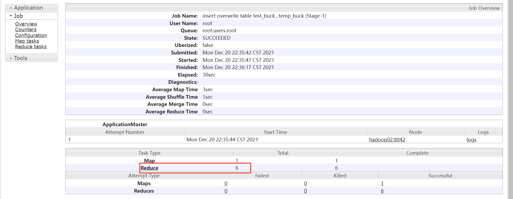

# 数仓ODS层、DWD层构建及DWB层构建

## 知识点01：课程回顾


## 知识点02：课程目标

1. ODS层实现
   - 实现：用Sqoop将MySQL中的数据同步到Hive的ODS层表中
   - **掌握：ODS层数据同步的几种方式以及Sqoop实现语法**
   - 开发：Sqoop + 脚本
2. DWD层实现
   - 实现：从ODS中抽取数据写入DWD层数据表中
   - **==掌握：拉链表的设计及构建==**：必须有良好的SQL基础以及拉链表设计非常熟悉
   - 开发：SQL：判断函数、Join、Union、窗口函数
3. DWB层实现
   - 实现：DWD抽取数据写入DWB的表中
   - **掌握：构建宽表【梳理数据表的关系：join】和降维【维度退化】设计**
   - 开发：SQL：Join
4. Hive中优化
   - **掌握Hive中核心的优化：JOIN、索引、属性优化**


## 知识点03：【掌握】ODS层：数据同步方式

- **目标**：**理解ODS层构建中数据同步的几种方式**

- **实施**

  - 大的划分：全量和增量

  - 由于不同数据源数据的数据量大小、更新变化频率、业务需求等多方面都可能是不一样的

  - 所以数仓中数据同步针对不同场景下的数据，同步的方式也不一样

  - 举个栗子

    - MySQL
      - 订单表：数据量大，变化【新增和更新】频率快，事务事实表
      - 地区表：数据量小，变量频率【新增和更新】慢，维度表
    - Hive：ODS
      - 订单表：增量
      - 地区表：全量

  - **数据同步方式**

    - **方式一：全量同步**【**快照表**：现在基本见不到了】

      - 设计：**每天新增一个日期分区，同步并存储到当天为止的全量数据**，历史数据定期删除

        - 优点：每天的数据都能完整存放在Hive对应那天分区中，新增的数据和更新的数据都能被查询到
        - 缺点：数据冗余过高，大部分的数据都是无用的

      - 栗子

        - MySQL

          ```shell
          #01-01
          userid01		laoer		18
          userid02		laoer		20
          #01-02
          userid03		laosan		22
          #01-03
          userid04		laosi		24
          ```

        - Hive：分区表

          ```shell
          #2号：daystr=2022-01-01
          userid01		laoda		18
          userid02		laoer		20
          #3号：daystr=2022-01-02
          userid01		laoda		18
          userid02		laoer		20
          userid03		laosan		22
          #4号：daystr=2022-01-03
          userid01		laoer		18
          userid02		laoer		20
          userid03		laosan		22
          userid04		laosi		24
          ```

      - 优点：保存了MySQL中数据的所有状态，查询到所有历史数据在对应时间的状态

      - 缺点：冗余度非常高，历史查询性能非常差

      - 场景：适用于数据会有新增和更新，但是数据量较少，且历史快照不用保存很久的情况

        

      

    - **方式二：全量覆盖**【全量表：一般都是维度表】

      - 设计：**不需要分区，每次同步都是先删后写，直接覆盖**

      - 场景：适用于数据量小而且很少有任何新增和变化的情况

      - 栗子：比如地区、时间、性别等维度数据，不会变更或很少会有变更，可以只保留最新值

        - MySQL

          ```shell
          #01-02
          id1			北京市
          id2			上海市
          id3			深圳市
          id4			广州市
          id5			金陵市
          ```

        - Hive

          ```shell
          #没有分区，每天直接删除原来的数据，从MySQL中采集所有数据直接覆盖
          id1			北京市
          id2			上海市
          id3			深圳市
          id4			广州市
          id5			金陵市
          ```

        

        

        

    - **方式三：仅同步新增**【**增量表**：每次都增量同步新增数据】

      - 设计：**每天新增一个日期分区，同步并存储当天的新增数据**

      - 场景：适合于数据永远只有新增，不会发生更新的场景

      - 栗子：比如登录记录表、访问日志表、交易记录表、商品评价表等‘

        - MySQL

          ```shell
          #01-01
          userid01		laoda		18
          userid02		laowu		20
          #01-02
          userid03		laosan		22
          #01-03
          userid04		laosi		24
          ```

        - Hive：分区表：将昨天新增的数据单独使用昨天的分区进行存储

          ```shell
          #2号：daystr=2022-01-01
          userid01		laoda		18
          userid02		laowu		20
          #3号：daystr=2022-01-02
          userid03		laosan		22
          #4号：daystr=2022-01-03
          userid04		laosi		24
          ```

          

        

        

    - **方式四：新增和更新都同步**【**拉链表**：同步新增和更新的数据】

      - 设计：**每天新增一个日期分区，同步并存储当天的新增和更新数据**

      - 场景：适用于既有新增又有更新的数据

      - 栗子：比如用户表、订单表、商品表等

        - MySQL

          ```shell
          #01-01
          userid01		laoer		18 # 3号发生了更新
          userid02		laowu		30 # 2号发生了更新
          #01-02
          userid03		laojiu		22
          #01-03
          userid04		laosi		24
          ```

        - Hive：分区表：将昨天新增的数据和更新单独使用昨天的分区进行存储

          ```shell
          #2号：daystr=2022-01-01
          userid01		laoda		18
          userid02		laoer		20
          #3号：daystr=2022-01-02
          userid02		laowu		30
          userid03		laojiu		22
          #4号：daystr=2022-01-03
          userid04		laosi		24
          userid01		laoer		18 
          ```

          

        

      

  - **离线数仓同步频率**

    - 首次执行：所有表都为全量同步，增量第一次也是全量

    - 循环执行：T + 1

      ```properties
      什么是T+1 ?
      这种说法来源于股票交易
      T+0: 是国际上普遍使用的一种证劵度（或期货）交易制度。凡在证劵（或期货）成交日当天办理好证劵（或期货）和价款清算交割手续的交易制度，就称为T+0交易。通俗说，就是当天买入的证道劵（或期货）在当天就可以卖出。
      T+1: 是一种股票交易制度，即当日买进的股票，要到下一个交易日才能卖出。“T”指交易登记日，“T+1”指登记日的次日。
      ```

- **小结**

  - 理解ODS层构建中数据同步的几种方式

    

## 知识点04：【理解】ODS层：全量覆盖

- **目标**：**理解ODS层构建数据表的全量覆盖**

- **实施**

  - 以`t_district区域字典表`为例

  - **数据特点**

    - 数据量小、很少发生变化、每次只要最新的结果

  - **建表语法【已创建，不用执行】**

    ```sql
    DROP TABLE if exists yp_ods.t_district;
    CREATE TABLE yp_ods.t_district
    (
        `id` string COMMENT '主键ID',
        `code` string COMMENT '区域编码',
        `name` string COMMENT '区域名称',
        `pid`  int COMMENT '父级ID',
        `alias` string COMMENT '别名'
    )
    comment '区域字典表'
    row format delimited fields terminated by '\t' 
    stored as orc 
    tblproperties ('orc.compress'='ZLIB');
    ```

  - **Sqoop同步命令**

    ```shell
    sqoop import "-Dorg.apache.sqoop.splitter.allow_text_splitter=true" \
    --connect 'jdbc:mysql://hadoop01:3306/yipin?useUnicode=true&characterEncoding=UTF-8&autoReconnect=true' \
    --username root \
    --password 123456 \
    --query "select * from t_district where 1=1 and  \$CONDITIONS" \
    --hcatalog-database yp_ods \
    --hcatalog-table t_district \
    -m 1
    ```

    - 注意：特殊语法使用

      - -D：用于指定修改Sqoop程序的属性
      - org.apache.sqoop.splitter.allow_text_splitter=true：如果--split-by指定的是文本类型，需要开启该参数
      - where 1= 1用于在程序开发时，方便加条件拼接SQL条件使用，这里可以不加，也可以暂时不管
      - 由于Hive中这张表时orc类型，所以必须使用hcatalog方式同步
      - 由于使用了hcatalog，只能追加，所以每次必须先清空表以后，再进行同步

    - 清空表，后面执行脚本采集

      ```sql
      truncate table t_district;
      ```

- **小结**

  - 理解ODS层构建数据表的全量覆盖


## 知识点05：【理解】ODS层：新增同步

- **目标**：**理解ODS层构建数据表的新增同步**

- **实施**

  - 以`t_user_login用户登录日志表`为例

  - **数据特点**

    - 数据量大、数据一旦产生不会发生改变，只有新增没有更新

  - **建表语法【已创建，不用执行】**

    ```sql
    DROP TABLE if exists yp_ods.t_user_login;
    CREATE TABLE yp_ods.t_user_login(
       id string,
       login_user string,
       login_type string COMMENT '登录类型（登陆时使用）',
       client_id string COMMENT '推送标示id(登录、第三方登录、注册、支付回调、给用户推送消息时使用)',
       login_time string,
       login_ip string,
       logout_time string
    ) 
    COMMENT '用户登录记录表'
    partitioned by (dt string)
    row format delimited fields terminated by '\t'
    stored as orc 
    tblproperties ('orc.compress' = 'ZLIB');
    ```

  - **Sqoop同步命令**

    - **以下命令不要运行，**MySQL中没有对应数据

    - 假设今天是：2021-12-20日，需要采集MYSQL中2021-12-19日的数据

      ```shell
      sqoop import "-Dorg.apache.sqoop.splitter.allow_text_splitter=true" \
      --connect 'jdbc:mysql://hadoop01:3306/yipin?useUnicode=true&characterEncoding=UTF-8&autoReconnect=true' \
      --username root \
      --password 123456 \
      # where substr(login_time,0,10) = '2021-12-19'
      --query "select *, '2021-12-19' as dt from t_user_login where 1=1 and (login_time between '2021-12-19 00:00:00' and '2021-12-19 23:59:59') and  \$CONDITIONS" \
      # substr(login_time,0,10) = '2021-12-19'
      --hcatalog-database yp_ods \
      --hcatalog-table t_user_login \
      -m 1
    ```
    
  - 假设今天是：2021-12-21日，需要采集MYSQL中2021-12-20日的数据
    
      ```shell
      sqoop import "-Dorg.apache.sqoop.splitter.allow_text_splitter=true" \
      --connect 'jdbc:mysql://hadoop01:3306/yipin?useUnicode=true&characterEncoding=UTF-8&autoReconnect=true' \
      --username root \
      --password 123456 \
      --query "select *, '2021-12-20' as dt from t_user_login where 1=1 and (login_time between '2021-12-20 00:00:00' and '2021-12-20 23:59:59') and  \$CONDITIONS" \
      --hcatalog-database yp_ods \
      --hcatalog-table t_user_login \
      -m 1
    ```
    
  - 固定写法：${yesterday}为昨天的日期
    
      ```shell
      sqoop import "-Dorg.apache.sqoop.splitter.allow_text_splitter=true" \
      --connect 'jdbc:mysql://hadoop01:3306/yipin?useUnicode=true&characterEncoding=UTF-8&autoReconnect=true' \
      --username root \
      --password 123456 \
      --query "select *, '${yesterday}' as dt from t_user_login where 1=1 and (login_time between '${yesterday} 00:00:00' and '${yesterday} 23:59:59') and  \$CONDITIONS" \
      --hcatalog-database yp_ods \
      --hcatalog-table t_user_login \
      -m 1
      ```

- **小结**

  - 理解ODS层构建数据表的新增同步


## 知识点06：【理解】ODS层：新增及更新同步

- **目标**：**理解ODS层构建数据表的新增及更新同步**

- **实施**

  - 以`t_store店铺表`为例

  - **数据特点**

    - 数据量大，既有新增，也有更新，店铺地址、描述、公告、电话等信息也可能会经常发生更新

  - **建表语法**【不用执行】

    ```sql
    CREATE TABLE yp_ods.t_store
    (
        `id`                 string COMMENT '主键',
        `user_id`            string,
        `store_avatar`       string COMMENT '店铺头像',
        `address_info`       string COMMENT '店铺详细地址',
        `name`               string COMMENT '店铺名称',
        `store_phone`        string COMMENT '联系电话',
        `province_id`        INT COMMENT '店铺所在省份ID',
        `city_id`            INT COMMENT '店铺所在城市ID',
        `area_id`            INT COMMENT '店铺所在县ID',
        `mb_title_img`       string COMMENT '手机店铺 页头背景图',
        `store_description` string COMMENT '店铺描述',
        `notice`             string COMMENT '店铺公告',
        `is_pay_bond`        TINYINT COMMENT '是否有交过保证金 1：是0：否',
        `trade_area_id`      string COMMENT '归属商圈ID',
        `delivery_method`    TINYINT COMMENT '配送方式  1 ：自提 ；3 ：自提加配送均可; 2 : 商家配送',
        `origin_price`       DECIMAL,
        `free_price`         DECIMAL,
        `store_type`         INT COMMENT '店铺类型 22天街网店 23实体店 24直营店铺 33会员专区店',
        `store_label`        string COMMENT '店铺logo',
        `search_key`         string COMMENT '店铺搜索关键字',
        `end_time`           string COMMENT '营业结束时间',
        `start_time`         string COMMENT '营业开始时间',
        `operating_status`   TINYINT COMMENT '营业状态  0 ：未营业 ；1 ：正在营业',
        `create_user`        string,
        `create_time`        string,
        `update_user`        string,
        `update_time`        string,
        `is_valid`           TINYINT COMMENT '0关闭，1开启，3店铺申请中',
        `state`              string COMMENT '可使用的支付类型:MONEY金钱支付;CASHCOUPON现金券支付',
        `idCard`             string COMMENT '身份证',
        `deposit_amount`     DECIMAL(11,2) COMMENT '商圈认购费用总额',
        `delivery_config_id` string COMMENT '配送配置表关联ID',
        `aip_user_id`        string COMMENT '通联支付标识ID',
        `search_name`        string COMMENT '模糊搜索名称字段:名称_+真实名称',
        `automatic_order`    TINYINT COMMENT '是否开启自动接单功能 1：是  0 ：否',
        `is_primary`         TINYINT COMMENT '是否是总店 1: 是 2: 不是',
        `parent_store_id`    string COMMENT '父级店铺的id，只有当is_primary类型为2时有效'
    )
    comment '店铺表'
    partitioned by (dt string) 
    row format delimited fields terminated by '\t' 
    stored as orc 
    tblproperties ('orc.compress'='ZLIB');
    ```

    - create_time：数据创建时间 一旦生成 不再修改
    - update_time：数据更新时间  数据变化时，时间会进行修改

  - **Sqoop同步命令**

    - 以下命令不要运行，MySQL中没有对应数据

    - 规则：如果数据创建时间或者数据更新时间为昨天，就需要进行同步

    - 假设今天是：2021-12-20日，需要采集MYSQL中2021-12-19日的数据

      ```shell
      sqoop import "-Dorg.apache.sqoop.splitter.allow_text_splitter=true" \
      --connect 'jdbc:mysql://hadoop01:3306/yipin?useUnicode=true&characterEncoding=UTF-8&autoReconnect=true' \
      --username root \
      --password 123456 \
      --query "select *, '2021-12-19' as dt from t_store where 1=1 and ((create_time between '2021-12-19 00:00:00' and '2021-12-19 23:59:59') or (update_time between '2021-12-19 00:00:00' and '2021-12-19 23:59:59')) and  \$CONDITIONS" \
      --hcatalog-database yp_ods \
      --hcatalog-table t_store \
      -m 1
      ```

    - 假设今天是：2021-12-21日，需要采集MYSQL中2021-12-20日的数据

      ```shell
      sqoop import "-Dorg.apache.sqoop.splitter.allow_text_splitter=true" \
      --connect 'jdbc:mysql://hadoop01:3306/yipin?useUnicode=true&characterEncoding=UTF-8&autoReconnect=true' \
      --username root \
      --password 123456 \
      --query "select *, '2021-12-20' as dt from t_store where 1=1 and ((create_time between '2021-12-20 00:00:00' and '2021-12-20 23:59:59') or (update_time between '2021-12-20 00:00:00' and '2021-12-20 23:59:59')) and  \$CONDITIONS" \
      --hcatalog-database yp_ods \
      --hcatalog-table t_store \
      -m 1
      ```

    - 固定写法：${yesterday}为昨天的日期

      ```shell
      sqoop import "-Dorg.apache.sqoop.splitter.allow_text_splitter=true" \
      --connect 'jdbc:mysql://hadoop01:3306/yipin?useUnicode=true&characterEncoding=UTF-8&autoReconnect=true' \
      --username root \
      --password 123456 \
      --query "select *, '${yesterday}' as dt from t_store where 1=1 and ((create_time between '${yesterday} 00:00:00' and '${yesterday} 23:59:59') or (update_time between '${yesterday} 00:00:00' and '${yesterday} 23:59:59')) and  \$CONDITIONS" \
      --hcatalog-database yp_ods \
      --hcatalog-table t_store \
      -m 1
      ```

- **小结**

  - 理解ODS层构建数据表的新增及更新同步


## 知识点07：【实现】ODS层：完整数据同步

- **目标**：**实现ODS层数据同步的实现**

- **实施**

  - **需求：将MySQL中的数据表按照增量和全量的需求进行划分，使用Sqoop同步到Hive的ODS层表中**

    - 全量覆盖表

      ```properties
      t_district: 区域字典表
      t_date: 时间维度表
      ```

    - 新增同步

      ```properties
      t_goods_evaluation: 订单评价表
      t_goods_evaluation_detail: 商品评价信息表
      t_order_delievery_item: 订单配送表 
      t_user_login: 用户登录日志表
      t_trade_record: 交易记录表
      ```

    - 新增更新同步

      ```properties
      t_score: 店铺详情表
      t_trade_area: 商圈表
      t_location: 地址表
      t_goods: 商品表
      t_goods_class:商品分类表 
      t_brand: 品牌表
      t_shop_order: 订单主表
      t_shop_order_address_detail: 订单副表 
      t_order_settle: 订单结算表
      t_refund_order: 订单退款表
      t_shop_order_group: 订单组表
      t_order_pay: 订单组支付表
      t_shop_order_goods_details: 订单和商品明细表
      t_shop_cart: 购物车表
      t_store_collect: 店铺收藏表
      t_goods_collect: 商品收藏表
      ```

  - **实现**

    - step1：将脚本`01_ODS/sqoop_import.sh`中的日期修改为昨天的日期

      - 脚本中：2022-01-06
    - 替换成：2022-03-19【注意：你哪天练习DWD层，就改成哪一天的前一天】
    
    
    
      
    
      
    
  - step2：将脚本`01_ODS/sqoop_import.sh`上传到hadoop01机器上
    
    ```
      # 安装上传工具
      yum install -y lrzsz
      cd /export/data
    rz
      ```

    - step3：添加可执行权限
    
      ```
      chmod u+x sqoop_import.sh
      ```
    
    - step4：执行
    
      ```shell
      ./sqoop_import.sh 
      ```

- **小结**

  - 实现ODS层数据同步的实现


## 知识点08：【掌握】DWD层：需求分析

- **目标**：**掌握DWD层的构建需求分析**

- **实施**

  

  - **需求**：对ODS层的数据进行清洗转换构建DWD层的明细数据，划分事实表和维度表

  - **分析**

    - step1：创建DWD层数据库
    - step2：创建DWD层数据表：划分事实表【fact】和维度表【dim】
    - step3：抽取ODS层数据进行清洗转换写入DWD层对应的数据表中

  - **问题**

    - 如何创建DWD层？
    - 如何划分事实表和维度表？
    - 数据要做哪些清洗转换？【本次项目中没有过多的清洗转换】
      - 数据来源文件：一般需要做较多的数据质量的把控
      - 数据来源数据库：业务数据本身就要保证完整
      - 常见的低质量数据：字段缺失、数值偏差、重复数据

  - **解决**

    - **建DWD层数据库**

      ```sql
      create database if not exists yp_dwd;
      ```

    - **事实表与维度表的划分**

      - 一般由业务需求决定

        - 构建指标的字段所在的表：事实表
      - 订单金额【order_amt】、订单个数【orderid】：订单信息表
        - 作为条件实现分组的字段所在的表：维度表
      - 每天、每个地区、每个商品、每个用户
        
  - 事实表【fact_*】：所有用于描述业务事实，最终聚合分析构建指标的数据表
      
    ```
        订单主副表、订单结算、订单组、订单退款、订单商品快照、购物车、店铺收藏等
        ```
      
    
      
  - 维度表【dim_*】：所有用于描述事实发生的条件，最终用作分组的字段的数据表
      
    ```
        用户、区域、时间、店铺、商圈、地址信息、商品、商品分类、品牌等
        ```
      
        
      
      - 注意事项
      
        - 有些情况下，一张表到底是属于事实表还是维度表，其实是跟后续的分析主题相关的。
        - 主题选取不同，可能对导致表的定位不同。
        - 举一个极端的例子：品牌表，如果后续专门研究分析品牌主题，那么做事实表可能更好。
        - 本项目总共实现3个主题：销售主题、商品主题、用户主题（练习）

- **小结**

  - 掌握DWD层的构建需求分析


## 知识点09：【掌握】DWD层：三种导入场景

- **目标**：**掌握DWD层构建的三种导入场景**

- **实施**

  ​										

  - **情况一：全量覆盖**
    - 数据特点：数据量相对较少，很少发生变化
    - 典型代表：dim_district区域字典维度表、dim_date时间维度表
    - 建表方式：普通数据表【DWD层：全量表】
  - **情况二：只有新增**
    - 数据特点：数据量相对较大，经常发生变化，但数据只会不断新增
    - 典型代表：fact_goods_evaluation订单评价事实表、fact_user_login登录记录事实表
    - 建表方式：分区结构表【按天分区，DWD：增量表】
  - **情况三：既有新增，也有更新**
    - 数据特点：数据量相对较大，经常发生变化，数据既有新增也有更新
    - 典型代表：fact_shop_order 订单表、fact_order_settle订单结算表等
    - 建表方式：分区表结构【按天分区：存储每天新增和更新的数据，DWD：拉链表】
    - 难点：更新的数据是数据的最新状态，而这个数据的历史状态在之前的分区中

- **小结**

  - 掌握DWD层构建的三种导入场景


## 知识点10：【掌握】DWD层：全量覆盖实现

- **目标**：**掌握DWD层全量覆盖实现**

- **实施**

  - 以`dim_district区域字典维度表`为例

  - **DWD层建表**

    ```sql
    DROP TABLE if EXISTS yp_dwd.dim_district;
    CREATE TABLE yp_dwd.dim_district(
      id string COMMENT '主键ID', 
      code string COMMENT '区域编码', 
      name string COMMENT '区域名称', 
      pid string COMMENT '父级ID', 
      alias string COMMENT '别名')
    COMMENT '区域字典表'
    row format delimited fields terminated by '\t'
    stored as orc 
    tblproperties ('orc.compress' = 'SNAPPY');
    ```

    - 普通数据表，不需要分区

  - **从ODS层抽取导入**

    ```sql
    -- 覆盖写入
    insert overwrite table yp_dwd.dim_district
    -- 抽取ODS层表
    select 
      * 
    from yp_ods.t_district
    where code is not null and  name is not null;
    ```

    - 每次直接覆盖

- **小结**

  - 掌握DWD层全量覆盖实现


## 知识点11：【掌握】DWD层：新增增量实现

- **目标**：**掌握DWD层新增增量实现**

- **实施**

  - 以`fact_goods_evaluation订单评价事实表`为例

  - **DWD层建表**

    ```sql
    DROP TABLE if EXISTS yp_dwd.fact_goods_evaluation;
    CREATE TABLE yp_dwd.fact_goods_evaluation(
      id string, 
      user_id string COMMENT '评论人id', 
      store_id string COMMENT '店铺id', 
      order_id string COMMENT '订单id', 
      geval_scores int COMMENT '综合评分', 
      geval_scores_speed int COMMENT '送货速度评分0-5分(配送评分)', 
      geval_scores_service int COMMENT '服务评分0-5分', 
      geval_isanony tinyint COMMENT '0-匿名评价，1-非匿名', 
      create_user string, 
      create_time string, 
      update_user string, 
      update_time string, 
      is_valid tinyint COMMENT '0 ：失效，1 ：开启')
    COMMENT '订单评价表'
    partitioned by (dt string)
    row format delimited fields terminated by '\t'
    stored as orc 
    tblproperties ('orc.compress' = 'SNAPPY');
    ```

    - 分区结构表，每天一个分区，每天增量写入对应的分区中

  - **从ODS层抽取导入**

    - 第一次：将所有历史中的每一天，以动态分区的方式写入分区表

      ```sql
      -- 覆盖写入fact_goods_evaluation的对应分区中
      INSERT overwrite TABLE yp_dwd.fact_goods_evaluation PARTITION(dt)
      select 
         id,
         user_id,
         store_id,
         order_id,
         geval_scores,
         geval_scores_speed,
         geval_scores_service,
         geval_isanony,
         create_user,
         create_time,
         update_user,
         update_time,
         is_valid,
         -- 按照数据创建时间进行动态分区
         substr(create_time, 1, 10) as dt
      -- 从ods层的表中抽取
      from yp_ods.t_goods_evaluation;
      ```

    - 第二次开始：假设今天是2022-01-02，实现T+1的静态分区写入分区表

      ```sql
      -- 覆盖写入fact_goods_evaluation的昨天的分区中
      INSERT overwrite TABLE yp_dwd.fact_goods_evaluation PARTITION(dt = '2022-01-01')
      select 
         id,
         user_id,
         store_id,
         order_id,
         geval_scores,
         geval_scores_speed,
         geval_scores_service,
         geval_isanony,
         create_user,
         create_time,
         update_user,
         update_time,
         is_valid,
         '2022-01-01' as dt
      -- 从ods层的表中抽取
      from yp_ods.t_goods_evaluation
      -- 抽取昨天分区的数据
      where dt = '2022-01-01';
      ```

    - 循环导入

      ```sql
      -- 覆盖写入fact_goods_evaluation的昨天的分区中
      INSERT overwrite TABLE yp_dwd.fact_goods_evaluation PARTITION(dt = '${yesterday}')
      select 
         id,
         user_id,
         store_id,
         order_id,
         geval_scores,
         geval_scores_speed,
         geval_scores_service,
         geval_isanony,
         create_user,
         create_time,
         update_user,
         update_time,
         is_valid,
         '${yesterday}' as dt
      -- 从ods层的表中抽取
      from yp_ods.t_goods_evaluation
      -- 抽取昨天分区的数据
      where dt = '${yesterday}';
      ```

- **小结**

  - 掌握DWD层新增增量实现


## 知识点12：【理解】DWD层：新增及更新问题

- **目标**：**掌握DWD层的新增及更新数据问题**

- **实施**

  - **问题1：假设今天是2022-01-01，产生了一个订单o001，2022-01-02怎么处理？**

    - 直接采集到Hive表中

      ```
      # ods：dt = 2022-01-01
      o001		2022-01-01		已支付
      ```

  - **问题2：假设今天是2022-01-02，昨天的o001订单的状态发生了变化，变成了已发货，2022-01-03怎么采集**

    - 需要采集到Hive表中

      ```
      #ods: dt = 2022-01-02
      o001		2022-01-01		已发货
      ```

  - **问题3：同一条数据的两个不同时间的状态Hive表中怎么存储？**

    - 拉链表来处理

  - **问题4：什么是拉链表？**

    - 使用两个时间字段用来标记一条数据的不同状态
    - start_date：数据状态的开始时间
    - end_date：数据状态的结束时间

    | 订单id | 创建时间   | 订单状态 | start_date | end_date   |
    | ------ | ---------- | -------- | ---------- | ---------- |
    | o001   | 2022-01-01 | 已支付   | 2022-01-01 | 2022-01-01 |
    | o001   | 2022-01-01 | 已发货   | 2022-01-02 | 9999-12-31 |

  - **问题5：怎么构建拉链表？**

    - step1：将昨天新增和更新的数据增量采集到ODS层分区表的昨天的分区中【startdate：就是昨天的日期】
    
    - step2：将昨天新增和更新的数据与DWD层的拉链表进行合并，生成最新拉链表放入一张临时表中

      - 数据表的合并：union all

        ```
        select * from ods where dt = 2022-03-19
        union all
        select * from dwd 
        ```
    
      - 修改老的拉链表中本次发生更新的，并且之前是最新状态的那条数据的end_date修改为本次最新状态的start_date-1
    
        - 我怎么这条数据这一次有没有发生更新？
        - 我怎么知道这条数据之前是最新状态，不是历史状态？
    
    - step3：将临时表的最新拉链结果覆盖到拉链表中
    
    - 举个栗子：T+1
    
      - 01-01
    
        - Hive上线
    
        - MySQL
    
          ```
          o001			已支付
          o002			已发货
          ```
    
      - 01-02
    
        - Hive：采集1号的数据
    
          ```shell
          # ODS：增量表				分区字段
          o001			已支付		2022-01-01
          o002			已发货		2022-01-01
          # DWD：拉链表				start_date		end_date
          o001			已支付		2022-01-01		9999-12-31
          o002			已发货		2022-01-01		9999-12-31
          ```
    
        - MySQL：数据会发生变化：新增了一条03，并且01发生了更新
    
          ```
      o001			已发货
          o002			已发货
          o003			已发货
          ```
        
      - 01-03
    
        - Hive：采集2号的数据
    
          ```shell
        #ODS层：增量表
          #dt = 2022-01-01
          o001			已支付		2022-01-01
          o002			已发货		2022-01-01
          #dt = 2022-01-02
          o003			已发货		2022-01-02
          o001			已发货		2022-01-02
          
          # DWD：老的拉链表
          o001			已支付		2022-01-01		9999-12-31
          o002			已发货		2022-01-01		9999-12-31
          
          # DWD：新的拉链表
        # 2021-12-31	
          o001			已下单		2021-12-31		2021-12-31
      # 2022-01-01
          o001			已支付		2022-01-01		2022-01-01
        o002			已发货		2022-01-01		9999-12-31
          # 2022-01-02
          o003			已发货		2022-01-02		9999-12-31
          o001			已发货		2022-01-02		9999-12-31
          ```
        
          - 新增数据：不用改，老的拉链表中没有历史状态
            - 003
          - 最新状态：不用改，本来就是这条数据的最新状态
            - 001		已发货
        - 没有更新：不用改，没有更新
            - 002
      - 历史状态：不用改，之前的拉链合并的时候已经改过来，不是这条数据在老的拉链表中的最新装填
            - o001			已下单	
        - 需要改：发生更新，之前是拉链表中的最新状态，改成目前最新状态的startdate-1
            - 条件 ： DWD层：发生更新  and enddate = ‘9999-12-31’
        
      - 创建一张临时表:ods_tmp
        
        ```
          select *,'2022-01-02' as end_date from ods where dt = 2022-01-02
          union all
          select * from dwd
          
          #DWD：新的拉链表临时结果
          o001			已支付			2022-01-01			2022-01-01
          o001			已发货			2022-01-02			9999-12-31
          o002			已发货			2022-01-01			9999-12-31
          o003			已发货			2022-01-02			9999-12-31
          ```
        
        - 将临时表的数据动态分区覆盖写入原来的拉链表中
        
          ```
          insert overwrite dwd_zip (dt)
          select *,start_date from dwd_tmp
          ```
        
          
    
    
    
    

- **小结**

  - 掌握DWD层的新增及更新数据问题


## 知识点13：【实现】DWD层：第一次拉链测试

- **目标**：**实现DWD层的第一次拉链实现**

- **实施**

  - 以`t_shop_order订单表`为例

  - **创建DWD层订单事实表**

    ```sql
    DROP TABLE if EXISTS yp_dwd.fact_shop_order;
    CREATE TABLE yp_dwd.fact_shop_order(
      id string COMMENT '根据一定规则生成的订单编号', 
      order_num string COMMENT '订单序号', 
      buyer_id string COMMENT '买家的userId', 
      store_id string COMMENT '店铺的id', 
      order_from string COMMENT '此字段可以转换 1.安卓\; 2.ios\; 3.小程序H5 \; 4.PC', 
      order_state int COMMENT '订单状态:1.已下单\; 2.已付款, 3. 已确认 \;4.配送\; 5.已完成\; 6.退款\;7.已取消', 
      create_date string COMMENT '下单时间', 
      finnshed_time timestamp COMMENT '订单完成时间,当配送员点击确认送达时,进行更新订单完成时间,后期需要根据订单完成时间,进行自动收货以及自动评价', 
      is_settlement tinyint COMMENT '是否结算\;0.待结算订单\; 1.已结算订单\;', 
      is_delete tinyint COMMENT '订单评价的状态:0.未删除\;  1.已删除\;(默认0)', 
      evaluation_state tinyint COMMENT '订单评价的状态:0.未评价\;  1.已评价\;(默认0)', 
      way string COMMENT '取货方式:SELF自提\;SHOP店铺负责配送', 
      is_stock_up int COMMENT '是否需要备货 0：不需要    1：需要    2:平台确认备货  3:已完成备货 4平台已经将货物送至店铺 ', 
      create_user string, 
      create_time string, 
      update_user string, 
      update_time string, 
      is_valid tinyint COMMENT '是否有效  0: false\; 1: true\;   订单是否有效的标志',
      end_date string COMMENT '拉链结束日期')
    COMMENT '订单表'
    partitioned by (start_date string)  
    row format delimited fields terminated by '\t' 
    stored as orc 
    tblproperties ('orc.compress' = 'SNAPPY');
    ```

    - start_date：数据的状态开始时间，作为分区字段
    - end_date：数据的状态结束时间，默认为9999-12-31或者9999-99-99

  - **第一次全量导入历史数据**

    ```sql
    ------------------因为采用了动态分区插入技术 因此需要设置相关参数---------------
    --分区
    SET hive.exec.dynamic.partition=true;
    SET hive.exec.dynamic.partition.mode=nonstrict;
    set hive.exec.max.dynamic.partitions.pernode=10000;
    set hive.exec.max.dynamic.partitions=100000;
    set hive.exec.max.created.files=150000;
    --hive压缩
    set hive.exec.compress.intermediate=true;
    set hive.exec.compress.output=true;
    --写入时压缩生效
    set hive.exec.orc.compression.strategy=COMPRESSION;
    
    --首次全量导入
    INSERT overwrite TABLE yp_dwd.fact_shop_order PARTITION (start_date)
    SELECT 
       id,order_num,buyer_id,store_id,
       --对枚举字段做了处理
       case order_from when 1 then 'android'
          when 2 then 'ios'
          when 3 then 'miniapp'
          when 4 then 'pcweb'
          else 'other' end as order_from,
       order_state,create_date,finnshed_time,
       is_settlement,is_delete,evaluation_state,
       way,is_stock_up,create_user,create_time,
       update_user,update_time,is_valid,
       '9999-99-99' end_date,
       --使用分区字段作为start_date
       dt as start_date
    FROM yp_ods.t_shop_order;
    ```

  - **验证结果**

    ```sql
    select 
        id,order_num,order_from,start_date,end_date 
    from yp_dwd.fact_shop_order
    limit 100;
    ```

- **小结**

  - 实现DWD层的第一次拉链实现


## 知识点14：【实现】DWD层：循环拉链测试

- **目标**：**实现DWD层循环拉链测试**

- **实施**

  - 先查询基础数据

    ```sql
    select
       id,
     order_num,
       start_date,
     end_date
    from yp_dwd.fact_shop_order
    where id='dd1910223851672f32';
    ```

    

    

  - **step0：模拟数据**

    - 为了演示效果，模拟MySQL中的数据产生了新增和更新

    - **MySQL中操作**

    - 删除之前订单

      ```sql
      delete from yipin.t_shop_order where id ='dd9999999999999999';
      ```

    - 新增一条订单

      ```sql
      INSERT INTO yipin.t_shop_order (id, order_num, buyer_id, store_id, order_from, order_state, create_date, finnshed_time, is_settlement, is_delete, evaluation_state, way, is_stock_up, create_user, create_time, update_user, update_time, is_valid) VALUES ('dd9999999999999999', '251', '2f322c3f55e211e998ec7cd30ad32e2e', 'e438ca06cdf711e998ec7cd30ad32e2e', 3, 2, '2022-03-20 17:52:23', null, 0, 0, 0, 'SELF', 0, '2f322c3f55e211e998ec7cd30ad32e2e', '2022-03-20 17:52:23', '2f322c3f55e211e998ec7cd30ad32e2e', '2022-03-20 18:52:34', 1);
      ```

    - 更新一条订单

      ```sql
      UPDATE t_shop_order SET order_num=666 WHERE id='dd1910223851672f32';
      UPDATE t_shop_order SET update_time='2022-03-20 12:12:12' WHERE id='dd1910223851672f32';
      ```

    - 验证结果

      ```
      select
      	*
      from t_shop_order
      where substr(create_time,1,10) = '2022-03-20' or substr(update_time,1,10) = '2022-03-20';
      ```

      

  - **step1：增量采集【新增和更新的数据】**

    - Sqoop采集

      ```shell
      sqoop import "-Dorg.apache.sqoop.splitter.allow_text_splitter=true" \
      --connect 'jdbc:mysql://hadoop01:3306/yipin?useUnicode=true&characterEncoding=UTF-8&autoReconnect=true' \
      --username root \
      --password 123456 \
      --query "select *, '2022-03-20' as dt from t_shop_order where 1=1 and (create_time between '2022-03-20 00:00:00' and '2022-03-20 23:59:59') or (update_time between '2022-03-20 00:00:00' and '2022-03-20 23:59:59') and  \$CONDITIONS" \
      --hcatalog-database yp_ods \
      --hcatalog-table t_shop_order \
      -m 1
      ```

      

    - Hive中验证

      ```sql
      show partitions t_shop_order;
      select * from t_shop_order where dt = '2022-03-20';
      ```

      

  - **step2：合并最新拉链数据到临时表中**

    - 创建临时表，表结构与拉链表结构一致

      ```sql
      DROP TABLE if EXISTS yp_dwd.fact_shop_order_tmp;
      CREATE TABLE yp_dwd.fact_shop_order_tmp(
        id string COMMENT '根据一定规则生成的订单编号',
        order_num string COMMENT '订单序号',
        buyer_id string COMMENT '买家的userId',
        store_id string COMMENT '店铺的id',
        order_from string COMMENT '此字段可以转换 1.安卓\; 2.ios\; 3.小程序H5 \; 4.PC',
        order_state int COMMENT '订单状态:1.已下单\; 2.已付款, 3. 已确认 \;4.配送\; 5.已完成\; 6.退款\;7.已取消',
        create_date string COMMENT '下单时间',
        finnshed_time timestamp COMMENT '订单完成时间,当配送员点击确认送达时,进行更新订单完成时间,后期需要根据订单完成时间,进行自动收货以及自动评价',
        is_settlement tinyint COMMENT '是否结算\;0.待结算订单\; 1.已结算订单\;',
        is_delete tinyint COMMENT '订单评价的状态:0.未删除\;  1.已删除\;(默认0)',
        evaluation_state tinyint COMMENT '订单评价的状态:0.未评价\;  1.已评价\;(默认0)',
        way string COMMENT '取货方式:SELF自提\;SHOP店铺负责配送',
        is_stock_up int COMMENT '是否需要备货 0：不需要    1：需要    2:平台确认备货  3:已完成备货 4平台已经将货物送至店铺 ',
        create_user string,
        create_time string,
        update_user string,
        update_time string,
        is_valid tinyint COMMENT '是否有效  0: false\; 1: true\;   订单是否有效的标志',
        end_date string COMMENT '拉链结束日期')
      COMMENT '订单表'
      partitioned by (start_date string)
      row format delimited fields terminated by '\t'
      stored as orc
      tblproperties ('orc.compress' = 'SNAPPY')
      ```

    - 合并到临时表中

      ```sql
      insert overwrite table yp_dwd.fact_shop_order_tmp partition (start_date)
      select
      	*
      from (
         --1、ods表的新分区数据(有新增和更新的数据)
          select
              id,order_num,buyer_id,
              store_id,
              case order_from when 1 then 'android'
                              when 2 then 'ios'
          					when 3 then 'miniapp'
          					when 4 then 'pcweb'
          					else 'other' end as order_from,
          	order_state,create_date,finnshed_time,
          	is_settlement,is_delete,evaluation_state,
          	way,is_stock_up,create_user,
          	create_time,update_user,update_time,is_valid,
          	'9999-99-99' end_date,
          	'2022-03-20' as start_date
          from yp_ods.t_shop_order
          where dt='2022-03-20'
          --合并
          union all
          -- 2、历史拉链表数据，并根据up_id判断更新end_time有效期
          select
          	fso.id,fso.order_num,fso.buyer_id,
          	fso.store_id,fso.order_from,fso.order_state,
          	fso.create_date,fso.finnshed_time,fso.is_settlement,
          	fso.is_delete,fso.evaluation_state,fso.way,
          	fso.is_stock_up,fso.create_user,fso.create_time,
          	fso.update_user,fso.update_time,fso.is_valid,
          --3、更新end_time：如果没有匹配到变更数据，或者当前已经是无效的历史数据，则保留原始end_time过期时间；否则变更end_time时间为前天（昨天之前有效）
          	if (tso.id is null or fso.end_date<'9999-99-99', fso.end_date, date_add(tso.dt, -1)) end_time,
              -- if(条件，true的结果，false的结果)
              -- if(tso.id is not null and fso.end_date = '9999-99-99',date_add(tso.dt, -1), fso.end_date)
          	fso.start_date
          -- 历史拉链表
          from yp_dwd.fact_shop_order fso
          -- 左连接当前最新数据：左表有结果就有，右表没有就为null
          -- 如果左表有并且右表也有：这条数据发生了更新
          left join (
              	select * from yp_ods.t_shop_order where dt='2022-03-20'
               ) tso
          	 on fso.id=tso.id
      ) his
      order by his.id, start_date;
      ```

    - 验证

      ```sql
      select
         id,
         order_num,
         start_date,
         end_date
      from yp_dwd.fact_shop_order_tmp
      where id='dd1910223851672f32';
      ```

  - **step3：覆盖拉链表**

    ```sql
    INSERT OVERWRITE TABLE yp_dwd.fact_shop_order partition (start_date)
    SELECT 
      * 
    -- 最新的拉链表的数据
    from yp_dwd.fact_shop_order_tmp;
  ```
    

- **小结**

  - 实现DWD层循环拉链测试

  

## 知识点15：【实现】DWD层：完整数据构建

- **目标**：**实现DWD层完整数据构建**

- **实施**

  - **需求：将ODS层中的数据表按照增量和全量的需求进行划分，使用SQL导入到Hive的DWD层表中**

  - **实现**

    - step1：Hive中运行`02_DWD/DT/create_dim_table.sql`文件，创建所有维度表

      

      

      

      

    - step2：Hive中运行`02_DWD/DT/insert-dim.sql`文件，导入所有维度表数据

      

      

      

      

    - step3：Hive中运行`02_DWD/FT/create_fact_table.sql`文件，创建所有事实表

      

      

      

      

      

    - step4：Hive中运行`02_DWD/FT/insert-fact.sql`文件，导入所有事实表数据

      

      

      

      

- **小结**

  - 实现DWD层完整数据构建


## 知识点16：【掌握】数仓分层设计回顾

- **目标**：**掌握数仓分层设计**

- **实施**

  

  - **ODS：原始数据层**，临时存储所有原始数据

  - **DWD：明细数据层**，对ODS层的数据进行清洗转换，保证数据质量，划分事实表和维度表

  - **DWB：基础数据层**，按照主题需求，对数据进行降维关联，实现数据宽表的构建

    - 问题1：为什么要构建宽表？

      - 提前对数据进行处理前准备：预处理处理过程
  - 为了避免后面每次数据处理都要做多张表的JOIN，导致计算的性能比较差
      - 根据需求，将后续需要用到字段按照不同的需求关联在一张表中

    - **问题2：什么是降维？**

    - 定义：降维又叫做**维度退化**，将维度字段退化到事实表中，但是实际上并没有对应的维度表

    - 目的：退化维度技术可以减少维度的数量（降维操作），简化维度数据仓库的模式。简单的模式比复杂的更容易理解，也有更好的查询性能。

    - 场景：如果这个**维度的数据特别少**，只有几条数据，没必要构建维度表
    
    - 需求：统计每个平台的订单个数、订单金额
    
    - 设计
    
        - 指标：订单个数、订单金额
        - 维度：平台
    
      - 方案一：构建一个平台维度表
    
        ```
        平台id		平台名称
      1			  安卓
        2			  IOS
      3			  小程序
        4              PC
        5              H5
        ```

      - 方案二：直接将维度数据存储在事实表中

        ```
        平台id		平台名称			订单个数			订单金额
        ```

    - 优点

      - 整个数仓中表的个数减少了
      - 业务相关联的数据数据字段聚在一起了，形成一张宽表
      - 分析查询时的效率显著提高了【多表查询和单表查询的差异】
    
    - 缺点
    
      - 数据大量冗余、宽表的概念已经不符合3范式设计要求了，但是数仓建模的核心追求是性能，只要有利于分析，能够加快数据分析性能，都可以做。

- **小结**

  - 掌握数仓分层设计


## 知识点17：【掌握】DWB层：需求分析

- **目标**：掌握DWB层的需求分析

- **实施**

  - **需求：基于不同主题实现维度退化，构建对应的主题宽表**

  - **分析**

    - step1：梳理主题需求，需要构建哪些数据宽表
    - step2：梳理维度需求，需要退化哪些维度到宽表中
    - step3：创建DWB层，通过数据关联关系，实现数据表的关联构建数据宽表

  - **问题**

    - 项目需求中有哪些主题需求？
    - 这些主题需要构建哪些数据宽表？
    - 怎么创建DWB层？

  - **解决**

    - 项目中的主题需求：销售主题、商品主题、用户主题【比较简单，不需要提前构建宽表】

    - 需要构建的数据宽表

      - **订单明细宽表**：dwb_order_detail
      - **店铺明细宽表**：dwb_shop_detail
      - **商品明细宽表**：dwb_goods_detail
      - 注意：用户主题没有进行退化维度操作，原因是后面的指标，单表就可以实现，不需要构建宽表。

    - 创建DWB层

      ```sql
      create database if not exists yp_dwb;
      ```

  - **实现思路**

    - step1：根据需要找到你需要的字段

      - empinfo：员工信息表

        ```
        empid		ename		salary			deptno			jobid
        ```

      - jobinfo：岗位信息表

        ```
        jobid		jobname		basic_salary
        ```

      - deptinfo：部门信息表

        ```
        deptno		dname		location
        ```

      - 需求：构建每个员工的详细信息

        ```
        empid		ename		salary		jobid		jobname		deptno		dname
        ```

      - 梳理关联关系

        - empinfo：deptno			jobid
        - jobinfo：jobid
        - deptinfo：deptno

    - step2：根据表的关联关系实现表的关联，取每张表的字段

      ```
      select
         a.*,b.*,c.*
      from empinfo a
      join deptinfo b on a.deptno = b.deptno
      join jobinfo c on a.jobid = c.jobid
      ```

      

- **小结**

  - 掌握DWB层的需求分析


## 知识点18：【理解】DWB层：订单宽表数据关系

- **目标**：**理解DWB层订单宽表的数据关系**

- **实施**

  - **指标**：订单宽表最终是为了构建哪些指标而设计的？

    ```
    订单总量、订单总金额、订单量占比、支付个数、支付总金额、退单个数、退单总金额、订单商品个数、评价个数、配送个数
    ```

  - **分析**：最终得到这些指标，需要哪些数据？

    - 订单数据、支付数据、退款数据、商品数据、评价数据、配送数据

  - **原始数据**

    - 订单数据

      ```properties
      fact_shop_order: 订单信息表
      fact_shop_order_address_detail: 订单明细表
      fact_shop_order_group: 订单组信息表
      ```

    - 支付数据

      ```properties
      fact_order_pay: 订单组支付信息表
      fact_order_settle: 订单结算信息表
      ```

    - 退款数据

      ```properties
      fact_refund_order: 订单退款信息表
      ```

    - 商品数据

      ```properties
      fact_shop_order_goods_details: 订单商品快照表
      ```

    - 评价数据

      ```properties
      fact_goods_evaluation: 订单评价信息表
      ```

    - 配送数据

      ```properties
      fact_order_delievery_item: 订单配送信息表
      ```

      

  - **数据内容**

    - fact_shop_order: 订单信息表，核心数据表，记录着核心的订单信息

      ```sql
      select
          id,--订单id
          order_num,--订单序号
      	buyer_id,--买家的userid
      	store_id,--店铺id
      	order_from,--订单来源:1.安卓 2.ios 3.小程序H5 4.PC
      	order_state,--订单状态:1.已下单 2.已付款 3. 已确认 4.配送 5.已完成 6.退款 7.已取消
      	create_date,--下单时间
      	finnshed_time,--完成时间
      	is_settlement,--是否结算:0.待结算订单  1.已结算订单
      	is_delete,--订单删除的状态:0.未删除(默认0)  1.已删除
      	evaluation_state,--订单评价的状态:0.未评价(默认0)  1.已评价
      	way,--取货方式:SELF-自提 SHOP-店铺负责配送
      	is_stock_up --是否需要备货 0：不需要    1：需要    2:平台确认备货  3:已完成备货  4:平台已经将货物送至店铺
      from yp_dwd.fact_shop_order
      limit 10;
      ```

      

    - fact_shop_order_address_detail: 订单明细表，记录订单额外信息，与订单主表是1对1关系

      ```sql
      select
          id,--订单id
          order_amount,--订单总金额:购买总金额-优惠金额
      	discount_amount,--优惠金额
      	goods_amount,--用户购买的商品的总金额+运费
      	is_delivery,--0.自提；1.配送
      	buyer_notes,--买家备注留言
      	pay_time,--订单支付时间
      	receive_time,--订单确认时间
      	delivery_begin_time,--配送开始时间
      	arrive_store_time,--到达门店时间
      	arrive_time,--订单完成时间
      	create_user,--创建用户id
      	create_time,--创建时间
      	update_user,--更新用户id
      	update_time,--更新时间
      	is_valid --订单是否有效  0: false; 1: true
      from yp_dwd.fact_shop_order_address_detail
      limit 10;
      ```

      

    - fact_shop_order_group: 订单组信息表，多笔订单构成一个订单组 (含orderID)

      ```sql
      select
          order_id,--订单id
          group_id,--订单组id
          is_pay --是否已支付,0未支付,1已支付
      from yp_dwd.fact_shop_order_group
      limit 10;
      ```

      

    - fact_order_pay: 订单组支付信息表，记录订单组支付信息，跟订单组是1对1关系 (含group_id)

      ```sql
      select
          group_id,--订单组id
          order_pay_amount --订单总金额
      from yp_dwd.fact_order_pay
      limit 10;
      ```

      

    - fact_order_settle: 订单结算信息表，记录一笔订单中配送员、圈主、平台、商家的分成 (含orderID)

      ```sql
      select
          order_id,--订单id
          id as settle_id,--结算id
      	settlement_amount,--结算金额，如果发生退款,则结算的金额 = 订单的总金额 - 退款的金额
      	dispatcher_user_id,--配送员id
      	dispatcher_money,--配送费，(如果退货方式为1:则买家支付配送费))
      	circle_master_user_id,--圈主id
      	circle_master_money,--圈主抽成金额
      	plat_fee,--平台抽成金额
      	store_money,--商家的金额
      	status,--结算状态，0.待结算 1.待审核 2.完成结算 3.拒绝结算
      	settle_time --结算时间
      from yp_dwd.fact_order_settle
      limit 10;
      ```

      

    - fact_refund_order: 订单退款信息表，记录退款相关信息(含orderID)	

      ```sql
      select
          order_id,--订单id
          id as refund_id,--退款id
      	apply_date,--申请退款时间
      	refund_reason,--申请退款原因
      	refund_amount,--申请退款金额
      	refund_state --退款状态，1.申请退款;2.拒绝退款; 3.同意退款,配送员配送; 4:商家同意退款,用户亲自送货 ;5.退款完成
      from yp_dwd.fact_refund_order
      limit 10;
      ```

      

    - fact_shop_order_goods_details: 订单商品快照表，记录每个订单中商品的详细信息

      ```sql
      select
          order_id,--订单id
          goods_id,--商品id
      	buy_num,--商品个数
      	goods_price,--商品单价
      	total_price,--商品总价
      	goods_name,--商品名称
      	goods_specification,--商品规格
      	goods_type,--商品类型  ytgj:进口商品    ytsc:普通商品     hots爆品
          goods_brokerage, --商家设置的商品分润的金额
      	is_refund as is_goods_refund --是否退款，0.不退款; 1.退款
      from yp_dwd.fact_shop_order_goods_details
      limit 10;
      ```

      

    - fact_goods_evaluation: 订单评价信息表，记录订单综合评分,送货速度评分等(含orderID) 

      ```sql
      select
          order_id,--订单id
          id, --评价id
          user_id,--评价用户id
          geval_scores,--综合评分
          geval_scores_speed,--送货速度评分
          geval_scores_service,--服务评分
          geval_isanony,--评价方式，0-匿名评价，1-非匿名
          create_time--评价时间
      from yp_dwd.fact_goods_evaluation
      limit 10;
      ```

      

    - fact_order_delievery_item: 订单配送信息表，记录配送员信息、收货人信息、商品信息(含orderID)

      ```sql
      select
          shop_order_id,--订单id
          id,--配送id
          dispatcher_order_state,--配送订单类型1.支付单; 2.退款单
          delivery_fee,--配送费
          distance,--配送距离
          dispatcher_code,--收货码
          receiver_name,--收件人名称
          receiver_phone,--收件人电话
          sender_name,--发货人名称
          sender_phone,--发货人电话
          create_time--创建时间
      from yp_dwd.fact_order_delievery_item
      limit 10;
      ```

  - **数据关系**

    - 除fact_order_pay订单组表之外，其他表都是通过order_id与订单主表进行连接
    - `fact_order_pay订单组信息表`与`fact_shop_order_group订单组支付信息表`通过group_id连接，间接与订单主表连接

    

    

- **小结**

  - 理解DWB层订单宽表的数据关系


## 知识点19：【实现】DWB层：订单宽表构建实现

- **目标**：**掌握DWB层订单宽表的构建实现**

- **实施**

  - **建表**

    ```sql
    CREATE TABLE yp_dwb.dwb_order_detail(
    --订单主表
      order_id string COMMENT '根据一定规则生成的订单编号', 
      order_num string COMMENT '订单序号', 
      buyer_id string COMMENT '买家的userId', 
      store_id string COMMENT '店铺的id', 
      order_from string COMMENT '渠道类型：android、ios、miniapp、pcweb、other', 
      order_state int COMMENT '订单状态:1.已下单\; 2.已付款, 3. 已确认 \;4.配送\; 5.已完成\; 6.退款\;7.已取消', 
      create_date string COMMENT '下单时间', 
      finnshed_time timestamp COMMENT '订单完成时间,当配送员点击确认送达时,进行更新订单完成时间,后期需要根据订单完成时间,进行自动收货以及自动评价', 
      is_settlement tinyint COMMENT '是否结算\;0.待结算订单\; 1.已结算订单\;', 
      is_delete tinyint COMMENT '订单评价的状态:0.未删除\;  1.已删除\;(默认0)', 
      evaluation_state tinyint COMMENT '订单评价的状态:0.未评价\;  1.已评价\;(默认0)', 
      way string COMMENT '取货方式:SELF自提\;SHOP店铺负责配送', 
      is_stock_up int COMMENT '是否需要备货 0：不需要    1：需要    2:平台确认备货  3:已完成备货 4平台已经将货物送至店铺 ', 
    --  订单副表
      order_amount decimal(36,2) COMMENT '订单总金额:购买总金额-优惠金额', 
      discount_amount decimal(36,2) COMMENT '优惠金额', 
      goods_amount decimal(36,2) COMMENT '用户购买的商品的总金额+运费', 
      is_delivery string COMMENT '0.自提；1.配送', 
      buyer_notes string COMMENT '买家备注留言', 
      pay_time string, 
      receive_time string, 
      delivery_begin_time string, 
      arrive_store_time string, 
      arrive_time string COMMENT '订单完成时间,当配送员点击确认送达时,进行更新订单完成时间,后期需要根据订单完成时间,进行自动收货以及自动评价', 
      create_user string, 
      create_time string, 
      update_user string, 
      update_time string, 
      is_valid tinyint COMMENT '是否有效  0: false\; 1: true\;   订单是否有效的标志',
    --  订单组
      group_id string COMMENT '订单分组id', 
      is_pay tinyint COMMENT '订单组是否已支付,0未支付,1已支付', 
    --  订单组支付
      group_pay_amount decimal(36,2) COMMENT '订单总金额\;', 
    --  退款单
      refund_id string COMMENT '退款单号', 
      apply_date string COMMENT '用户申请退款的时间', 
      refund_reason string COMMENT '买家退款原因', 
      refund_amount decimal(36,2) COMMENT '订单退款的金额', 
      refund_state tinyint COMMENT '1.申请退款\;2.拒绝退款\; 3.同意退款,配送员配送\; 4:商家同意退款,用户亲自送货 \;5.退款完成', 
    --  结算
      settle_id string COMMENT '结算单号',
      settlement_amount decimal(36,2) COMMENT '如果发生退款,则结算的金额 = 订单的总金额 - 退款的金额', 
      dispatcher_user_id string COMMENT '配送员id', 
      dispatcher_money decimal(36,2) COMMENT '配送员的配送费(配送员的运费(如果退货方式为1:则买家支付配送费))', 
      circle_master_user_id string COMMENT '圈主id', 
      circle_master_money decimal(36,2) COMMENT '圈主分润的金额', 
      plat_fee decimal(36,2) COMMENT '平台应得的分润', 
      store_money decimal(36,2) COMMENT '商家应得的订单金额', 
      status tinyint COMMENT '0.待结算；1.待审核 \; 2.完成结算；3.拒绝结算', 
      settle_time string COMMENT ' 结算时间', 
    -- 订单评价
      evaluation_id string,
      evaluation_user_id string COMMENT '评论人id',
      geval_scores int COMMENT '综合评分',
      geval_scores_speed int COMMENT '送货速度评分0-5分(配送评分)',
      geval_scores_service int COMMENT '服务评分0-5分',
      geval_isanony tinyint COMMENT '0-匿名评价，1-非匿名',
      evaluation_time string,
    -- 订单配送
      delievery_id string COMMENT '主键id',
      dispatcher_order_state tinyint COMMENT '配送订单状态:0.待接单.1.已接单,2.已到店.3.配送中 4.商家普通提货码完成订单.5.商家万能提货码完成订单。6，买家完成订单',
      delivery_fee decimal(36,2) COMMENT '配送员的运费',
      distance int COMMENT '配送距离',
      dispatcher_code string COMMENT '收货码',
      receiver_name string COMMENT '收货人姓名',
      receiver_phone string COMMENT '收货人电话',
      sender_name string COMMENT '发货人姓名',
      sender_phone string COMMENT '发货人电话',
      delievery_create_time string,
    -- 商品快照
      order_goods_id string COMMENT '--商品快照id', 
      goods_id string COMMENT '购买商品的id', 
      buy_num int COMMENT '购买商品的数量', 
      goods_price decimal(36,2) COMMENT '购买商品的价格', 
      total_price decimal(36,2) COMMENT '购买商品的价格 = 商品的数量 * 商品的单价 ', 
      goods_name string COMMENT '商品的名称', 
      goods_specification string COMMENT '商品规格', 
      goods_type string COMMENT '商品分类     ytgj:进口商品    ytsc:普通商品     hots爆品', 
      goods_brokerage decimal(36,2) COMMENT '商家设置的商品分润的金额',
      is_goods_refund tinyint COMMENT '0.不退款\; 1.退款'  
    )
    COMMENT '订单明细表'
    PARTITIONED BY(dt STRING)
    row format delimited fields terminated by '\t' 
    stored as orc 
    tblproperties ('orc.compress' = 'SNAPPY');
    ```

  - **实现**【如果表是一张拉链表，注意加上过滤条件 end_date='9999-99-99',把当前有效的数据查询出来】

    ```sql
    --分区
    SET hive.exec.dynamic.partition=true;
    SET hive.exec.dynamic.partition.mode=nonstrict;
    set hive.exec.max.dynamic.partitions.pernode=10000;
    set hive.exec.max.dynamic.partitions=100000;
    set hive.exec.max.created.files=150000;
    --hive压缩
    set hive.exec.compress.intermediate=true;
    set hive.exec.compress.output=true;
    --写入时压缩生效
    set hive.exec.orc.compression.strategy=COMPRESSION;
    --实现
    INSERT into yp_dwb.dwb_order_detail partition(dt)
    select
    	o.id as order_id,
    	o.order_num,
    	o.buyer_id,
    	o.store_id,
    	o.order_from,
    	o.order_state,
    	o.create_date,
    	o.finnshed_time,
    	o.is_settlement,
    	o.is_delete,
    	o.evaluation_state,
    	o.way,
    	o.is_stock_up,
    	od.order_amount,
    	od.discount_amount,
    	od.goods_amount,
    	od.is_delivery,
    	od.buyer_notes,
    	od.pay_time,
    	od.receive_time,
    	od.delivery_begin_time,
    	od.arrive_store_time,
    	od.arrive_time,
    	od.create_user,
    	od.create_time,
    	od.update_user,
    	od.update_time,
    	od.is_valid,
    	og.group_id,
    	og.is_pay,
    	op.order_pay_amount as group_pay_amount,
    	refund.id as refund_id,
    	refund.apply_date,
    	refund.refund_reason,
    	refund.refund_amount,
    	refund.refund_state,
    	os.id as settle_id,
    	os.settlement_amount,
    	os.dispatcher_user_id,
    	os.dispatcher_money,
    	os.circle_master_user_id,
    	os.circle_master_money,
    	os.plat_fee,
    	os.store_money,
    	os.status,
    	os.settle_time,
        e.id,
        e.user_id,
        e.geval_scores,
        e.geval_scores_speed,
        e.geval_scores_service,
        e.geval_isanony,
        e.create_time,
        d.id,
        d.dispatcher_order_state,
        d.delivery_fee,
        d.distance,
        d.dispatcher_code,
        d.receiver_name,
        d.receiver_phone,
        d.sender_name,
        d.sender_phone,
        d.create_time,
    	ogoods.id as order_goods_id,
    	ogoods.goods_id,
    	ogoods.buy_num,
    	ogoods.goods_price,
    	ogoods.total_price,
    	ogoods.goods_name,
    	ogoods.goods_specification,
    	ogoods.goods_type,
        ogoods.goods_brokerage,
    	ogoods.is_refund as is_goods_refund,
    	SUBSTRING(o.create_date,1,10) as dt --动态分区值
    FROM yp_dwd.fact_shop_order o
    --订单副表
    left join yp_dwd.fact_shop_order_address_detail od on o.id=od.id and od.end_date='9999-99-99'
    --订单组
    left join yp_dwd.fact_shop_order_group og on og.order_id = o.id and og.end_date='9999-99-99'
    --and og.is_pay=1
    --订单组支付信息
    left JOIN yp_dwd.fact_order_pay op ON op.group_id = og.group_id and op.end_date='9999-99-99'
    --退款信息
    left join yp_dwd.fact_refund_order refund on refund.order_id=o.id and refund.end_date='9999-99-99'
    --and refund.refund_state=5
    --结算信息
    left join yp_dwd.fact_order_settle os on os.order_id = o.id and os.end_date='9999-99-99'
    --商品快照
    left join yp_dwd.fact_shop_order_goods_details ogoods on ogoods.order_id = o.id and ogoods.end_date='9999-99-99'
    --订单评价表
    left join yp_dwd.fact_goods_evaluation e on e.order_id=o.id and e.is_valid=1
    --订单配送表
    left join yp_dwd.fact_order_delievery_item d on d.shop_order_id=o.id and d.dispatcher_order_type=1 and d.is_valid=1
    where o.end_date='9999-99-99';
    ```

    

- **小结**

  - 掌握DWB层订单宽表的构建实现


## 知识点20：【理解】DWB层：店铺宽表数据关系

- **目标**：**理解DWB层店铺宽表的数据关系**

- **实施**

  - **需求**：店铺宽表是为了那些需求而设计的？

    ```
    店铺总个数、收藏店铺个数、每个地区的店铺个数、商圈店铺个数、店铺类型比例
    ```

  - **分析**：最终得到这些指标，需要哪些数据？

    - 店铺数据、商圈数据、地区数据

  - **原始数据**

    - 店铺数据

      ```properties
      dim_store: 店铺信息表
      ```

    - 商圈数据

      ```properties
      dim_trade_area: 商圈信息表
      ```

    - 地区数据

      ```properties
      dim_location: 地址信息表
      dim_district: 区域字典表
      ```

  - **数据内容**

    - dim_store: 店铺信息表

      ```sql
      select
          id,--店铺id
      	address_info,--店铺详细地址
      	name as store_name,--店铺名称
      	is_pay_bond,--是否有交过保证金 1：是0：否
      	trade_area_id,--商圈id
      	delivery_method,--配送方式  1 ：自提  2 : 商家配送  3 ：自提加配送均可
      	store_type,--店铺类型 22天街网店 23实体店 24直营店铺 33会员专区店
      	is_primary,--是否是总店 1: 是 2: 不是
      	parent_store_id --父级店铺的id，只有当is_primary类型为2时有效
      from yp_dwd.dim_store
      limit 10;
      ```

      

    - dim_trade_area: 商圈信息表

      ```sql
      select
          id,--商圈id
      	name as trade_area_name --商圈名称
      from yp_dwd.dim_trade_area
      limit 10;
      ```

      

    - dim_location: 地址信息表

      ```sql
      select
          correlation_id,--地址关联id
          type,--地址类型   1：商圈地址；2：店铺地址；3.用户地址管理;4.订单买家地址信息;5.订单卖家地址信息
          adcode--百度地址县区编码
      from yp_dwd.dim_location
      --只要店铺地址信息
      where type = 2
      limit 10;
      ```

      

    - dim_district: 区域字典表

      ```sql
      select
          code,--百度地址编码
          id,--地址唯一id
          name,--地址名称
          pid--地址父级行政区域的id
      from yp_dwd.dim_district
      limit 10;
      ```

    - 注意：需求要构建省份、城市、县区三级行政地理信息

      ```sql
      select
      	d1.code as area_id, --县区id
          d1.name as area_name,--县区名称
          d2.code as city_id,--城市id
          d2.name as city_name,--城市名称
          d3.code as province_id,--省份id
          d3.name as province_name--省份名称
      -- 县区级别
      from yp_dwd.dim_district d1
      -- 城市级别：县区的父级id = 城市的id
      LEFT JOIN yp_dwd.dim_district d2 ON d2.id = d1.pid
      -- 省份级别：城市的父级id = 省份的id
      LEFT JOIN yp_dwd.dim_district d3 ON d3.id = d2.pid
      ;
      
    -- 工作中这张表有rank级别字段 0-国家，1-省份，2-城市，3-县区
      select
      	a.countyid,a.countyname
      	b.cityid,b.cityname,
      	c.provinceid,c.provincename
      from (select id as countyid, name as countyname ,pidfrom dim_area where rank = 3) a
      join (select id as cityid, name as cityname ,pid from dim_area where rank = 2) b
      on a.pid = b.cityid
      join (select id as provinceid, name as provincename from dim_area where rank = 1) c
      on b.pid = c.provinceid
      ```
      
      

  - **数据关系**

    

- **小结**

  - 理解DWB层店铺宽表的数据关系


## 知识点21：【实现】DWB层：店铺宽表构建实现

- **目标**：**掌握DWB层店铺宽表的构建实现**

- **实施**

  - **建表**

    ```sql
    CREATE TABLE yp_dwb.dwb_shop_detail(
    --  店铺
      id string, 
      address_info string COMMENT '店铺详细地址', 
      store_name string COMMENT '店铺名称', 
      is_pay_bond tinyint COMMENT '是否有交过保证金 1：是0：否', 
      trade_area_id string COMMENT '归属商圈ID', 
      delivery_method tinyint COMMENT '配送方式  1 ：自提 ；3 ：自提加配送均可\; 2 : 商家配送', 
      store_type int COMMENT '店铺类型 22天街网店 23实体店 24直营店铺 33会员专区店', 
      is_primary tinyint COMMENT '是否是总店 1: 是 2: 不是', 
      parent_store_id string COMMENT '父级店铺的id，只有当is_primary类型为2时有效', 
    --  商圈
      trade_area_name string COMMENT '商圈名称',
    --  区域-店铺
      province_id string COMMENT '店铺所在省份ID', 
      city_id string COMMENT '店铺所在城市ID', 
      area_id string COMMENT '店铺所在县ID', 
      province_name string COMMENT '省份名称', 
      city_name string COMMENT '城市名称', 
      area_name string COMMENT '县名称'
      )
    COMMENT '店铺明细表'
    row format delimited fields terminated by '\t' 
    stored as orc 
    tblproperties ('orc.compress' = 'SNAPPY');
    ```

  - **实现**

    ```sql
    INSERT into yp_dwb.dwb_shop_detail
    SELECT 
    	s.id,
    	s.address_info,
    	s.name as store_name,
    	s.is_pay_bond,
    	s.trade_area_id,
    	s.delivery_method,
    	s.store_type,
    	s.is_primary,
    	s.parent_store_id,
    	ta.name as trade_area_name,
    	d3.code as province_id,
    	d2.code as city_id,
    	d1.code as area_id,
    	d3.name as province_name,
    	d2.name as city_name,
    	d1.name as area_name
    --店铺
    FROM yp_dwd.dim_store s
    --商圈
    LEFT JOIN yp_dwd.dim_trade_area ta ON ta.id = s.trade_area_id and ta.end_date='9999-99-99'
    --地区  注意type=2才表示地址是店铺地址
    LEFT JOIN yp_dwd.dim_location lc on lc.correlation_id = s.id and lc.type=2 and lc.end_date='9999-99-99'
    LEFT JOIN yp_dwd.dim_district d1 ON d1.code = lc.adcode
    LEFT JOIN yp_dwd.dim_district d2 ON d2.id = d1.pid
    LEFT JOIN yp_dwd.dim_district d3 ON d3.id = d2.pid
    WHERE s.end_date='9999-99-99'
    ;
    ```

- **小结**

  - 掌握DWB层店铺宽表的构建实现


## 知识点22：【理解】DWB层：商品宽表数据关系

- **目标**：**理解DWB层商品宽表的数据关系**

- **实施**

  - **指标**：商品宽表是为了那些需求而设计的？

    ```
    商品销量TopN、商品收藏TopN、不同类别商品销量、不同品牌商品销量
    ```

  - **分析**：最终得到这些指标，需要哪些数据？

    - 商品信息、商品分类信息、品牌信息

  - **原始数据**

    - 商品信息

      ```properties
      dim_goods: 商品信息表
      ```

    - 分类信息

      ```properties
      dim_goods_class: 商品分类信息表
      ```

    - 品牌信息

      ```properties
      dim_brand: 商品品牌信息表
      ```

      

  - **数据内容**

    - dim_goods: 商品信息表

      ```sql
      select
          id,--商品id
          store_id,--商店id
          class_id,--分类id，最后一层分类
          store_class_id,--店铺分类id
          brand_id,--品牌id
          goods_name,--商品名称
          goods_specification,--商品规格
          search_name,--模糊搜索名称字段
          goods_sort,--商品排序
          goods_market_price,--商品市场价
          goods_price,--商品销售价【原价】
          goods_promotion_price,--商品促销价格【售价】
          goods_storage,--商品库存
          goods_limit_num,--购买数量限制
          goods_unit,--计量单位
          goods_state,--商品状态 1正常，2下架,3违规（禁售）
          goods_verify,--商品审核状态: 1通过，2未通过，3审核中
          activity_type,--活动类型:0无活动1促销2秒杀3折扣
          discount,--商品折扣(%)
          seckill_begin_time,--秒杀开始时间
          seckill_end_time,--秒杀结束时间
          seckill_total_pay_num,--已秒杀数量
          seckill_total_num,--秒杀总数限制
          seckill_price,--秒杀价格
          top_it,--商品置顶：1-是，0-否
          create_user,--创建用户id
          create_time,--创建时间
          update_user,--更新用户id
          update_time,--更新时间
          is_valid --0 ：失效，1 ：开启
      from yp_dwd.dim_goods
      limit 10;
      ```

      

    - dim_goods_class: 商品分类信息表

      ```sql
      select
          id,--类别id
          name,--类别名称
          parent_id,--父id
          level --分类级别,1-小类，2-中类，3-大类
      from yp_dwd.dim_goods_class
      ;
      ```

      - 实际的需求中需要，将商品分类的所有级别进行列举

        ```
        商品id	小类别id	小类别名称		中类别id	中类别名称	大类别id	大类别名称
        ```

      - 需要自连接展开，类似前面的地区构建

        ```sql
        select
            --商品小类:
        	CASE class1.level WHEN 3 THEN class1.id ELSE NULL END as min_class_id,
        	CASE class1.level WHEN 3 THEN class1.name ELSE NULL END as min_class_name,
        	--商品中类
        	CASE WHEN class1.level=2 THEN class1.id WHEN class2.level=2 THEN class2.id ELSE NULL END as mid_class_id,
        	CASE WHEN class1.level=2 THEN class1.name WHEN class2.level=2 THEN class2.name ELSE NULL END as mid_class_name,
        	--商品大类
        	CASE WHEN class1.level=1 THEN class1.id
        		 WHEN class2.level=1 THEN class2.id
        		 WHEN class3.level=1 THEN class3.id
        		 ELSE NULL END as max_class_id,
        	CASE WHEN class1.level=1 THEN class1.name
        		 WHEN class2.level=1 THEN class2.name
        		 WHEN class3.level=1 THEN class3.name
        		 ELSE NULL END as max_class_name
        -- 小类别
        from dim_goods_class class1
        -- 中类别： 小类别的父id = 中类别的id
        left join yp_dwd.dim_goods_class class2 on class1.parent_id = class2.id AND class2.end_date='9999-99-99'
        -- 大类别： 中类别的父id = 大类别的id
        left join yp_dwd.dim_goods_class class3 on class2.parent_id = class3.id AND class3.end_date='9999-99-99'
        ;
        ```

        

    - dim_brand: 商品品牌信息表

      ```sql
      select
          id,--品牌id
          brand_name --品牌名称
      from yp_dwd.dim_brand
      ;
      ```

      

  - **数据关系**

    

- **小结**

  - 理解DWB层商品宽表的数据关系


## 知识点23：【实现】DWB层：商品宽表构建实现

- **目标**：**掌握DWB层商品宽表的构建实现**

- **实施**

  - **建表**

    ```sql
    CREATE TABLE yp_dwb.dwb_goods_detail(
      id string, 
      store_id string COMMENT '所属商店ID', 
      class_id string COMMENT '分类id:只保存最后一层分类id', 
      store_class_id string COMMENT '店铺分类id', 
      brand_id string COMMENT '品牌id', 
      goods_name string COMMENT '商品名称', 
      goods_specification string COMMENT '商品规格', 
      search_name string COMMENT '模糊搜索名称字段:名称_+真实名称', 
      goods_sort int COMMENT '商品排序', 
      goods_market_price decimal(36,2) COMMENT '商品市场价', 
      goods_price decimal(36,2) COMMENT '商品销售价格(原价)', 
      goods_promotion_price decimal(36,2) COMMENT '商品促销价格(售价)', 
      goods_storage int COMMENT '商品库存', 
      goods_limit_num int COMMENT '购买限制数量', 
      goods_unit string COMMENT '计量单位', 
      goods_state tinyint COMMENT '商品状态 1正常，2下架,3违规（禁售）', 
      goods_verify tinyint COMMENT '商品审核状态: 1通过，2未通过，3审核中', 
      activity_type tinyint COMMENT '活动类型:0无活动1促销2秒杀3折扣', 
      discount int COMMENT '商品折扣(%)', 
      seckill_begin_time string COMMENT '秒杀开始时间', 
      seckill_end_time string COMMENT '秒杀结束时间', 
      seckill_total_pay_num int COMMENT '已秒杀数量', 
      seckill_total_num int COMMENT '秒杀总数限制', 
      seckill_price decimal(36,2) COMMENT '秒杀价格', 
      top_it tinyint COMMENT '商品置顶：1-是，0-否', 
      create_user string, 
      create_time string, 
      update_user string, 
      update_time string, 
      is_valid tinyint COMMENT '0 ：失效，1 ：开启', 
    --  商品小类
      min_class_id string COMMENT '分类id:只保存最后一层分类id', 
      min_class_name string COMMENT '店铺内分类名字', 
    --  商品中类
      mid_class_id string COMMENT '分类id:只保存最后一层分类id', 
      mid_class_name string COMMENT '店铺内分类名字', 
    --  商品大类
      max_class_id string COMMENT '分类id:只保存最后一层分类id', 
      max_class_name string COMMENT '店铺内分类名字', 
    --  品牌
      brand_name string COMMENT '品牌名称'
      )
    COMMENT '商品明细表'
    row format delimited fields terminated by '\t' 
    stored as orc 
    tblproperties ('orc.compress' = 'SNAPPY');
    ```

  - **实现**

    ```sql
    INSERT into yp_dwb.dwb_goods_detail
    SELECT
    	goods.id,
    	goods.store_id,
    	goods.class_id,
    	goods.store_class_id,
    	goods.brand_id,
    	goods.goods_name,
    	goods.goods_specification,
    	goods.search_name,
    	goods.goods_sort,
    	goods.goods_market_price,
    	goods.goods_price,
    	goods.goods_promotion_price,
    	goods.goods_storage,
    	goods.goods_limit_num,
    	goods.goods_unit,
    	goods.goods_state,
    	goods.goods_verify,
    	goods.activity_type,
    	goods.discount,
    	goods.seckill_begin_time,
    	goods.seckill_end_time,
    	goods.seckill_total_pay_num,
    	goods.seckill_total_num,
    	goods.seckill_price,
    	goods.top_it,
    	goods.create_user,
    	goods.create_time,
    	goods.update_user,
    	goods.update_time,
    	goods.is_valid,
    	--商品小类
    	CASE class1.level WHEN 3
    		THEN class1.id
    		ELSE NULL
    		END as min_class_id,
    	CASE class1.level WHEN 3
    		THEN class1.name
    		ELSE NULL
    		END as min_class_name,
    	--商品中类	
    	CASE WHEN class1.level=2
    		THEN class1.id
    		WHEN class2.level=2
    		THEN class2.id
    		ELSE NULL
    		END as mid_class_id,
    	CASE WHEN class1.level=2
    		THEN class1.name
    		WHEN class2.level=2
    		THEN class2.name
    		ELSE NULL
    		END as mid_class_name,
    	--商品大类	
    	CASE WHEN class1.level=1
    		THEN class1.id
    		WHEN class2.level=1
    		THEN class2.id
    		WHEN class3.level=1
    		THEN class3.id
    		ELSE NULL
    		END as max_class_id,
    	CASE WHEN class1.level=1
    		THEN class1.name
    		WHEN class2.level=1
    		THEN class2.name
    		WHEN class3.level=1
    		THEN class3.name
    		ELSE NULL
    		END as max_class_name,
    	brand.brand_name
    --SKU
    FROM yp_dwd.dim_goods goods
    --商品分类
    left join yp_dwd.dim_goods_class class1 on goods.store_class_id = class1.id AND class1.end_date='9999-99-99'
    left join yp_dwd.dim_goods_class class2 on class1.parent_id = class2.id AND class2.end_date='9999-99-99'
    left join yp_dwd.dim_goods_class class3 on class2.parent_id = class3.id AND class3.end_date='9999-99-99'
    --品牌
    left join yp_dwd.dim_brand brand on goods.brand_id=brand.id AND brand.end_date='9999-99-99'
    WHERE goods.end_date='9999-99-99'
    ;
    ```

- **小结**

  - 掌握DWB层商品宽表的构建实现


## 知识点24：【掌握】Hive中Join的几种策略及场景

- **目标**：**掌握Hive中几种Join策略及场景**

- **实施**

  - **Map Join**

    - 原理：将小的那份数据给每个MapTask的内存都放一份完整的数据，大的数据每个部分都可以与小数据的完整数据进行join

      - Hive会先判断是否满足Map Join，如果满足，走MapJoin，如果不满足，走Reduce Join

      - Hive中默认自动开启了Map Join

        ```properties
        hive.auto.convert.join=true
        ```

      - 判断条件

        ```properties
        --2.x版本之前的控制属性
        hive.mapjoin.smalltable.filesize=25M
        --2.0版本开始由以下参数控制
        hive.auto.convert.join.noconditionaltask.size=128M
        ```

    - 特点：不用经过shuffle，需要占用内存空间存放小的数据文件，性能比较高

    - 应用：适合于小表join小表，或者小表join大表

  - **Reduce Join**

    - 原理：将两张表的数据在shuffle阶段利用shuffle的分区来将数据按照关联字段进行合并

      - order：1000万条：500M

        ```
        orderid		pid			price
        o1			p1			100万
        o2			p1			200万
        o3			p1			200万
        o4			p1			200万
        o5			p1			200万
        o6			p2			100万
        ```

      - product：100万商品：200M

        ```
        pid		pname
        p1		火箭
        p2		坦克
        p3		AK
        ……
        ```

      - 需求

        ```
        orderid		pid		pname	price
        o1			p1		火箭	100万
        o2			p1		火箭	200万
        o3			p1		火箭	200万
        o4			p1		火箭	200万
        o5			p1		火箭	200万
        o6			p2		坦克	100万
        ```

      - ReduceJoin

        - Map阶段：读取数据，输出K2，V2

          ```sql
          --订单表数据
          K2		V2
          p1	o1	100万
          p1	o2	200万
          p1	o3	200万
          p1	o4	200万
          p1	o5	200万
          p2	o6	100万
          
          --商品表数据
          K2		V2
          p1		火箭
          p2		坦克
          p3		AK
          ```

          

        - Shuffle阶段：分区、排序、分组

          ```
          p1：reduce0
          	p1	o1	100万		0
          	p1	o2	200万		0
          	p1	o3	200万       0
          	p1	o4	200万       0
          	p1	o5	200万       0
          	p1		火箭		0
          	
          p2：reduce1
          	p2	o6	100万		1
          	p2		坦克		1
          	
          p3：reduce0
          	p3		AK			0
          ```

          

        - Reduce阶段

          ```
          orderid		pid		pname	price
          o1			p1		火箭	100万
          o2			p1		火箭	200万
          o3			p1		火箭	200万
          o4			p1		火箭	200万
          o5			p1		火箭	200万
          o6			p2		坦克	100万
          ```

          

    - 特点：必须经过shuffle，利用Shuffle过程中的分组

    - 应用：适合于大表join大表

    - 问题：性能慢并且容易出现数据倾斜

- **小结**

  - Map Join、Reduce Join区别及场景分别是什么？


## 知识点25：【理解】Bucket分桶的功能与作用

- **目标**：**理解Bucket分桶的功能与作用**

- **实施**

  - **分桶的设计**

    - 定义：实现将数据按照一定的规则，将数据划分到不同的文件中

      - Hive分区：分目录，将不同数据文件放入不同目录
        - 设计目的：减少程序输入，提高性能
        - 分区字段：逻辑字段
      - Hive分桶：分文件，将不同数据放入不同文件
        - 设计目的：Join
        - 分桶字段：物理字段

    - 本质：底层就是MapReduce的分区，分几个桶，就会利用几个Reduce来实现分桶，每个Reduce的结果文件就是每个桶的数据

    - 规则：K2【分桶字段】的Hash值取余桶的个数

    - 语法

      ```sql
      clustered by col [sorted by col]
      ```

    - 流程

      ```properties
      step1: 先创建一张普通表，将数据先加载到普通表
      step2: 再创建一张桶表，通过insert语句走MapReduce将数据写入桶表
      注意: 桶表的数据只能由insert写入
      ```

    - 测试

      - 创建文件：vim /export/data/bulk.txt

        ```
        1	laoda
        2	laoer
        3	laosan
        4	laosi
        5	laowu
        6	laoliu
        7	laoqi
        8	laoba
        9	laojiu
        10	laoshi
        11	shiyi
        12	shier
        ```

        

      - 创建普通表

        ```sql
        use default;
        create table temp_buck(
        id int,
        name string
        ) row format delimited fields terminated by '\t';
        
        load data local inpath '/export/data/bulk.txt' into table temp_buck;
        
        select * from temp_buck;
        ```

        

      - 创建分桶表

        ```sql
        --开启分桶，如果不开启，是不会启动多个reduce分桶的
        set hive.enforce.bucketing=true;
        --2.x版本可以通过以下参数禁止使用load语句加载数据到表中
        set hive.strict.checks.bucketing = true;
        --创建分桶
        create table test_buck(
        id int, 
        name string
        )
        clustered by(id) sorted by (id desc) into 6 buckets
        row format delimited fields terminated by '\t';
        ```

        

      - 写入分桶表

        ```sql
        insert overwrite table test_buck
        select * from temp_buck;
        ```

        

      - 查看结果

        

        

  - **分桶的功能**

    - 分桶Join：构建分桶的主要应用场景【大表join大表】

    - 分桶采样：一般在测试开发阶段，用于做数据测试，抽取部分数据对程序的结果进行验证

    - 其他场景：行级事务性操作

  - **分桶采样**

    - 目的：开发测试过程中，原始数据过大，测试验证代码逻辑时非常的不方便，取部分数据来做测试代码的逻辑

    - 常规采样：不做分桶，也是可以进行采样：tablesample（N percent）

      ```sql
      select * from tableName tablesample(N PERCENT);--按照文件大小的比例来进行采样
      select * from temp_buck tablesample(10 PERCENT);
      ```

    - 分桶采样

      ```sql
      select …… from tableName tablesample(bucket x out of y)
      x：采样的桶的编号
      第一个桶：x
      	第二个桶：x+y
      	第三个桶：x+y+y
      	……
      y：分桶因子
      	举个栗子
      	桶的个数为6：y = 1 2 3 6
      	
      例如：x=1 y=2
      采样的桶的个数 = 桶的总个数 / 分桶因子 = 6 / 2 = 3个桶
      第一个桶：1
      第二个桶：3
      第三个桶：5
      
      select * from test_buck tablesample(bucket 1 out of 3);
      ```

  - **分桶Join**

    - 查看SQL执行计划：explain select……

    - Bucket Map  Join：分桶Join

      - 第一种普通的分桶join：Bucket map  Join

        - 语法：`clusterd by col into N buckets`
        - 两张表必须为桶表，并且桶的个数要相等或者成倍数

        - 分桶字段 = Join字段

      - 第二种基于排序的分桶Join：Sort Merge Bucket Join => SMB Join

        - 语法：`clusterd by col sorted by col into N buckets`

        - 两张表必须为桶表，并且桶的个数要相等

        - 分桶字段 = Join字段 = 排序字段

        - 为什么这种性能更好？

          - 不做排序

            - product：Bucket1：x

              ```
              pid1		火箭
              pid7		AK
              pid4		坦克
              ……
              ```

            - order：Bucket1：y

              ```
              pid1		orderid1
              pid4		orderid2
              pid1		orderid3
              pid4		orderid4
              pid1		orderid5
              ……
              ```

          - 做了排序

            - product：Bucket1：x

              ```
              pid1		火箭
              pid4		坦克
              pid7		AK
              ……
              ```

            - order：Bucket1：y

              ```
              pid1		orderid1
              pid1		orderid3
              pid1		orderid5
              pid4		orderid2
              pid4		orderid4
              ……
              ```

    - 创建emp普通表

      ```sql
      --创建数据库
      create database db_emp;
      use db_emp;
      --创建普通员工表
      create table tb_emp01(
      empno string,
      ename string,
      job string,
      managerid string,
      hiredate string,
      salary double,
      jiangjin double,
      deptno string
      ) row format delimited fields terminated by '\t';
      --加载数据
      load data local inpath '/export/data/emp01.txt' into table tb_emp01;
      ```

      

    - 创建emp桶表

      ```sql
      --切换数据库
      use db_emp;
      --创建分桶员工表
      create table tb_emp02(
      empno string,
      ename string,
      job string,
      managerid string,
      hiredate string,
      salary double,
      jiangjin double,
      deptno string
      ) 
      clustered by(deptno) sorted by (deptno asc) into 3 buckets
      row format delimited fields terminated by '\t';
      --加载数据
      insert overwrite table tb_emp02
      select * from tb_emp01;
      ```

      

    - 创建dept普通表

      ```sql
      --创建普通部门表
      create table tb_dept01(
      deptno string,
      dname string,
      loc string
      )
      row format delimited fields terminated by ',';
      --加载数据
      load data local inpath '/export/data/dept01.txt' into table tb_dept01;
      ```

      

    - 创建dept桶表

      ```sql
      --创建部门分桶表
      create table tb_dept02(
        deptno string,
        dname string,
        loc string
      )
      clustered by(deptno) sorted by (deptno asc) into 3 buckets
      row format delimited fields terminated by ',';
      --加载数据
      insert overwrite table tb_dept02
      select * from tb_dept01;
      ```

      

    - Reduce Join

      ```sql
      --普通Reduce Join
      explain
      select
        a.empno,
        a.ename,
        a.salary,
        b.deptno,
        b.dname
      from tb_emp01 a join tb_dept01 b on a.deptno = b.deptno;
      ```

      

      

    - Bucket Join

      ```sql
      --开启分桶SMB join
      set hive.optimize.bucketmapjoin = true;
      set hive.auto.convert.sortmerge.join=true;
      set hive.optimize.bucketmapjoin.sortedmerge = true;
      set hive.auto.convert.sortmerge.join.noconditionaltask=true;
      
      explain
      select
        a.empno,
        a.ename,
        a.salary,
        b.deptno,
        b.dname
      from tb_emp02 a join tb_dept02 b on a.deptno = b.deptno;
      ```

      

      

- **小结**

  - 理解Bucket分桶的功能与作用


## 知识点26：【了解】Hive优化：索引机制

- **目标**：**了解Hive优化中的索引机制**

- **实施**

  - **Hive中的索引支持**

    - Hive支持Index索引构建

    - 限制：0.7 ~ 3.0，3.0版本以后不再支持Hive的索引

    - 索引管理

      ```
      create index indexName  on   Tbname(col)
      ```

  - **Hive中索引使用**

    - https://cwiki.apache.org/confluence/display/Hive/LanguageManual+DDL#LanguageManualDDL-Create/Drop/AlterIndex

    - 功能：将Hive中的数据对应的文件路径、文件中的偏移量构建索引信息，做过滤查询加快MR读取数据的性能

    - 本质：通过一个MapReduce对所有数据构建索引表，将索引信息存储在索引表中

      - 原表：100条数据

        ```
        tb_source：id
        1-40   => file1
        41-80  => file2
        81-100 => file3
        101-200 => file4
        ```

    - 创建索引：自动通过MapReduce创建了一张索引表，索引表中记录了每条数据对应的文件的信息

      ```
      create index idindex on table tb_source(id) 
      ```

        ```
        # 自动生成一张索引表：tb_soruce_idindx
        
        id			filepath			offset
        1			file1				0
        ……
        40			file1				1000000
        ……
        99			file3				1000000
        ```

    - 查询数据：先根据索引表里记录的关系找到id = 40所在文件的文件以及偏移量，直接加载文件

      ```
      select * from table where id = 40;
      ```

        

  - **Hive中索引问题**

    - 问题：索引不会自动更新
    - tb_source：新增100条数据，id 101 - 200
    - 如果查询新增的数据就无法走索引，索引不会自动更新，必须强制手动更新
    - 通过一个命令走一个MapReduce程序来手动更新索引数据
    - 管理非常麻烦

- **小结**

  - 了解Hive优化中的索引机制


## 知识点27：【掌握】Hive优化：ORC索引

- **目标**：**掌握Hive优化中的ORC索引机制**

- **实施**

  - 常见的文件类型：textfile/orc/parquet

  - **ORC文件类型**

    - 列式存储，对于列的处理更加友好

      - 举个栗子

        - table

          ```
          1		2		3
          a		b		c
          ```

        - 按行存储：读取列的时候，必须将整行读取，过滤列

          ```
          1		2		3   	a		b		c
          
          -- 如果读取这张表的一列
          select col1 from table;
          ```

        - 列式存储：直接从文件中返回这一列的数据

          ```
          1		a		2		b		3		c
          ```

    - 相同的数据，占用的空间更小

    - 支持基于数据内容构建文件级别索引

    - ORC文件中保存了三个层级的统计信息，分别为**文件级别、stripe级别和row group级别**的

      - 文件级别索引：每个文件都会记录这个文件中所有信息
      - Strip级别索引：组成的逻辑单元，记录每个strip中的信息
      - Row Group 行组索引：每一行的所有列的信息

    - 他们都可以用来根据Search ARGuments（谓词下推条件）判断是否可以跳过某些数据，在统计信息中都包含成员数和是否有null值，并且对于不同类型的数据设置一些特定的统计信息

    - ORC文件的内部存储结构：ORC每部存储是按照Strip划分存储的

  - **Row Group Index**

    - 功能：将每一列在这个Strip中对应最大值和最小值进行记录，当用户进行比较查询时，可以通过记录的最大与最小值判断查询的数据是否在这个Strip中，如果在，读取Strip，如果不在就直接跳过，不读取Strip

    - 应用：做**范围比较**，一般用唯一标识的那一列，例如id等来进行**排序**，作为查询条件

    - 使用

      - 创建表时，指定开启row group index

        ```sql
        create  table2()
        stored as orc (’orc.create.index’=’true’)
        ```

      - 查询数据时，开启row group index 过滤查询

        ```sql
        hive.optimize.index.filter=true
        ```

      - 注意：如果要想实现基于范围的查询索引过滤，必须由用户自己保证写入orc的数据是基于查询条件有序的

        ```sql
        insert into table2
        select id,name from table1 sort by id 
        ```

      ```
        - 以后按照这个排序的字段做过滤，就可以走行组索引
      
        - 实现范围过滤
      ```

  - **Bloom Filter Index**

    - 布隆过滤索引

      - **row group ：范围过滤**，根据某列排序的结果做范围比较
      - **bloom filter：等值过滤**

    - 一般的查询条件

      - 时间：直接是分区字段，直接使用分区过滤了
      - 唯一标识符：基于row group index
      - 其他的列作为查询条件？
      - 指定为某些列在Strip中构建索引

    - 功能：根据指定的列，在生成ORC文件时，在每个Strip中生成这一列所有值的编码值，当进行等值判断时，直接读取对应的索引进行判断，如果在这个Strip中，就读取，如果不在，就跳到下一个Strip，降低数据读取的IO

    - 注意：布隆过滤特点，如果索引中显示有对应的编码，实际不一定有这个值，但是没有这个编码就一定没有这个值

    - 举例

      - 文件中

        ```
        1
        2
        3
        ```

      - 索引：所有数据取余5的结果记录在索引中

        ```
        1,2,3
        ```

      - 查询：3，3 % 5 = 3 ，索引中有，可以读文件

      - 查询：4，4 % 5 = 4，索引中没有 ，不要读

      - 查询：6，6 % 5 = 1，索引中有，可以读文件

    - 使用，创建表时候，指定为某一列创建索引

      ```sql
      create table () stored as orc (”orc.bloom.filter.columns”=”列名称”)
      create table () stored as orc (”orc.bloom.filter.columns”=”name1,name2”)
      ```

- **小结**

  - 掌握Hive优化中的ORC索引机制


## 知识点28：【掌握】Hive优化：小文件处理

- **目标**：**掌握Hive优化中的小文件处理方案**

- **实施**

  - **问题**：如何解决底层MapReduce对小文件处理性能比较差的情况？

  - **解决思路**

    - 方案一：先尽量避免小文件的产生
      - 如果发现程序产生了小文件，就进行合并
      - 产生原因：每个Reduce产生一个文件
        - 数据量小、Reduce多
      - 避免：调整Reduce个数
    - 方案二：对小文件的处理，先合并再处理
      - 提前将所有小文件进行合并

  - **属性**

    ```shell
    #设置Hive中底层MapReduce读取数据的输入类：将所有文件合并为一个大文件作为输入
    set hive.input.format=org.apache.hadoop.hive.ql.io.CombineHiveInputFormat;
    
    #如果hive的程序，只有maptask，将MapTask产生的所有小文件进行合并
    set hive.merge.mapfiles=true;
    #如果hive的程序，有Map和ReduceTask,将ReduceTask产生的所有小文件进行合并
    set hive.merge.mapredfiles=true;
    #每一个合并的文件的大小
    set hive.merge.size.per.task=256000000;
    #平均每个文件的大小，如果小于这个值就会进行合并
    set hive.merge.smallfiles.avgsize=16000000;
    ```

  - **栗子**

    - MapTask1：10M

    - MapTask2：10M

    - MapTask3：10M

    - MapTask4：30M

    - 由于平均大小为15M，小于16M，自动启动一个MapReduce将结果进行合并

- **小结**

  - 掌握Hive优化中的小文件处理方案


## 知识点29：【了解】Hive优化：其他属性优化

- **目标**：**了解Hive优化中的常用属性优化**

- **实施**

  - **矢量化查询**

    - 功能：按照批次对数据进行读取查询

      - 不开启：Hive读一条处理一条
      - 开启了：Hive每个批次读取1024条，处理1024条

    - 属性

      ```properties
      set hive.vectorized.execution.enabled = true;
      set hive.vectorized.execution.reduce.enabled = true;
      ```

  - **零拷贝**

    - 功能：数据在操作系统中从内存中不用经过多次拷贝直接读取

      - 不开启：必须在内存中经过多次交换才能读取到数据

      - 开启了：数据可以直接从内存中读取

    - 属性

      ```properties
      set hive.exec.orc.zerocopy=true;
      ```

  - **关联优化器**

    - 功能：Hive在解析SQL语句，转换为MapReduce时候，可以将相关联的部分合并在一起执行

    - https://cwiki.apache.org/confluence/display/Hive/Correlation+Optimizer

      ```
      select deptno,avg(salary) as avgsal from table group by deptno order by deptno;
      ```

      - 不开启
        - 先走第一个MapReduce进行分组，结果保存在磁盘
        - 再走第二个MapReduce进行排序，得到最终的结果
      - 开启了
      - 自动判断所有执行过程语法数是否有重合的过程，放在一起执行
        - 只启动一个MapReduce，就可以得到最终的结果

    - 属性

      ```properties
      set hive.optimize.correlation=true;
      ```

- **小结**

  - 了解Hive优化中的常用属性优化