# 大数据应用及项目介绍

## 知识点01：课程回顾

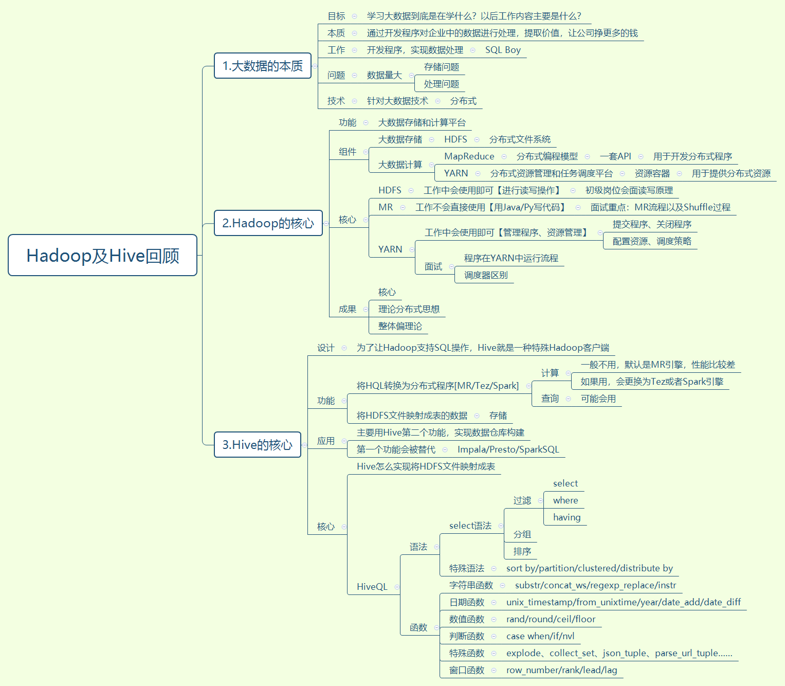


## 知识点02：课程目标

- 目标：支撑面试、综合应用【查漏补缺】
- 核心：新的知识【数据仓库】，老的知识【HiveSQL】

1. 大数据在工作中落地
   - 了解：大数据目前怎么能给公司带来价值？
   - **==掌握：大数据数据处理流程==**
2. 新零售项目的背景和需求
   - **==掌握：项目背景和需求==**
   - **理解：项目业务流程**：整个公司实现的业务，流程和数据产生
   - **==掌握：项目数据来源==**：数据从哪来，有哪些核心数据
3. 项目技术选型和技术架构
   - **==掌握：项目技术选型和技术架构==**
   - 理解：常用大数据技术


## 知识点03：【理解】大数据分析应用本质

- **目标**：**理解大数据分析的应用本质**

- **实施**

  - **本质**：**通过对公司数据的处理分析，提供数据支持，让公司挣更多的钱**

  - **思考**：常规公司怎么能挣更多的钱？

    - **step1：推广**：获取更多的用户流量，更多的用户可能会带来更多的订单
      - 广告：精准投放，我们怎么知道哪些平台有很多我们的目标用户？
        - 先做不精准的投放，根据投放效果【点击率、浏览人数、订单人数】，再来精准投放
      - 砍价：实时统计用户砍成的结果
        - 获取更多用户
    - **step2：转化**：通过一定的优惠策略，促进用户首单转化，引导用户消费
      - 送优惠券、免单
      - 用户注册率、转化率、使用优化券比例
    - **step3：服务**：给用户提交更好的购物体验，提高用户粘性，让用户沉淀
      - 对用户数据进行画像

  - **问题**：上面的数据：用户搜索、投放效果、用户画像、消费习惯等结果是怎么来的？

    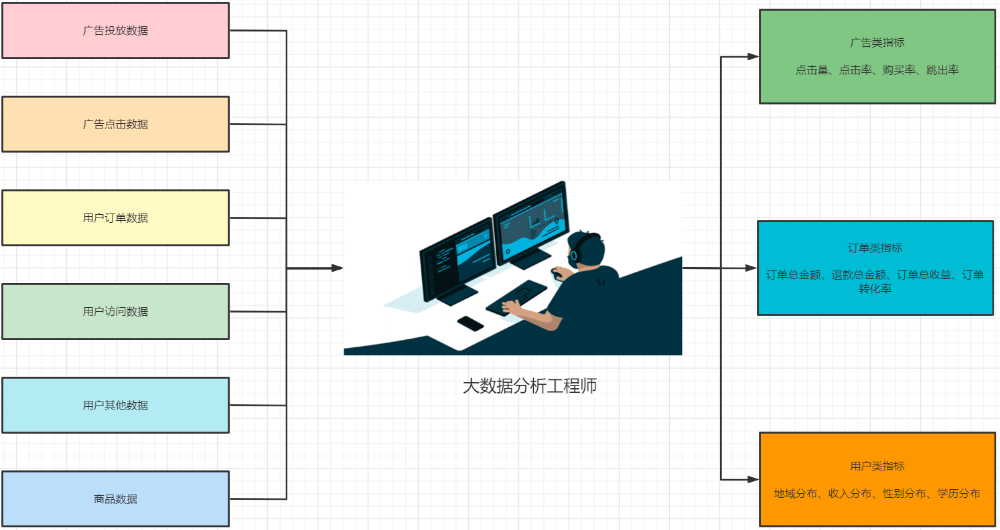

    

- **小结**

  - 理解大数据分析的应用本质

  

## 知识点04：【理解】大数据分析应用场景

- **目标**：**理解大数据分析的具体应用场景**

- **实施**

  - **数据分析**：流量分析、订单分析、用户分析、来源分析

    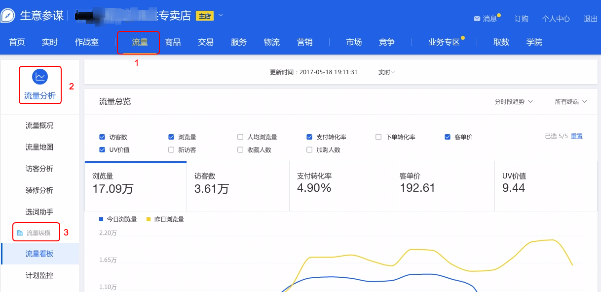

    

  - **广告营销**：投放分析、推荐分析、营收分析、效果分析

    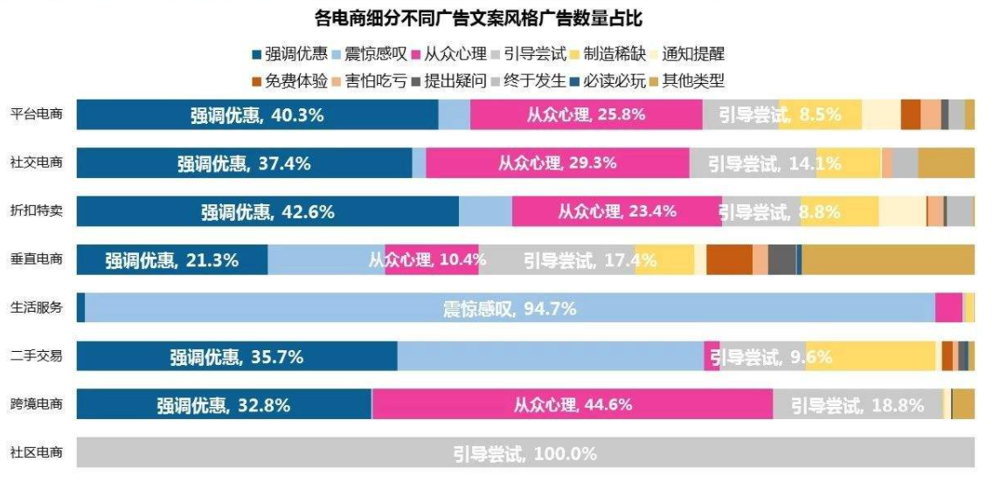

    

  - **推荐系统**：用户画像、用户相似度推荐、商品属性推荐、用户关系推荐

    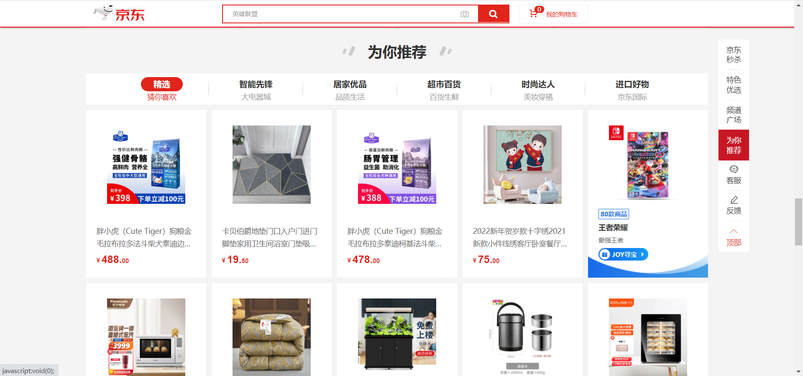

    

  - **风控系统**：刷单风控、信用风控、恶意访问拦截

    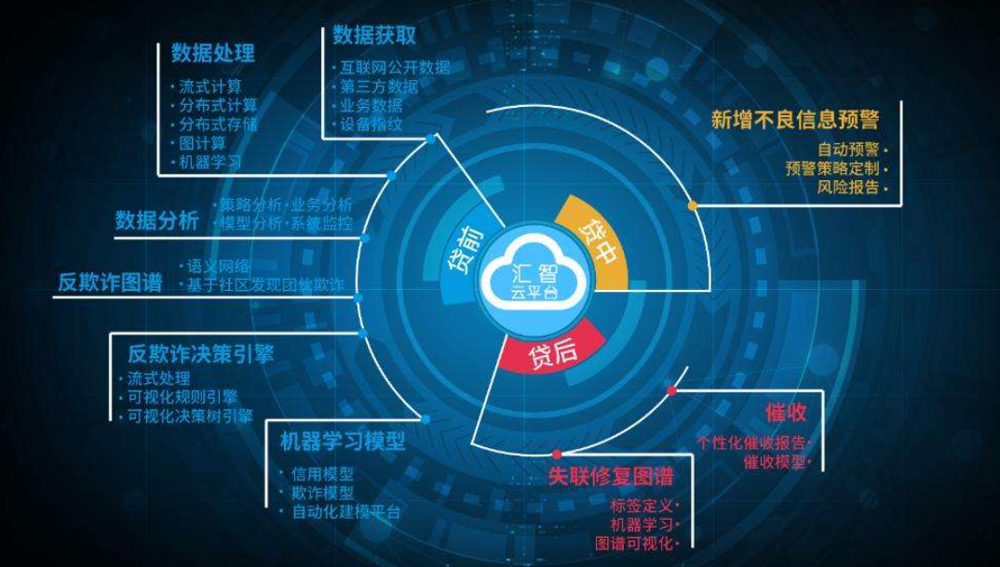

    

  - **机器学习**：无人驾驶、人脸识别、语音助手

    

    

- **小结**

  - 理解大数据分析的具体应用场景


## 知识点05：【掌握】大数据数据处理流程

- **目标**：**掌握大数据业务处理的流程**

- **实施**

  - **数据生成**：不由大数据工程师负责，我们需要知道数据有哪些，以及存储在什么地方
    - 业务数据：业务系统关系型数据库
    - 爬虫数据：数据库或者文件
    - 日志数据：文件
    - 第三方数据：合作方
  - **数据采集**：将公司各种数据源的数据进行采集同步到数据仓库中进行统一的存储和管理
  - **数据存储**：将整个公司所有的数据统一管理和存储，必须构建数据仓库
  - **数据处理**：根据公司的需求，对原始数据进行处理，ETL转换成需要的结果数据
  - **数据应用**：数据分析、搜索引擎、用户画像、推荐系统

  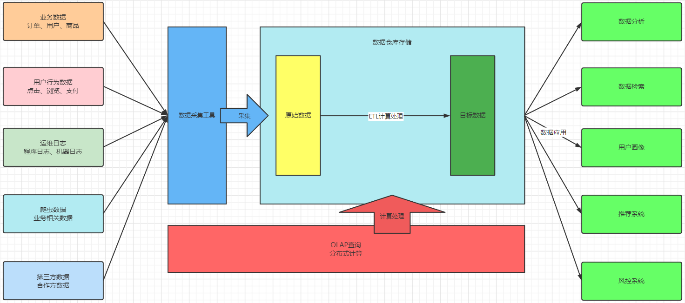

- **小结**

  - 掌握大数据业务处理的流程


## 知识点06：【了解】零售行业背景和新零售概念

- **目标**：**了解新零售的概念和项目背景**

  - 什么是新零售？
  - 为什么要构建新零售的大数据平台？
  - 大数据平台最终的效果是什么？

- **实施**

  - **行业背景**

    - **第一代零售：流动地摊**

      

      - 优点：购物灵活
      - 缺点：位置不固定，商品种类不全，价格不透明，质量参差不齐没有保障

      

    - **第二代零售：百货商店**

      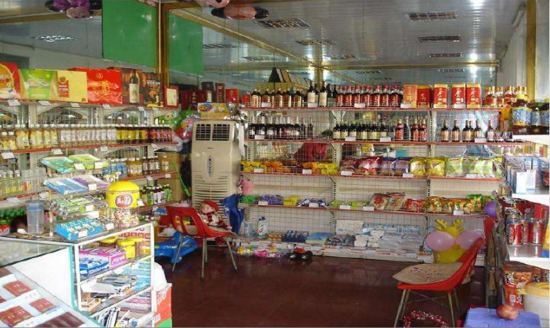

      - 优点：货物相对齐全，价格透明，质量有保障
      - 缺点：购物环境较差，种类只能满足基础生活，服务一般，商品包装不美观

      

    - **第三代零售：超级市场**

      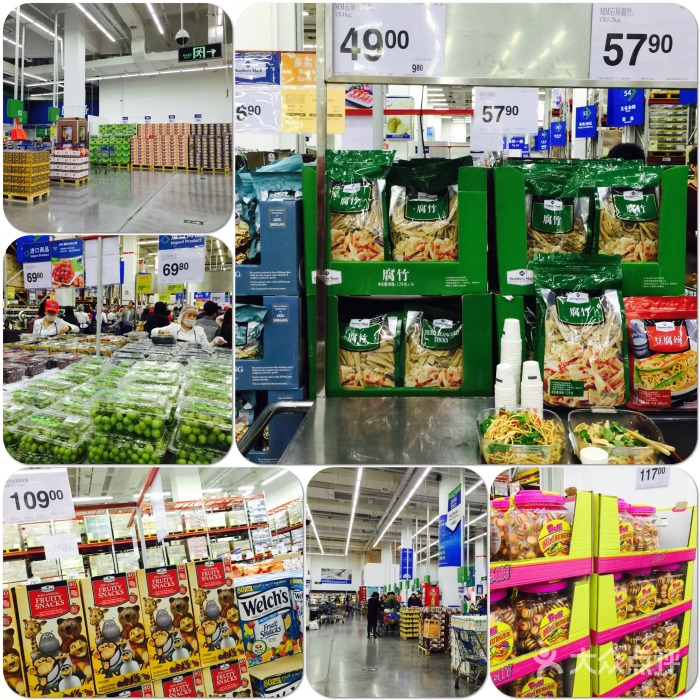

      - 优点：购物环境优美，商品种类全面，包装精美
      - 缺点：网点较少，集中化程度太高

      

    - **第四代：连锁商店**

      

      - 优点：全国连锁，购物便捷，价格透明，商品标准化，性价比高
      - 缺点：种类不全面

      

    - **第五代：线上零售**

      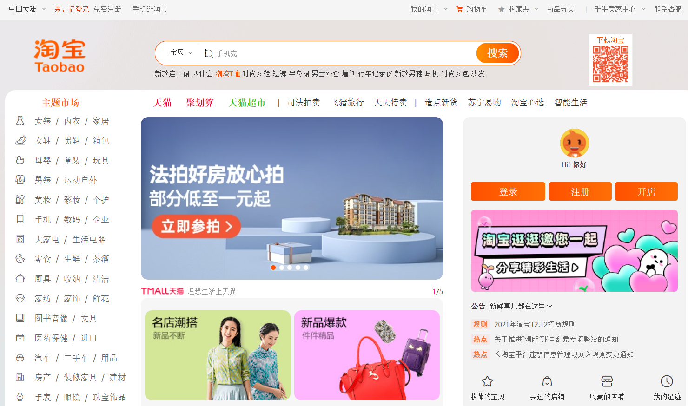

      - 优点：种类齐全，购物便捷，价格便宜
      - 缺点：时效性不高，售后相对麻烦

      

  - **新零售的概念**

    - 本质：结合线上和线下的优点，将线上和线下业务进行整合成新的零售方式

      - 线上：种类全，操作方便，时效性差，售后麻烦
      - 线下：种类少，距离较远，时效性高，售后方便

    - 新零售将购物流程进行拆解

      - 线上【售前】：挑选、咨询、搜索、下单
      - 线下【售后】：配送、安装、维修、退换

    - 代表企业

      |   线上APP    |    线下门店    |
      | :----------: | :------------: |
      |     盒马     | 盒马鲜生会员店 |
      |     山姆     |   山姆会员店   |
      |   永辉生活   |    永辉超市    |
      |   华润万家   |  华润万家超市  |
      |  大润发优鲜  |   大润发超市   |
      |   苏宁易购   |    苏宁易购    |
      |    家乐福    |   家乐福超市   |
      |    麦德龙    |     麦德龙     |
      | IKEA宜家家居 |      宜家      |

      - 仓库配货：京东到家、叮咚买菜、每日优鲜、朴朴、天猫半日达

- **小结**

  - 了解新零售的概念和项目背景

  

## 知识点07：【掌握】新零售项目背景和需求

- **目标**：**掌握新零售的项目背景和需求**

- **实施**

  - **项目背景**

    ```
        本项目是基于一家国内大型综合连锁超市研发的大数据分析平台，该公司全国覆盖了省市区等多级网点，线上提供了商城的APP，每年有千万级别的用户订单，日销售额数亿元，业务数据量非常庞大。针对新零售的业务模式，本项目用于对整个业务线上和线下的综合零售数据进行数据分析。
    ```

    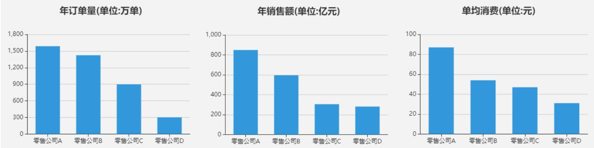

    ```
        项目整体围绕销售、履单、会员、商品和客服等零售环节中涉及的数据、信息等，通过大数据分析处理，最终目标是提高履单效率、减少运营成本、更有效地满足客户服务要求，实现库存优化和增加营收的目标，并针对数据分析结果，提出具有中观指导意义的解决方案。
    ```

  - ==**项目需求**==

    - 面临问题：用户量、订单量、履单率增长慢、ROI低【成本高，利润低】、退单率高
    - 最终需求：通过对企业数据的统计分析发现运营问题，构建可视化报表，支撑公司的运营决策，提高履单率和ROI
    - 具体目标：提升用户量、提高下单率、降低退单率等
    - 具体需求
      - 销售主题分析：订单总量、订单总金额、订单量占比、支付个数、支付总金额、退单个数、退单总金额
      - 用户主题分析：活跃会员数、新增会员数、新增消费会员数、总付费会员个数、总会员数、会员新鲜度
      - 商品主题分析：商品销量TopN、商品收藏TopN、商品加入购物车TopN、商品复购率、商品退单率

  - **项目效果**

    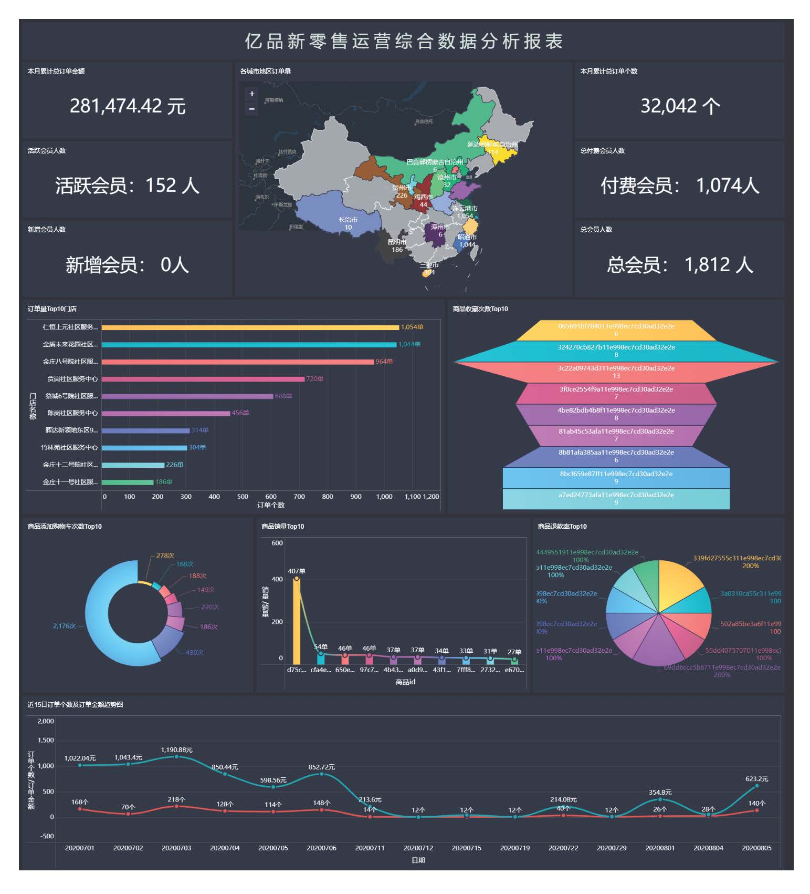

- **小结**

  - 掌握新零售的项目背景和需求


## 知识点08：【理解】新零售业务流程：商品上架

- **目标**：**理解新零售业务商品上架流程**

- **实施**

  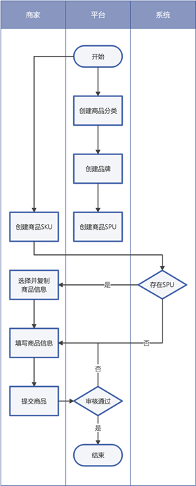

  ```shell
  --SPU(Standard Product Unit)：标准化产品单元。
  #是商品信息聚合的最小单位，是一组可复用、易检索的标准化信息的集合，该集合描述了一个产品的特性。
  --SKU(Stock Keeping Unit)：库存量单位。
  #可以是以件、盒、托盘等为单位。SKU是物理上不可分割的最小存货单元。
  #举例
  SPU：是拿来给用户购买商品查询的，比如: iPhone X。SPU只是代表型号，与规格，颜色和款式无关;
  SKU：是用户点击进来展示的，加上颜色,尺寸等属性。如iPhone X 土豪金 64G 和 iPhone X 土豪金 128G的SKU是不同的。
  ```

  - step1：平台发布统一的商品分类信息、品牌信息和商品SPU信息
  - step2：店铺商家在发布商品SKU【属性】时，可以通过系统查询类似的SPU商品
  - step3：如果存在SPU，可直接复制商品信息后进行完善，如果不存在SPU则需要商家自己填写商品SKU【属性】详情
  - step4：完善商品SKU【属性】信息后，商家需要提交给平台进行审核
  - step5：审核通过后即可发布此商品，否则需要重新编辑并提交审核

- **小结**

  - 理解新零售业务商品上架流程


## 知识点09：【理解】新零售业务流程：单店订单

- **目标**：**理解新零售业务单店订单的流程**

- **实施**

  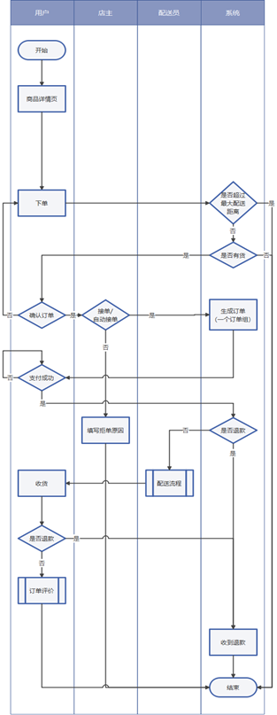

  

  - step1：用户提交订单：在商品详情页直接点击购买下单
  - step2：后台校验订单：判断是否超出最大配送距离、商品是否有货等
  - step3：用户确认订单：用户确定订单，商家手动接单或自动接单，如果拒绝接单，填写拒单原因后订单结束
  - step4：系统生成订单：实际生成一个订单组，一个订单组可以包含多个子订单，**该订单组中只包含一个子订单**
  - step5：用户进行支付：用户确认订单内容进行支付，如果支付失败则重新发起支付
  - step6：开始订单配货：配货员进行配货，配货完成，先判断是否已发起退款，如申请退款则进入退款流程
  - step7：开始配送流程：当配送员送达订单时，配送流程结束
  - step8：用户确认收货：如发现包裹（损坏、漏发、不想要）可申请退款，交由系统确认，并直接退款否则确认收货
  - step9：订单结束评价：对配送服务和商品进行评价，订单结束

- **小结**

  - 理解新零售业务单店订单的流程


## 知识点10：【理解】新零售业务流程：购物车订单

- **目标**：**理解新零售业务购物车订单的流程**

- **实施**

  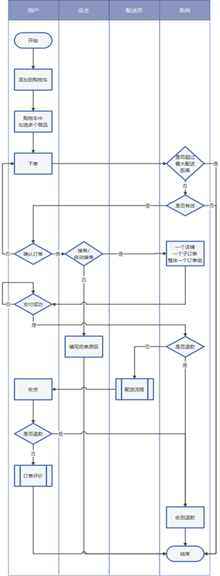

  

  - step1：提交商品订单：用户添加多个店铺的商品到购物车中，在购物车中选中多个店铺商品一起提交订单
  - step2：后台校验订单：校验订单是否超出最大配送距离、商品是否有货等
  - step3：用户确认订单：用户确定订单，商家手动接单或自动接单，如果拒绝接单，填写拒单原因后订单结束
  - step4：系统生成订单：实际生成一个订单组，每个店铺的商品是一个子订单，**该订单组包含多个子订单**
  - step5：用户进行支付：用户确认订单内容进行支付，如果支付失败则重新发起支付
  - step6：开始订单配货：配货员进行配货，配货完成，先判断是否已发起退款，如申请退款则进入退款流程
  - step7：开始配送流程：当配送员送达订单时，配送流程结束
  - step8：用户确认收货：如发现包裹（损坏、漏发、不想要）可申请退款，交由系统确认，并直接退款否则确认收货
  - step9：订单结束评价：对配送服务和商品进行评价，订单结束

- **小结**

  - 理解新零售业务购物车订单的流程


## 知识点11：【理解】新零售业务流程：配送业务

- **目标**：**理解新零售业务配送业务的流程**

- **实施**

  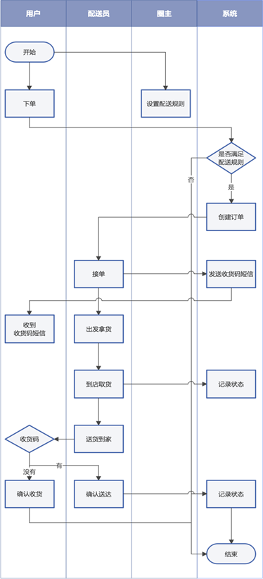

  

  - step1：商圈制定规则：订单最低配送费用、每公里增加配送费用、最大配送距离等
  - step2：用户提交订单：系统判定是否满足最大配送距离，不满足则下单失败
  - step3：配送骑手接单：系统派单给骑手，并发送收货码给用户
  - step4：骑手到店取货：骑手接单根据调度到店取件，系统更新订单状态
  - step5：骑手送货到家：配送员将商品配送到家，索取用户的收货码，并确认送达或由客户主动完成订单
  - step6：订单更新完成：后台更新订单状态，订单结束

- **小结0**

  - 理解新零售业务配送业务的流程


## 知识点12：【理解】新零售业务流程：退货退款

- **目标**：**理解新零售业务退货退款的流程**

- **实施**

  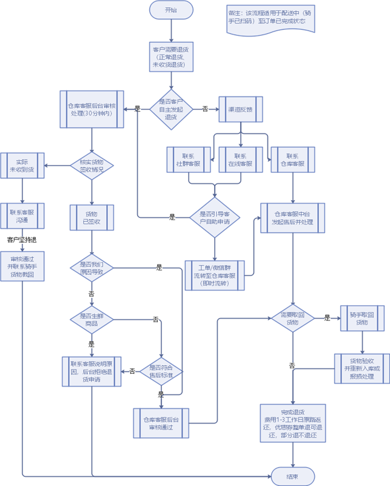

  

  - step1：收到退货申请：客户下单后且已处于配送状态
  - step2：用户主动发起退货，仓库客服后台审核处理
    - 如果用户**未收到货**，则联系用户，用户坚持退，通知骑手取消配送，退货结束
    - 如果用户**已收到货**
      - **是商家的原因**导致：比如商品质量问题等，后台审核通过，判断是否需要取回货物
        - 需要取回：联系骑手取回货物，仓库验收并报损，退货完成
        - 无需取回：直接退货完成
      - **非商家的原因**导致：判断是否是生鲜商品
        - 是生鲜：拒绝退货申请，退货完成
        - 非生鲜：退货理由是否符合标准，不符合，拒绝退货申请，符合则审核通过，判断是否需要取回货物
          - 需要取回：联系骑手取回货物，仓库验收并报损，退货完成
          - 无需取回：直接退货完成
  - step3：非用户主动发起退货，而是通过渠道反馈联系到客服
    - 联系社群或者在线客服：判断是否引导用户自主实现退货申请
      - 是：执行step2
      - 否：生成工单，转接给仓库客服
    - 联系仓库客服：判断是否需要取回货物
      - 需要取回：联系骑手取回货物，仓库验收并报损，退货完成
      - 无需取回：直接退货完成

- **小结**

  - 理解新零售业务退货退款的流程


## 知识点13：【掌握】新零售业务核心数据源

- **目标**：**掌握新零售业务的核心数据来源**

  - **==面试：数据来源是什么？有哪些核心的数据表？==**

- **实施**

  - **数据来源**：**业务系统**

    - 用户数据、商品数据、订单数据、配送数据、评价数据

    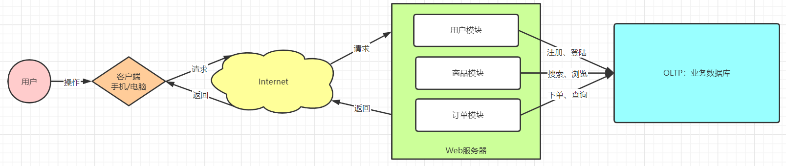

  - **业务存储**：**MySQL**

  - **数据内容**：【表很多，表关系很复杂】

    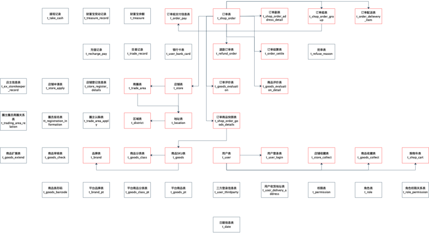

    - 订单相关

      ```properties
      -- 订单主表: t_shop_order
      -- 订单副表: t_shop_order_address_detail
      -- 订单组表: t_shop_order_group
      -- 订单组支付表: t_orderlpay
      -- 订单结算表: t_order_settle
      -- 订单配送表: t_order_delievery_item
      -- 退款订单表: t_refund_order
      -- 订单评价表: t_goods_evaluation
      -- 商品评价表: t_goods_evaluation_detail
      -- 订单商品快照表: t_shop_order_goods_details
      ```

    - 商品相关

      ```properties
      -- 商品表: t_goods
      -- 商品分类表: t_goods_class
      -- 品牌表: t_brand
      ```

    - 店铺相关

      ```properties
      -- 店铺表: t_store
      -- 商圈表: t_trade_area
      -- 地址表: t_location
      -- 区域字典表: t_district
      ```

    - 用户相关

      ```properties
      -- 登录日志表: t_user_login
      -- 店铺收藏表: t_store_collect
      -- 购物车表: t_shop_cart
      ```

    - 配置相关

      ```properties
      -- 时间信息表: t_date
      ```

- **小结**

  - 掌握新零售业务的核心数据来源


## 知识点14：【了解】大数据常见技术架构

- **目标**：**了解大数据技术架构**

- **实施**

  - **技术需求**

    - 离线：对全量的数据进行批处理，一般为T+1，即今天处理昨天的数据
      - 每天、每月、每个季度数据分析报表
    - 实时：对实时的数据进行增量处理，数据一产生就立即被处理，累计结果
      - 实时风控、实时推荐、实时大屏

  - **Lambda架构**

    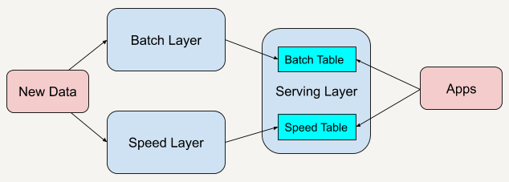

    - **Batch Layer：批处理层**，对离线的历史数据进行预计算，为了下游能够快速查询想要的结果。
      - 由于批处理基于完整的历史数据集，因此准确性可以得到保证。
      - 批处理层可以用 Hadoop、Spark 和 Flink 等框架计算
    - **Speed Layer：加速处理层**，处理实时的增量数据，这一层重点在于低延迟。
      - 加速层的数据不如批处理层那样完整和准确，但是可以填补批处理高延迟导致的数据空白。
      - 加速层可以用 Storm、Spark streaming 和 Flink 等框架计算
    - **Serving Layer：合并层**，计算历史数据和实时数据都有了，合并层的工作自然就是将两者数据合并，输出到数据库或者其他介质，供下游分析

  - **Kappa架构**

    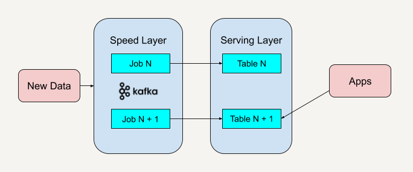

    - 核心思想：用实时代替离线，流批一体
    - 数据行业规则：数据的价值会随着时间的流逝而逐渐降低，实现价值最大化，必须使用实时技术

- **小结**

  - 了解大数据技术架构


## 知识点15：【理解】大数据常见技术选型

- **目标**：**理解大数据常见技术选型**

- **实施**

  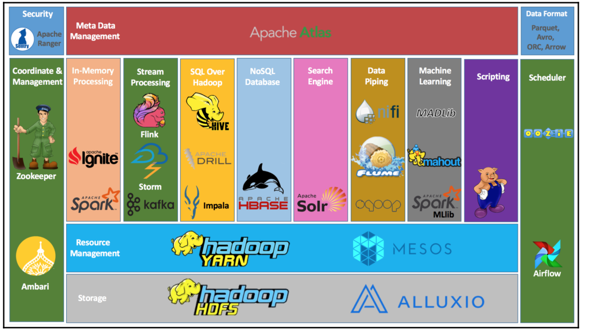

  - 数据来源
    - RDBMS：MySQL、Oracle
    - 文件：用户行为日志、爬虫数据、JSON/Text/CSV/TSV
  - 数据采集
    - Flume/Sqoop/DataX/FileBeats/Logstash/Canal/OGG/Kettle
  - 数据存储
    - HDFS【文件系统】/Hive【数据仓库】
    - Hbase/Redis：NoSQL数据库
    - Kafka：消息队列
    - ES：全文检索引擎
    - ……
  - 数据计算
    - MapReduce
    - Tez
    - **Spark【主要用于离线计算】**/impala/Presto/Kylin/Druid
    - **Flink【主要用于实时计算】**/Storm
  - 数据应用
    - 报表：FineBI、PowerBI、Tableau、SuperSet
  - 其他工具
    - 协调服务组件：Zookeeper
    - 任务调度组件：Oozie/Airflow/Azkaban/DS
    - 集群管理组件：CM、Ambari

- **小结**

  - 理解大数据常见技术选型


## 知识点16：【掌握】新零售项目技术选型及架构

- **目标**：**掌握新零售项目的技术选型**

  - 项目的技术选型是什么？画项目技术架构图

- **实施**

  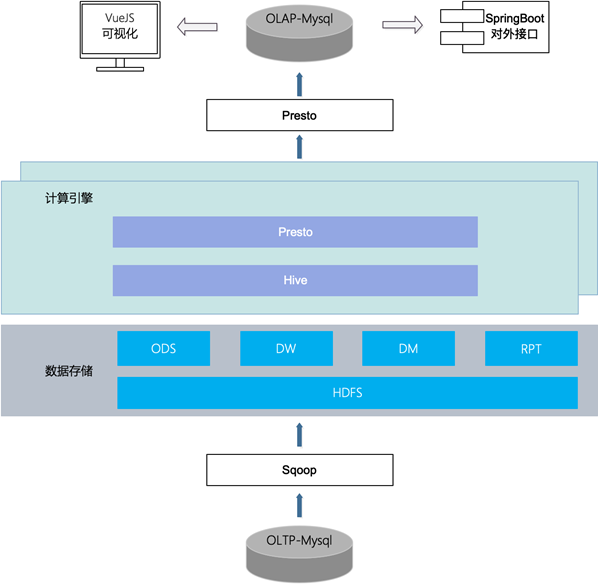

  - 数据来源：MySQL数据库
  - **数据采集：Sqoop数据库同步工具**
  - 数据存储：Hive离线数仓
  - 数据处理：Hive【MR】 + **Presto【内存式】**
  - **数据应用：FineBI**
  - **调度工具：Oozie实现自动化任务流调度**
  - 协调服务：Zookeeper
  - **集群管理：Cloudera Manager**
  
- **小结**

  - 掌握新零售项目的技术选型
